.. role:: skyblue
.. role:: red

DBSCAN
======

Outlier detector based on DBSCAN.

Fairly unreliable as it is very sensitive to input parameters which make it
difficult to automatically determine suitable parameters.  Automatically
determined parameters can sometimes be very effective, but often they do not
have the desired results.  Seeing as there is a single epsilon value for all
clusters the algorithm fails when varying density clusters are present in the
data.

Therefore if DBSCAN identifies more than 33% of the data points in a time series
as outliers, this algorithm will return an inconclusive results.

See the docstrings - https://earthgecko-skyline.readthedocs.io/en/latest/skyline.custom_algorithms.html#module-custom_algorithms.dbscan

See the custom_algorithm source - https://github.com/earthgecko/skyline/blob/master/skyline/custom_algorithms/dbscan.py

Example analysis output
------------------------

The below graphs show the results of dbscan run with the default
algorithm_parameters against seasonal, seasonal unstable, stable and unstable
time series.

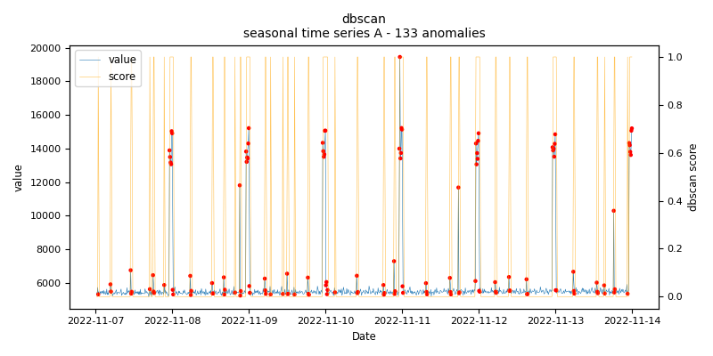
    
    *dbscan.seasonal.A - runtime: 0.381 seconds*

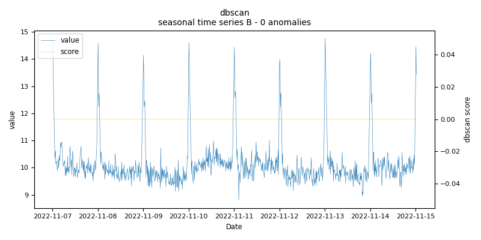
    
    *dbscan.seasonal.B - runtime: 0.23 seconds*

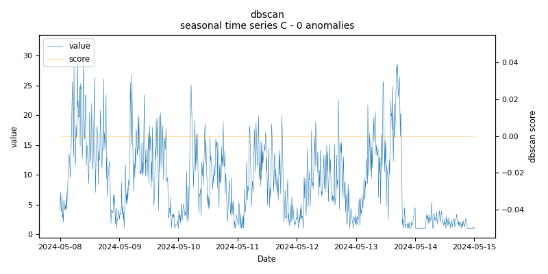
    
    *dbscan.seasonal.C - runtime: 0.186 seconds*

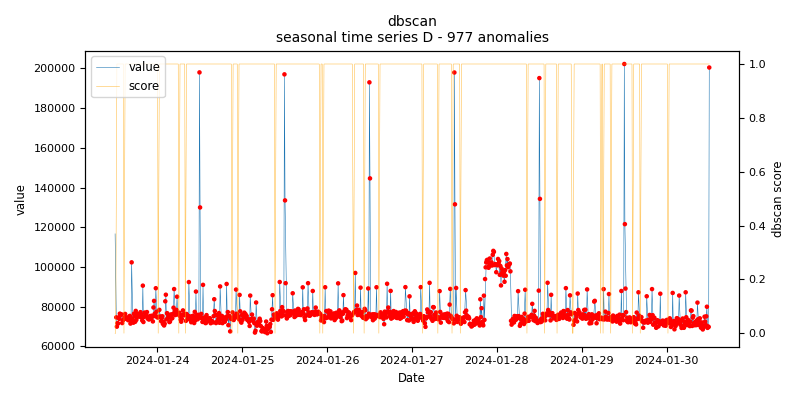
    
    *dbscan.seasonal.D - runtime: 0.145 seconds*

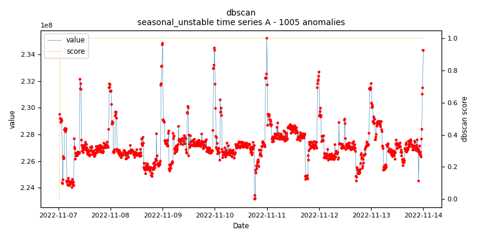
    
    *dbscan.seasonal_unstable.A - runtime: 0.214 seconds*

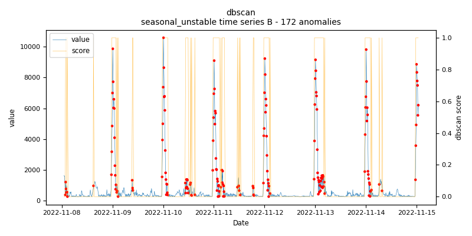
    
    *dbscan.seasonal_unstable.B - runtime: 2.904 seconds*

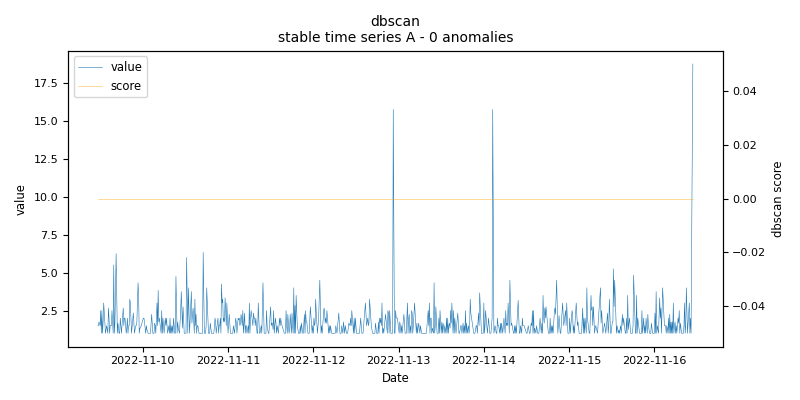
    
    *dbscan.stable.A - runtime: 0.271 seconds*

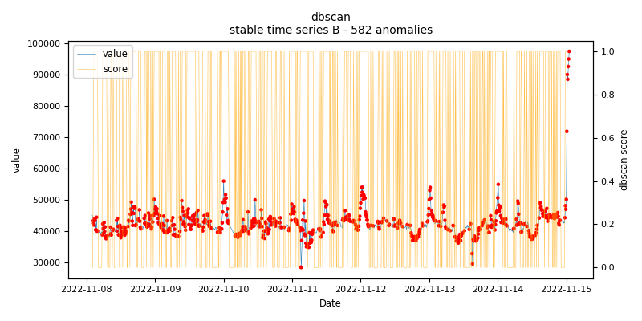
    
    *dbscan.stable.B - runtime: 0.3 seconds*

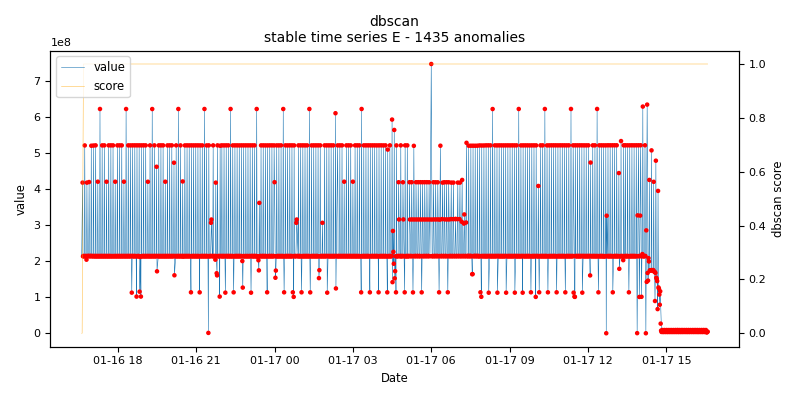
    
    *dbscan.stable.E - runtime: 0.142 seconds*

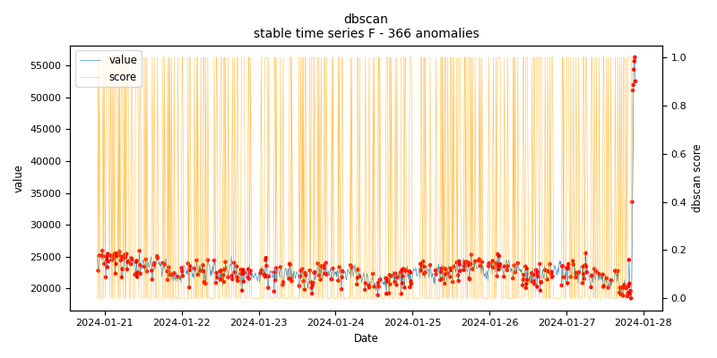
    
    *dbscan.stable.F - runtime: 0.174 seconds*

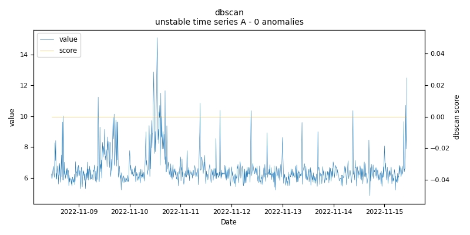
    
    *dbscan.unstable.A - runtime: 0.788 seconds*

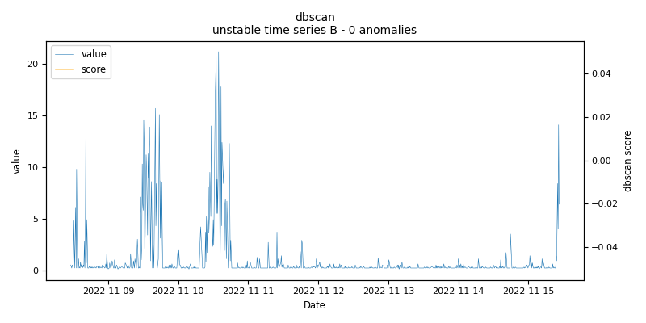
    
    *dbscan.unstable.B - runtime: 0.99 seconds*
