.. role:: skyblue
.. role:: red

grafana_promql_anomaly_detection
================================

EXPERIMENTAL

A loose Python implementation of the Grafana PromQL Anomaly Detection method.

https://github.com/grafana/promql-anomaly-detection/tree/cd5a307ac7e44beb7e42299fe05cd71dd5647237

https://grafana.com/blog/2024/10/03/how-to-use-prometheus-to-efficiently-detect-anomalies-at-scale/

This implementation does not take into account the alert only if breached
x times which in a running implementation on Grafana would be provided by
the rules.

See the docstrings - https://earthgecko-skyline.readthedocs.io/en/latest/skyline.custom_algorithms.html#module-custom_algorithms.grafana_promql_anomaly_detection

See the custom_algorithm source - https://github.com/earthgecko/skyline/blob/master/skyline/custom_algorithms/grafana_promql_anomaly_detection.py

Example analysis output
------------------------

The below graphs show the results of grafana_promql_anomaly_detection run with the default
algorithm_parameters against seasonal, seasonal unstable, stable and unstable
time series.

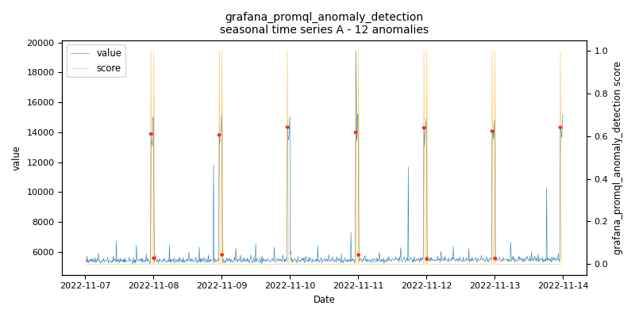
    
    *grafana_promql_anomaly_detection.seasonal.A - runtime: 0.394 seconds*

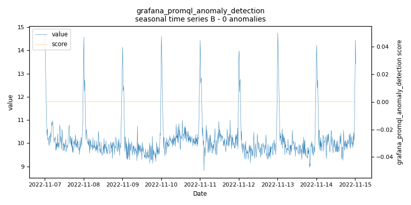
    
    *grafana_promql_anomaly_detection.seasonal.B - runtime: 0.396 seconds*

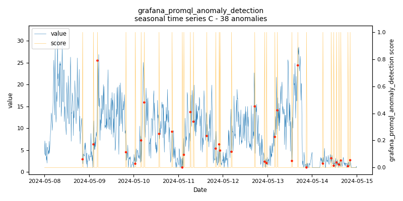
    
    *grafana_promql_anomaly_detection.seasonal.C - runtime: 5.793 seconds*

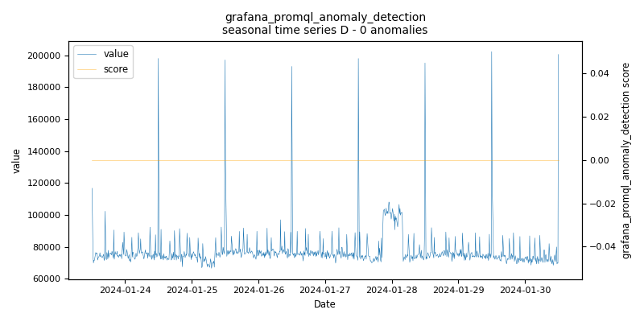
    
    *grafana_promql_anomaly_detection.seasonal.D - runtime: 0.193 seconds*

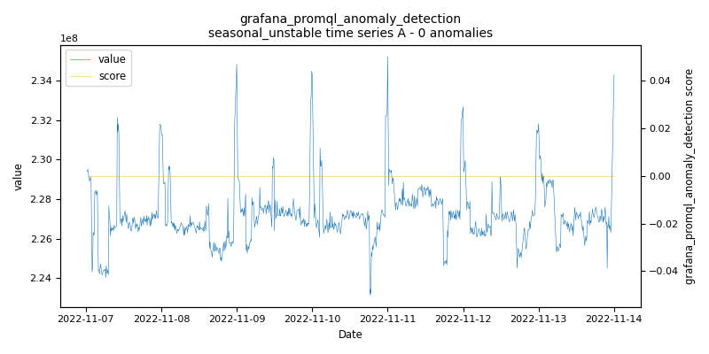
    
    *grafana_promql_anomaly_detection.seasonal_unstable.A - runtime: 0.381 seconds*

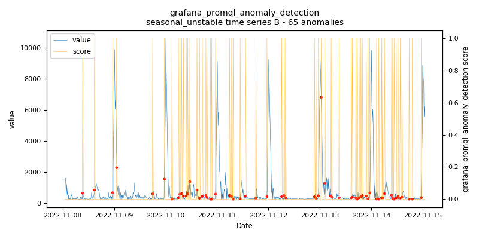
    
    *grafana_promql_anomaly_detection.seasonal_unstable.B - runtime: 0.109 seconds*

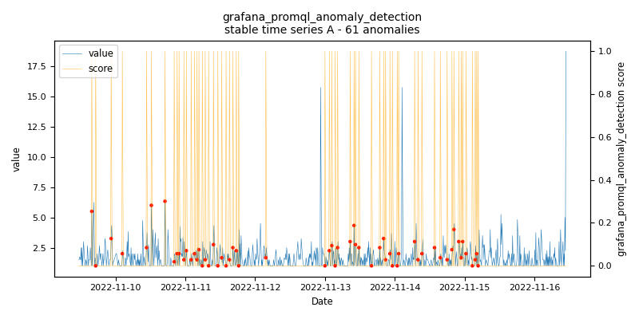
    
    *grafana_promql_anomaly_detection.stable.A - runtime: 0.107 seconds*

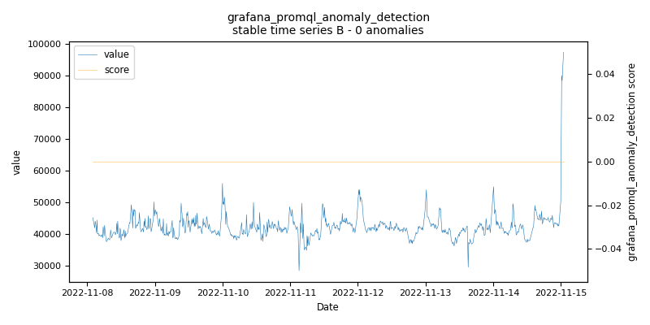
    
    *grafana_promql_anomaly_detection.stable.B - runtime: 0.106 seconds*

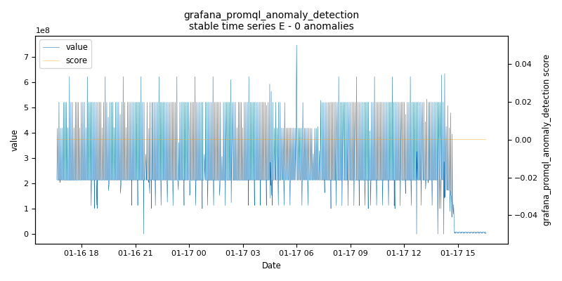
    
    *grafana_promql_anomaly_detection.stable.E - runtime: 0.08 seconds*

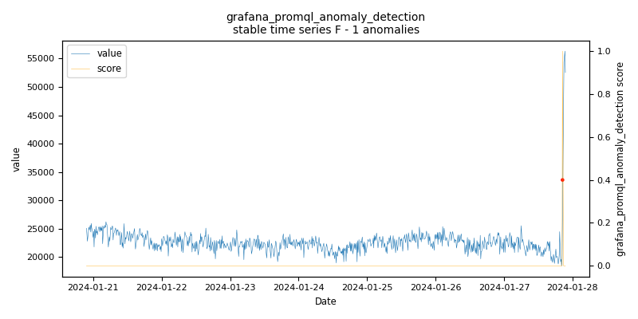
    
    *grafana_promql_anomaly_detection.stable.F - runtime: 0.091 seconds*

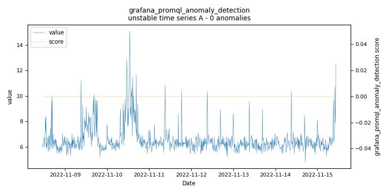
    
    *grafana_promql_anomaly_detection.unstable.A - runtime: 0.102 seconds*

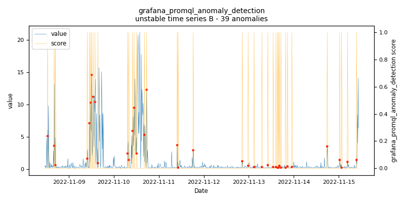
    
    *grafana_promql_anomaly_detection.unstable.B - runtime: 0.403 seconds*