.. role:: skyblue
.. role:: red

isolation_forest
================

Outlier detector based on Isolation Forest.

See the docstrings - https://earthgecko-skyline.readthedocs.io/en/latest/skyline.custom_algorithms.html#module-custom_algorithms.isolation_forest

See the custom_algorithm source - https://github.com/earthgecko/skyline/blob/master/skyline/custom_algorithms/isolation_forest.py

Example analysis output
------------------------

The below graphs show the results of isolation_forest run with the default
algorithm_parameters against seasonal, seasonal unstable, stable and unstable
time series.

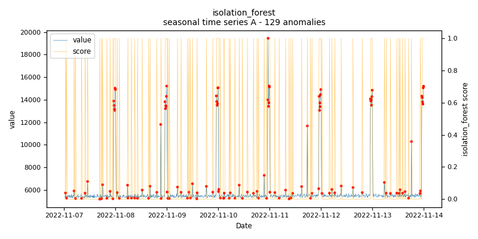
    
    *isolation_forest.seasonal.A - runtime: 0.335 seconds*

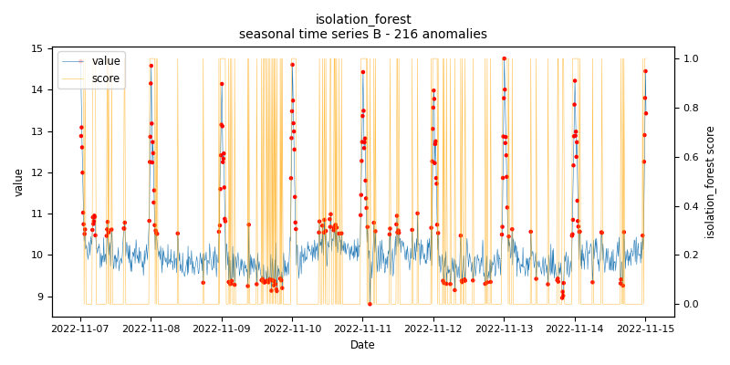
    
    *isolation_forest.seasonal.B - runtime: 0.385 seconds*

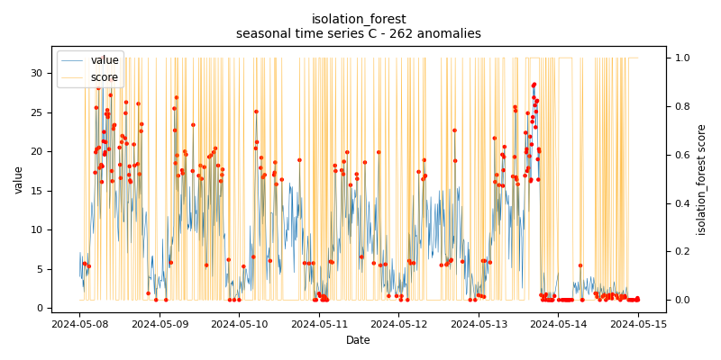
    
    *isolation_forest.seasonal.C - runtime: 0.357 seconds*

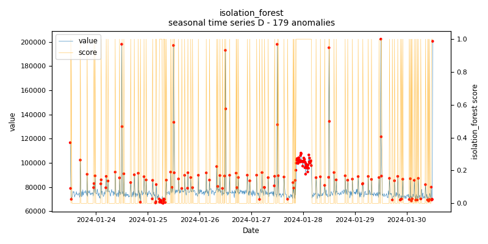
    
    *isolation_forest.seasonal.D - runtime: 0.403 seconds*

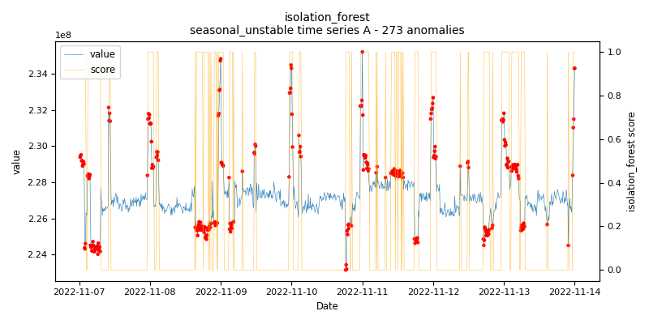
    
    *isolation_forest.seasonal_unstable.A - runtime: 0.399 seconds*

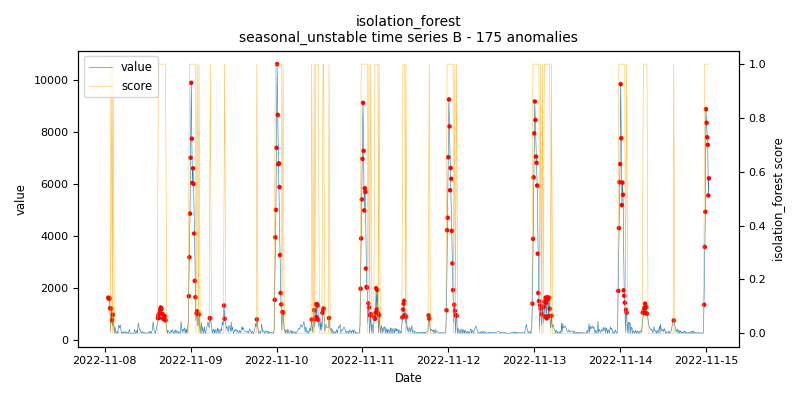
    
    *isolation_forest.seasonal_unstable.B - runtime: 0.368 seconds*

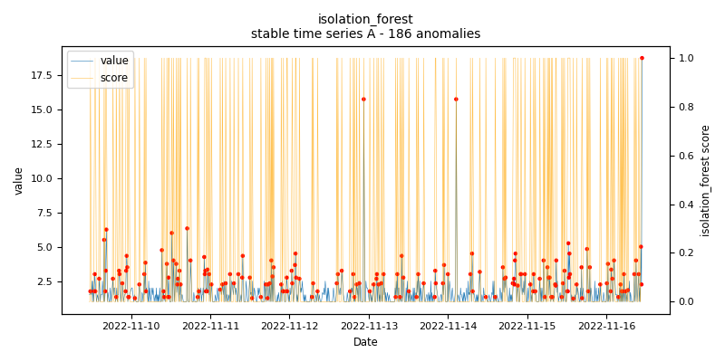
    
    *isolation_forest.stable.A - runtime: 0.356 seconds*

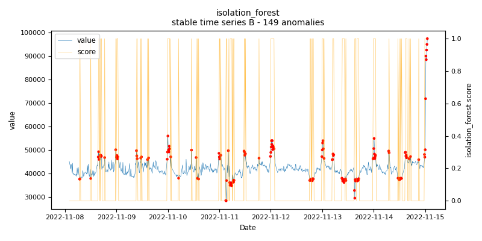
    
    *isolation_forest.stable.B - runtime: 0.434 seconds*

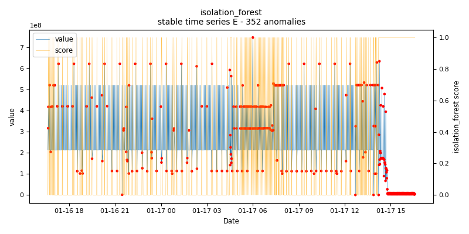
    
    *isolation_forest.stable.E - runtime: 0.571 seconds*

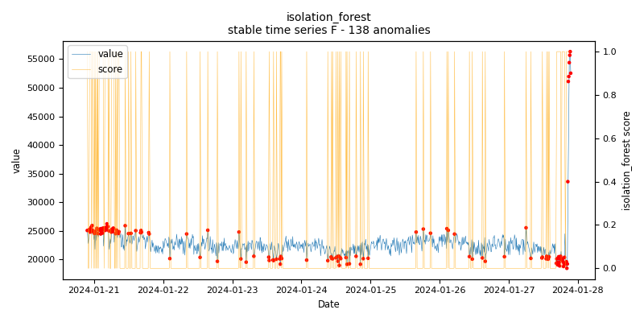
    
    *isolation_forest.stable.F - runtime: 0.528 seconds*

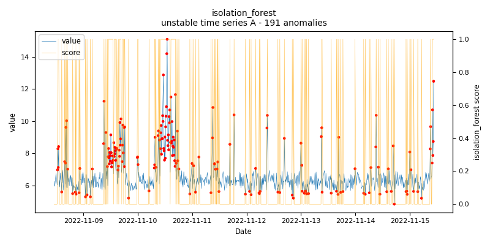
    
    *isolation_forest.unstable.A - runtime: 0.878 seconds*

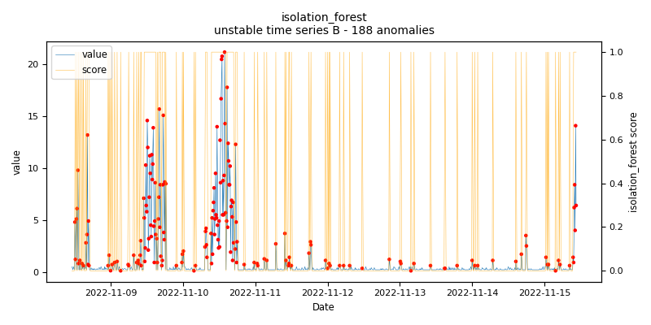
    
    *isolation_forest.unstable.B - runtime: 0.424 seconds*
