.. role:: skyblue
.. role:: red

LAD
===

EXPERIMENTAL

Large Deviations Anomaly Detection

Univariate implementation of

Large Deviations Anomaly Detection (LAD) for collection of multivariate time series data: Applications to COVID-19 data (Sreelekha Guggilam, Varun Chandola, Abani K. Patra)

Journal of Computational Science 72 (2023) 102101

https://www.sciencedirect.com/science/article/pii/S1877750323001618

https://pdf.sciencedirectassets.com/280179/1-s2.0-S1877750323X00076/1-s2.0-S1877750323001618/main.pdf

https://doi.org/10.1016/j.jocs.2023.102101

At 95 percentile may be one the noisiest algorithm yet.

If threshold is set at 95, will detect step changes, etc.

If threshold is set at 99 will only detect most severe spike/dip/point anomalies.

Fast but noisy.

See the docstrings - https://earthgecko-skyline.readthedocs.io/en/latest/skyline.custom_algorithms.html#module-custom_algorithms.lad

See the custom_algorithm source - https://github.com/earthgecko/skyline/blob/master/skyline/custom_algorithms/lad.py

Example analysis output
------------------------

The below graphs show the results of lad run with the default
algorithm_parameters against seasonal, seasonal unstable, stable and unstable
time series.

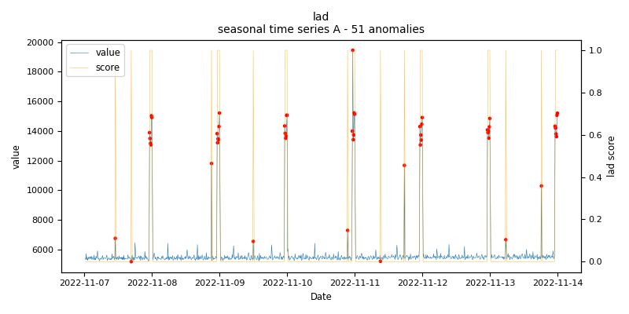
    
    *lad.seasonal.A - runtime: 0.003 seconds*

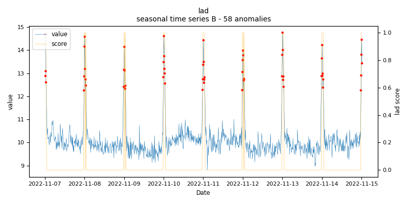
    
    *lad.seasonal.B - runtime: 0.003 seconds*

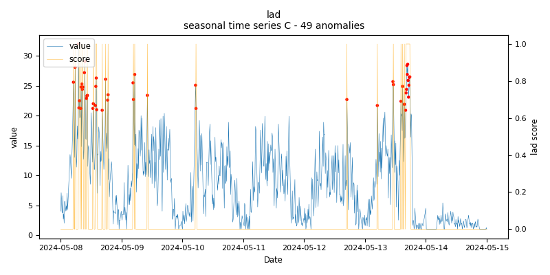
    
    *lad.seasonal.C - runtime: 0.003 seconds*

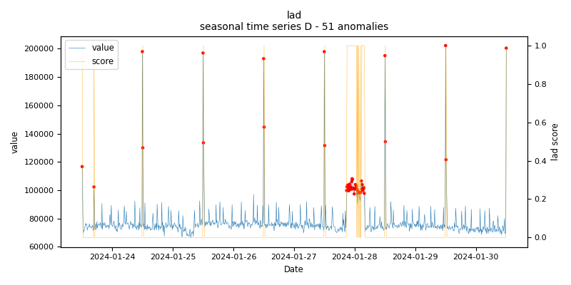
    
    *lad.seasonal.D - runtime: 0.004 seconds*

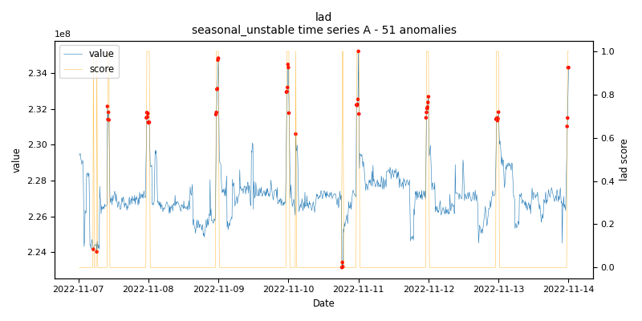
    
    *lad.seasonal_unstable.A - runtime: 0.004 seconds*

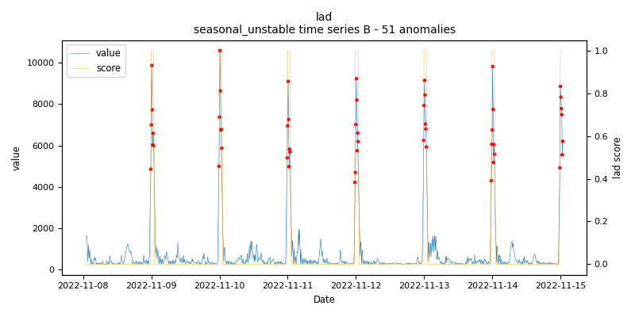
    
    *lad.seasonal_unstable.B - runtime: 0.003 seconds*

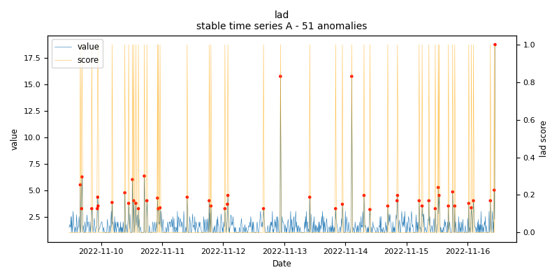
    
    *lad.stable.A - runtime: 0.003 seconds*

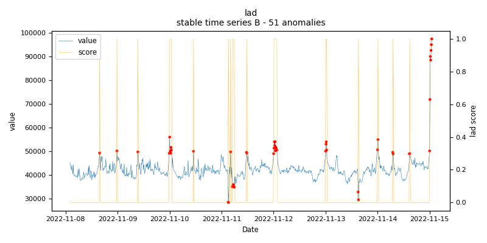
    
    *lad.stable.B - runtime: 0.003 seconds*

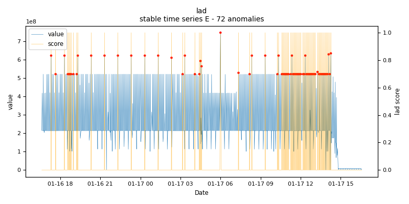
    
    *lad.stable.E - runtime: 0.004 seconds*

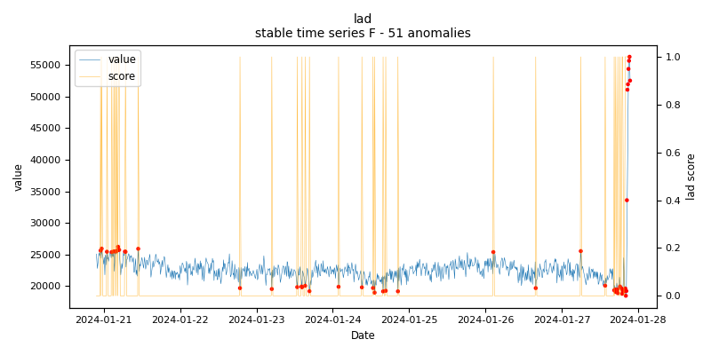
    
    *lad.stable.F - runtime: 0.002 seconds*

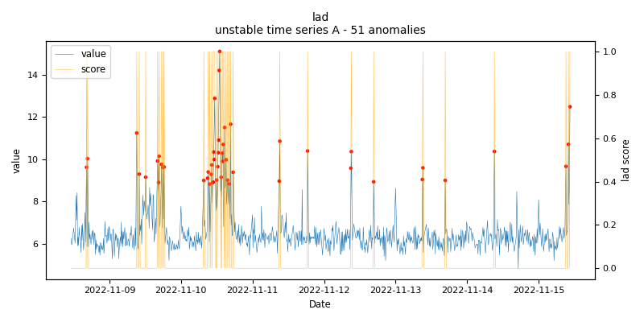
    
    *lad.unstable.A - runtime: 0.005 seconds*

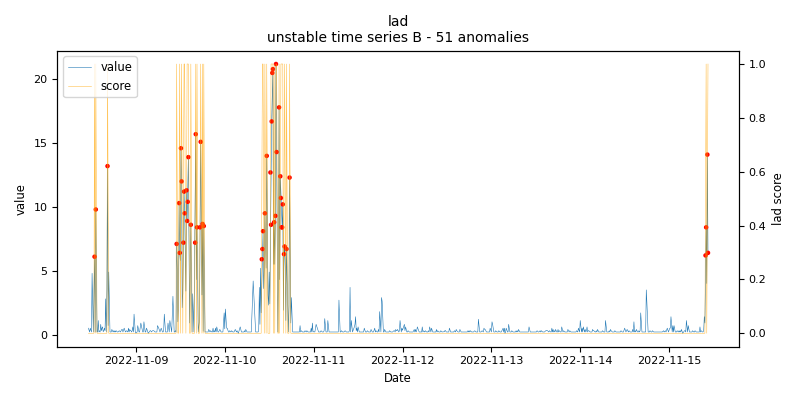
    
    *lad.unstable.B - runtime: 0.002 seconds*