.. role:: skyblue
.. role:: red

Locally Adaptive One-Class Classifier Fusion with Dynamic ℓp-Norm Constraints
=============================================================================

EXPERIMENTAL

Using a TCPDBench type naming convention here, laoccfdlpnc for short.

An implementation of:

Locally Adaptive One-Class Classifier Fusion with Dynamic ℓp-Norm Constraints for Robust Anomaly Detection

https://arxiv.org/pdf/2411.06406

Not super fast, but not too slow.

Should be limited to time series with <= 2000 data points.

When laoccfdlpnc is used as a custom_algorithm in Mirage or SNAB it should be
used via the flux/tornado method only, due it it's initialisation time.  This is
handled natively by using the purpose built skyline_laoccfdlpnc custom_algorithm
and enabling :mod:`setings.FLUX_TORNADO_ENABLED`.

See the docstrings - https://earthgecko-skyline.readthedocs.io/en/latest/skyline.custom_algorithms.html#module-custom_algorithms.laoccfdlpnc

See the custom_algorithm source - https://github.com/earthgecko/skyline/blob/master/skyline/custom_algorithms/laoccfdlpnc.py

For skyline_laoccfdlpnc See https://earthgecko-skyline.readthedocs.io/en/latest/skyline.custom_algorithms.html#module-custom_algorithms.skyline_laoccfdlpnc

Example analysis output
------------------------

The below graphs show the results of laoccfdlpnc run with the default
algorithm_parameters against seasonal, seasonal unstable, stable and unstable
time series.

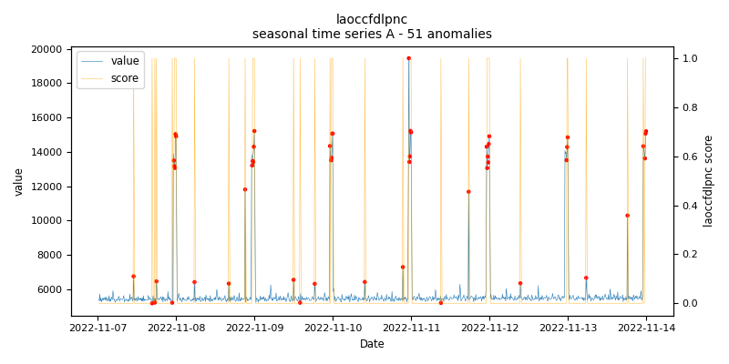
    
    *laoccfdlpnc.seasonal.A - runtime: 20.081 seconds*

    *skyline_laoccfdlpnc.seasonal.A - runtime: 2.386 seconds*

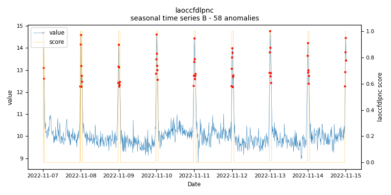
    
    *laoccfdlpnc.seasonal.B - runtime: 6.498 seconds*

    *skyline_laoccfdlpnc.seasonal.B - runtime: 1.74 seconds*

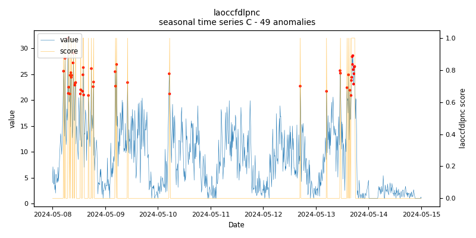
    
    *laoccfdlpnc.seasonal.C - runtime: 14.609 seconds*

    *skyline_laoccfdlpnc.seasonal.C - runtime: 2.184 seconds*

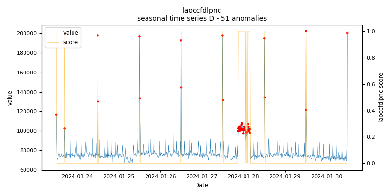
    
    *laoccfdlpnc.seasonal.D - runtime: 18.886 seconds*

    *skyline_laoccfdlpnc.seasonal.D - runtime: 6.006 seconds*

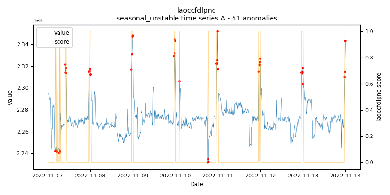
    
    *laoccfdlpnc.seasonal_unstable.A - runtime: 8.29 seconds*

    *skyline_laoccfdlpnc.seasonal_unstable.A - runtime: 17.915 seconds*

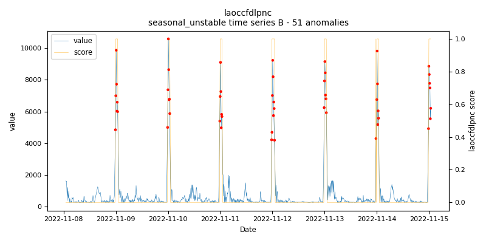
    
    *laoccfdlpnc.seasonal_unstable.B - runtime: 4.089 seconds*

    *skyline_laoccfdlpnc.seasonal_unstable.B - runtime: 13.787 seconds*

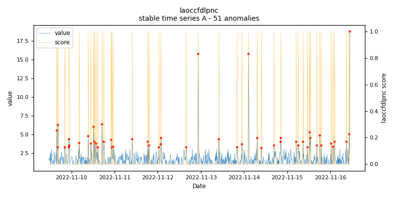
    
    *laoccfdlpnc.stable.A - runtime: 8.704 seconds*

    *skyline_laoccfdlpnc.stable.A - runtime: 1.043 seconds*

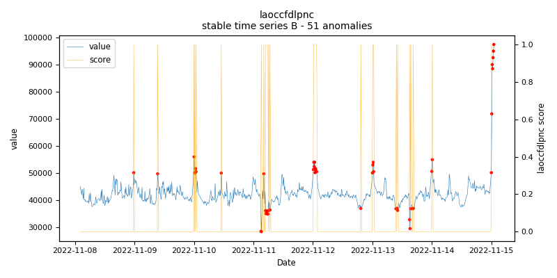
    
    *laoccfdlpnc.stable.B - runtime: 2.169 seconds*

    *skyline_laoccfdlpnc.stable.B - runtime: 1.221 seconds*

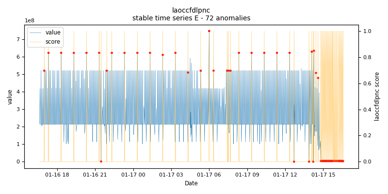
    
    *laoccfdlpnc.stable.E - runtime: 13.495 seconds*

    *skyline_laoccfdlpnc.stable.E - runtime: 2.628 seconds*

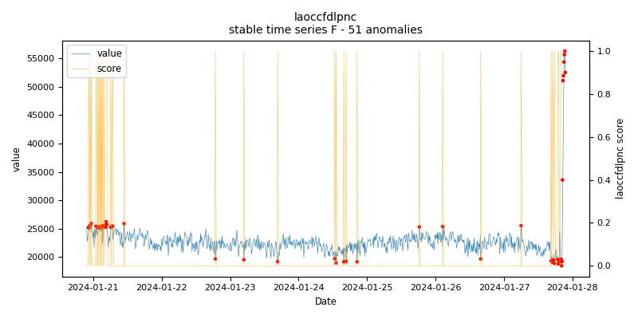
    
    *laoccfdlpnc.stable.F - runtime: 7.606 seconds*

    *skyline_laoccfdlpnc.stable.F - runtime: 21.004 seconds*

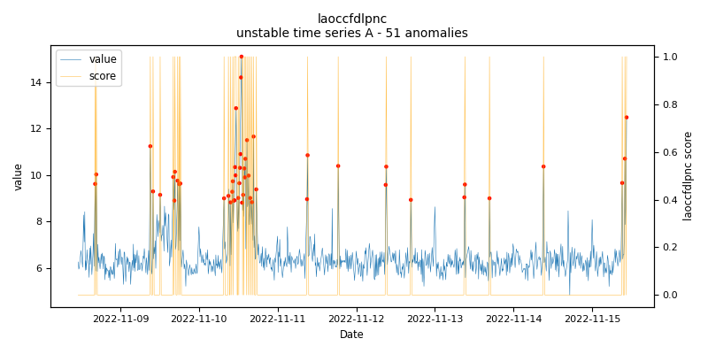
    
    *laoccfdlpnc.unstable.A - runtime: 38.307 seconds*

    *skyline_laoccfdlpnc.unstable.A - runtime: 3.214 seconds*

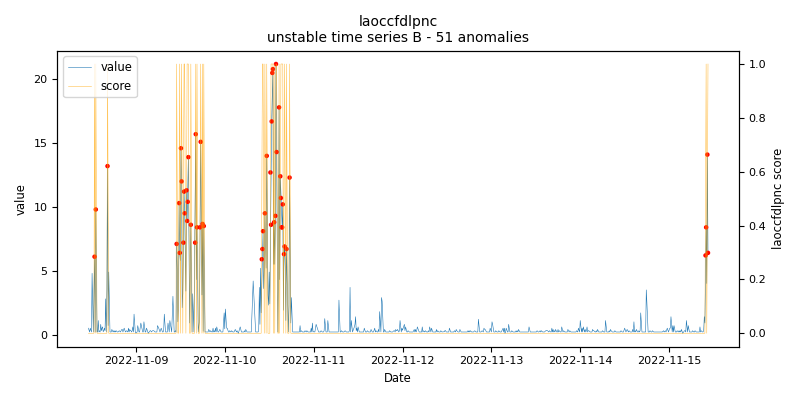
    
    *laoccfdlpnc.unstable.B - runtime: 4.122 seconds*

    *skyline_laoccfdlpnc.unstable.B - runtime: 5.914 seconds*
