.. role:: skyblue
.. role:: red

Local Outlier Factor
====================

See the docstrings - https://earthgecko-skyline.readthedocs.io/en/latest/skyline.custom_algorithms.html#module-custom_algorithms.lof

See the custom_algorithm source - https://github.com/earthgecko/skyline/blob/master/skyline/custom_algorithms/lof.py

Example analysis output
------------------------

The below graphs show the results of lof run with the default
algorithm_parameters against seasonal, seasonal unstable, stable and unstable
time series.

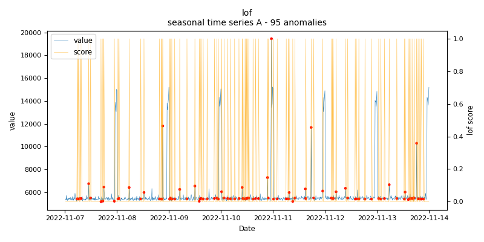
    
    *lof.seasonal.A - runtime: 0.082 seconds*

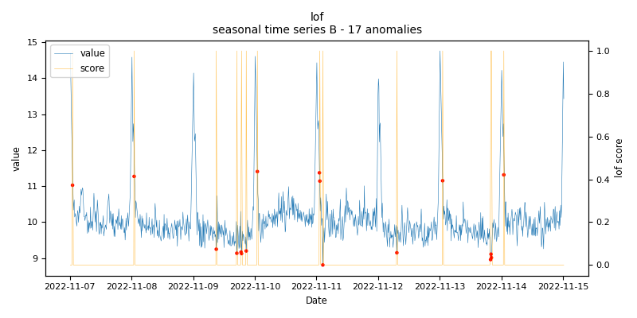
    
    *lof.seasonal.B - runtime: 0.104 seconds*

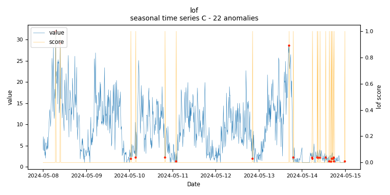
    
    *lof.seasonal.C - runtime: 0.017 seconds*

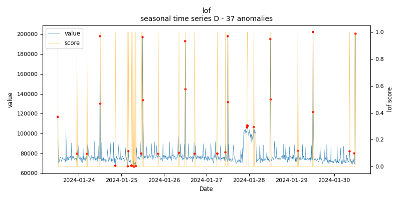
    
    *lof.seasonal.D - runtime: 0.024 seconds*

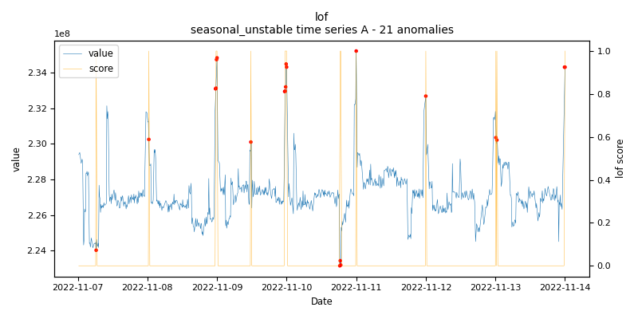
    
    *lof.seasonal_unstable.A - runtime: 0.098 seconds*

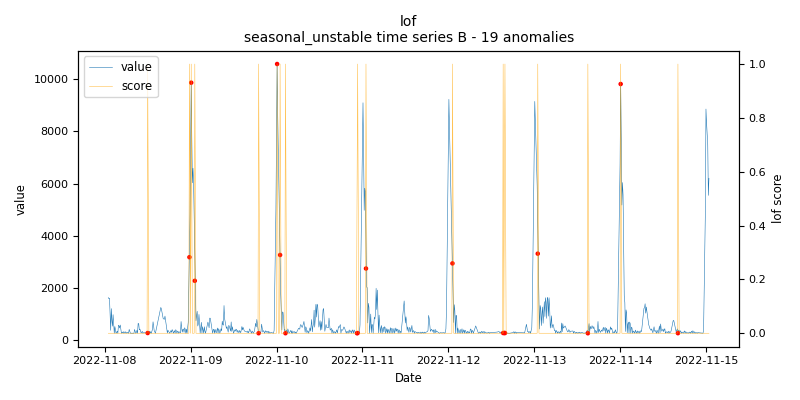
    
    *lof.seasonal_unstable.B - runtime: 0.037 seconds*

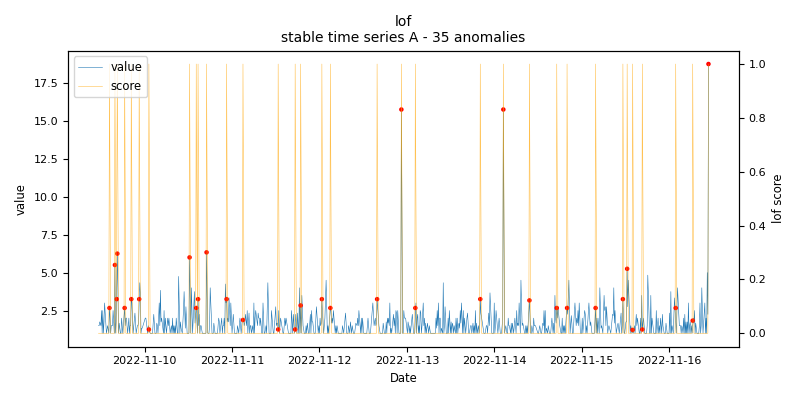
    
    *lof.stable.A - runtime: 0.018 seconds*

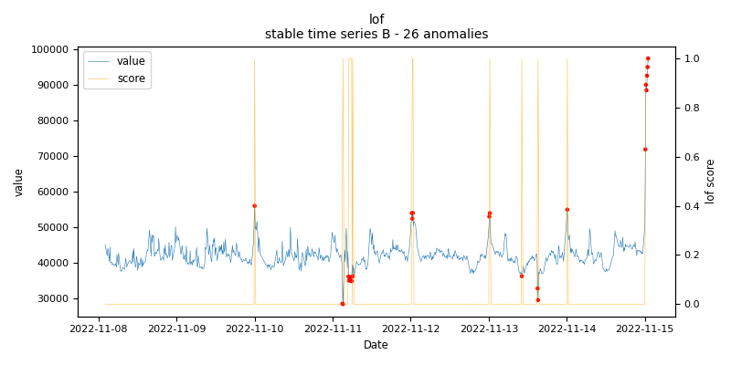
    
    *lof.stable.B - runtime: 0.018 seconds*

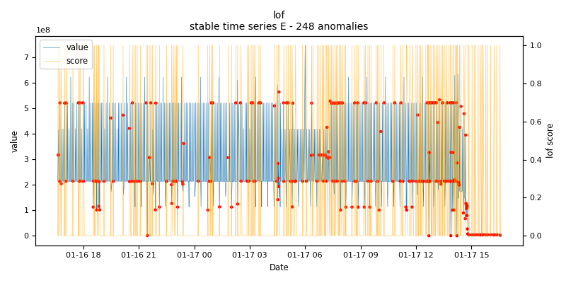
    
    *lof.stable.E - runtime: 0.075 seconds*

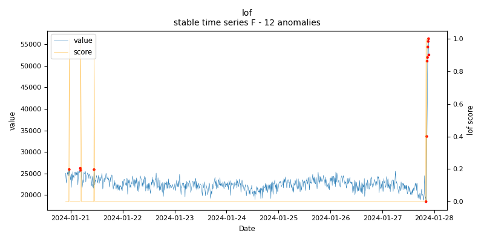
    
    *lof.stable.F - runtime: 0.032 seconds*

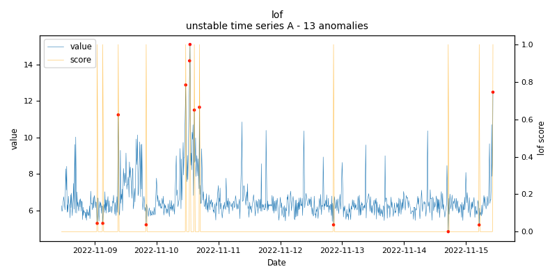
    
    *lof.unstable.A - runtime: 0.092 seconds*

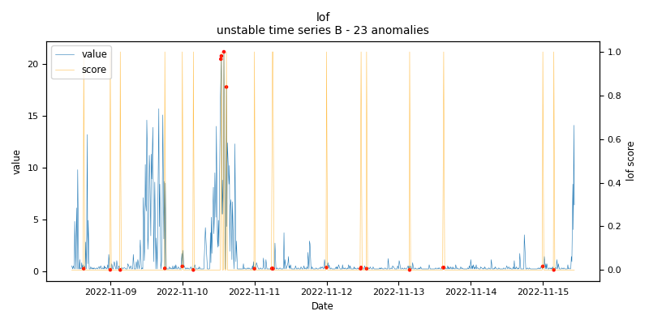
    
    *lof.unstable.B - runtime: 0.102 seconds*