.. role:: skyblue
.. role:: red

macd
====

Outlier detection for time series data using Moving Average
Convergence/Divergence

See the docstrings - https://earthgecko-skyline.readthedocs.io/en/latest/skyline.custom_algorithms.html#module-custom_algorithms.macd

See the custom_algorithm source - https://github.com/earthgecko/skyline/blob/master/skyline/custom_algorithms/macd.py

Example analysis output
------------------------

The below graphs show the results of macd run with the default
algorithm_parameters against seasonal, seasonal unstable, stable and unstable
time series.

.. note:: This is a changepoint detection algorithm only.

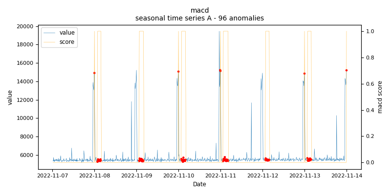
    
    *macd.seasonal.A - runtime: 0.009 seconds*

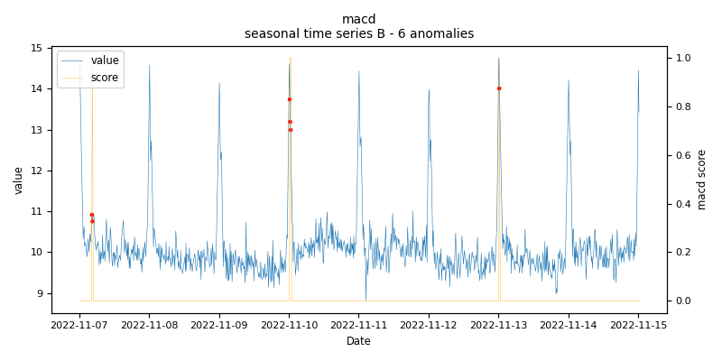
    
    *macd.seasonal.B - runtime: 0.013 seconds*

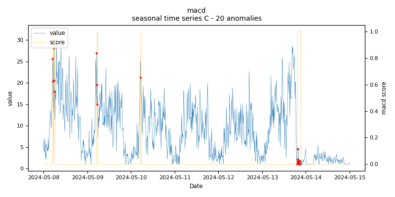
    
    *macd.seasonal.C - runtime: 0.01 seconds*

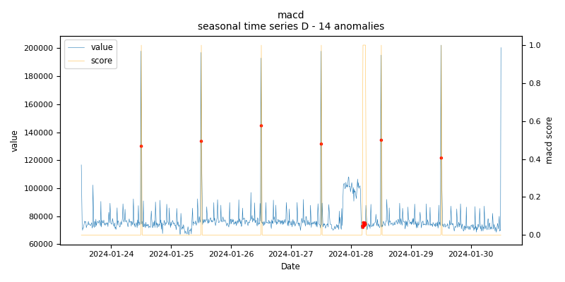
    
    *macd.seasonal.D - runtime: 0.206 seconds*

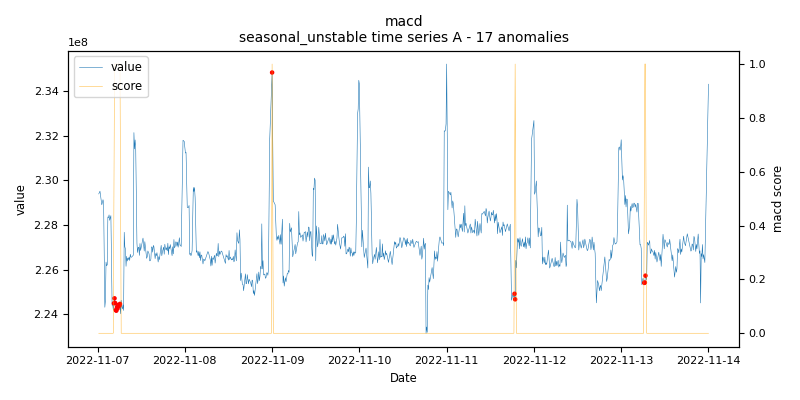
    
    *macd.seasonal_unstable.A - runtime: 0.105 seconds*

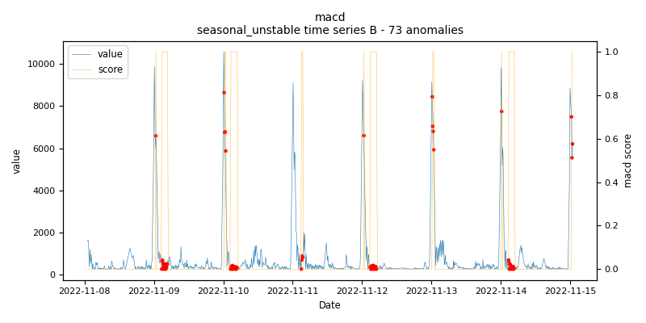
    
    *macd.seasonal_unstable.B - runtime: 0.293 seconds*

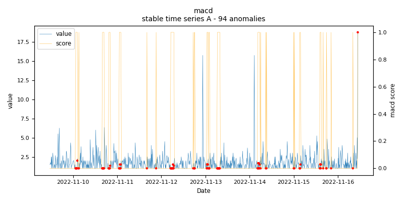
    
    *macd.stable.A - runtime: 0.012 seconds*

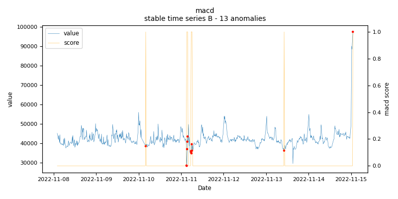
    
    *macd.stable.B - runtime: 0.087 seconds*

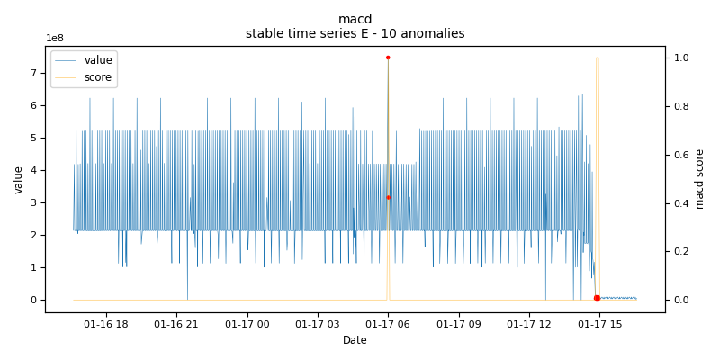
    
    *macd.stable.E - runtime: 0.077 seconds*

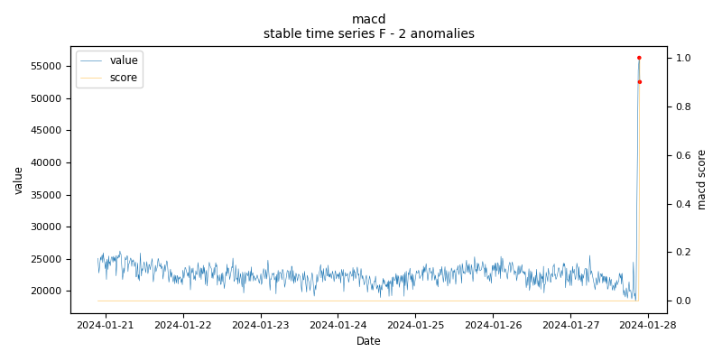
    
    *macd.stable.F - runtime: 0.181 seconds*

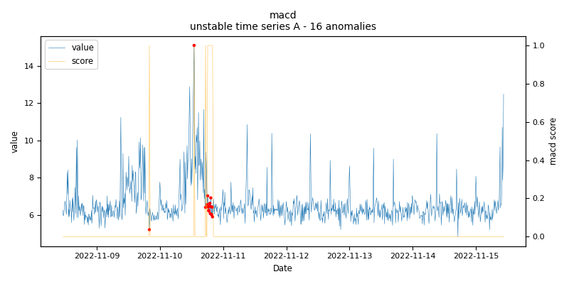
    
    *macd.unstable.A - runtime: 0.103 seconds*

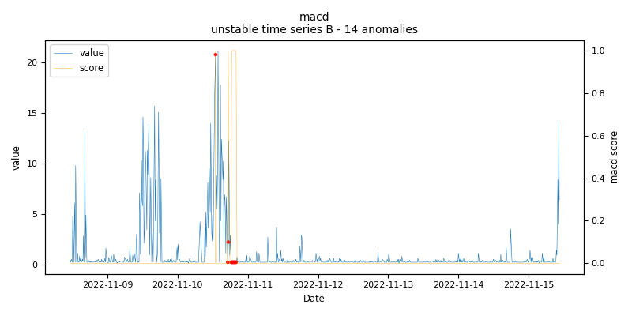
    
    *macd.unstable.B - runtime: 0.185 seconds*