.. role:: skyblue
.. role:: red

MSTL
====

A basic implementation of statsforecast MSTL.

https://github.com/Nixtla/statsforecast

https://nixtlaverse.nixtla.io/statsforecast/docs/models/multipleseasonaltrend.html

This algorithm has a vary variable run time depending on the data.  Not really
suitable for use as real time custom_algorithm to be used with Mirage due to the
vary variable run time.

See the docstrings - https://earthgecko-skyline.readthedocs.io/en/latest/skyline.custom_algorithms.html#module-custom_algorithms.mstl

See the custom_algorithm source - https://github.com/earthgecko/skyline/blob/master/skyline/custom_algorithms/mstl.py

Example analysis output
------------------------

The below graphs show the results of mstl run with the default
algorithm_parameters against seasonal, seasonal unstable, stable and unstable
time series.

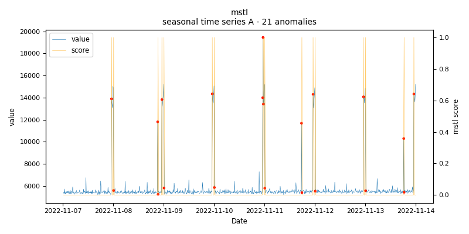
    
    *mstl.seasonal.A - runtime: 3.276 seconds*

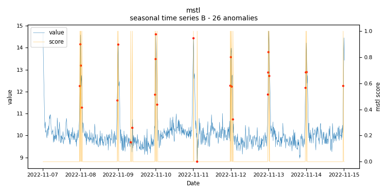
    
    *mstl.seasonal.B - runtime: 4.403 seconds*

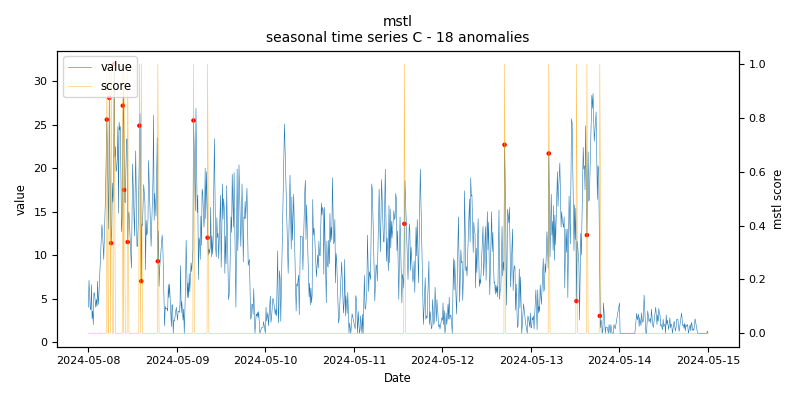
    
    *mstl.seasonal.C - runtime: 3.036 seconds*

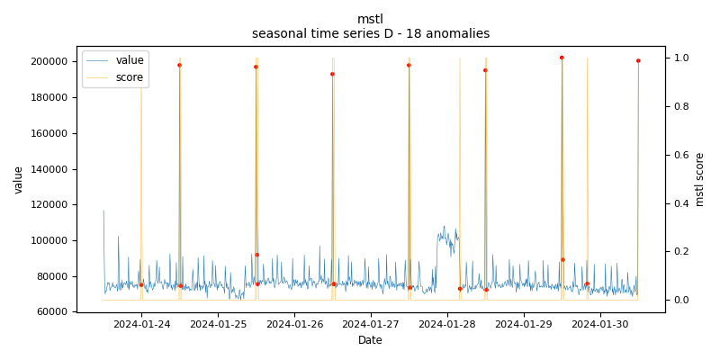
    
    *mstl.seasonal.D - runtime: 8.104 seconds*

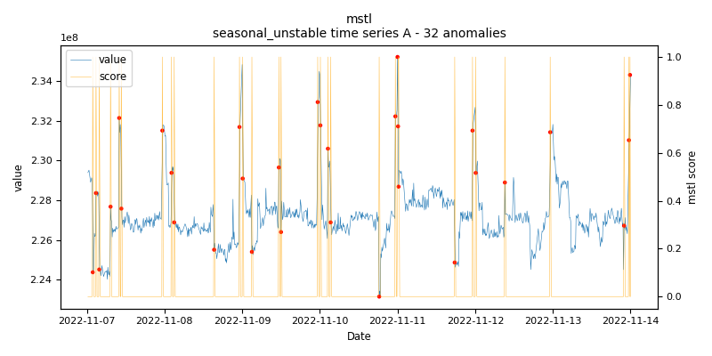
    
    *mstl.seasonal_unstable.A - runtime: 4.364 seconds*

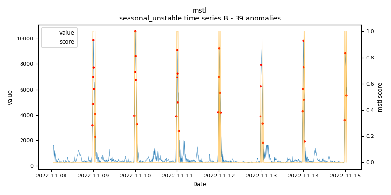
    
    *mstl.seasonal_unstable.B - runtime: 6.889 seconds*

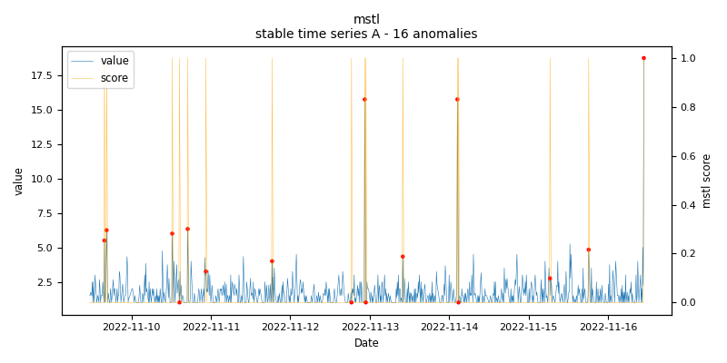
    
    *mstl.stable.A - runtime: 10.858 seconds*

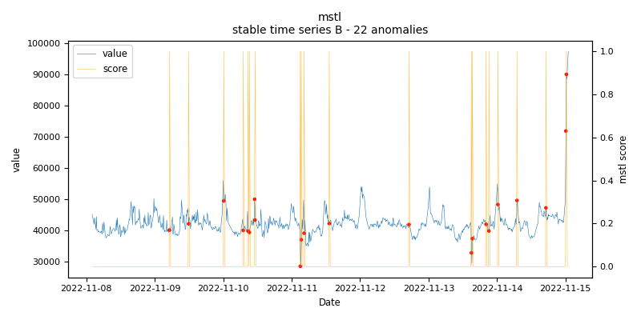
    
    *mstl.stable.B - runtime: 15.602 seconds*

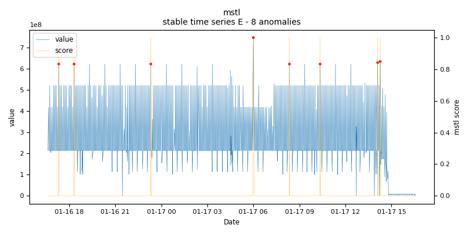
    
    *mstl.stable.E - runtime: 22.005 seconds*

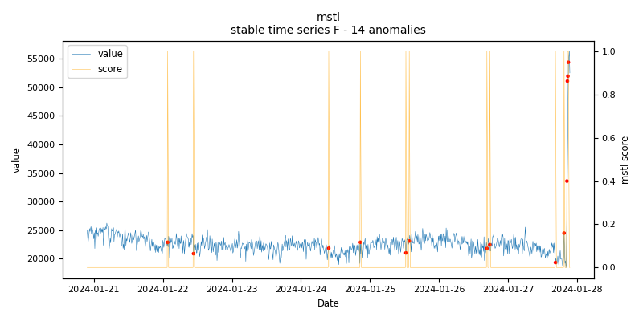
    
    *mstl.stable.F - runtime: 14.815 seconds*

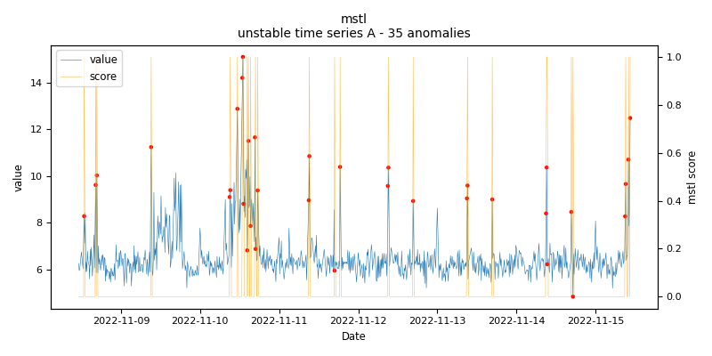
    
    *mstl.unstable.A - runtime: 3.563 seconds*

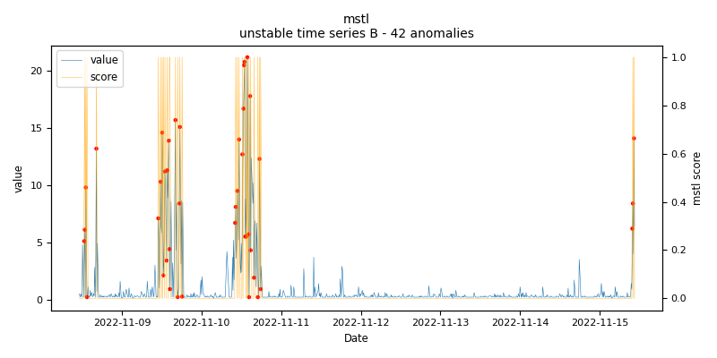
    
    *mstl.unstable.B - runtime: 20.613 seconds*