.. role:: skyblue
.. role:: red

one_class_svm
=============

Outlier detector for time series data using One Class SVM base on the moving
mean and variance, unless the variance is low in which case the standard
deviation will be used in place of variance.  The algorithm parameters to
be concerned with are ``'window'`` which defines the length of sliding
window to use, ``nu`` which defines the percentage that can be considered as
outliers e.g. 0.1 would be 10%.  Do note that if the variance is low each
spike or trough will probably be identified as an outlier.

See the docstrings - https://earthgecko-skyline.readthedocs.io/en/latest/skyline.custom_algorithms.html#module-custom_algorithms.one_class_svm

See the custom_algorithm source - https://github.com/earthgecko/skyline/blob/master/skyline/custom_algorithms/one_class_svm.py

Example analysis output
------------------------

The below graphs show the results of one_class_svm run with the default
algorithm_parameters against seasonal, seasonal unstable, stable and unstable
time series.

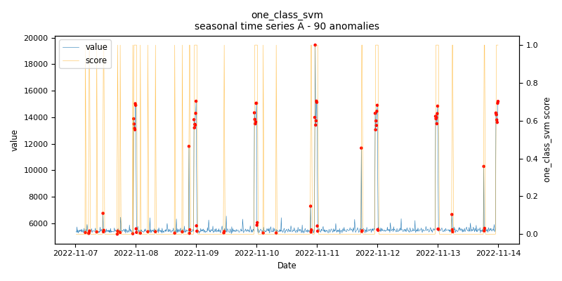
    
    *one_class_svm.seasonal.A - runtime: 0.079 seconds*

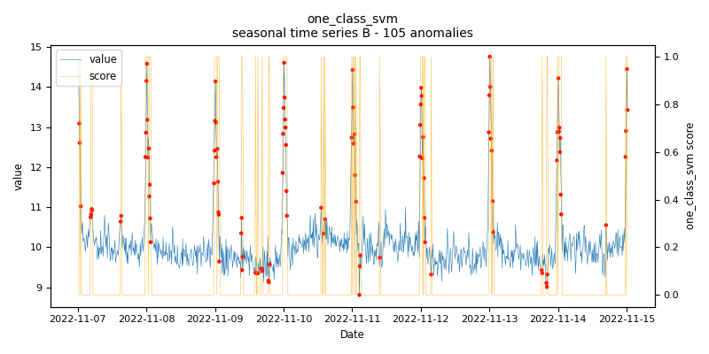
    
    *one_class_svm.seasonal.B - runtime: 0.035 seconds*

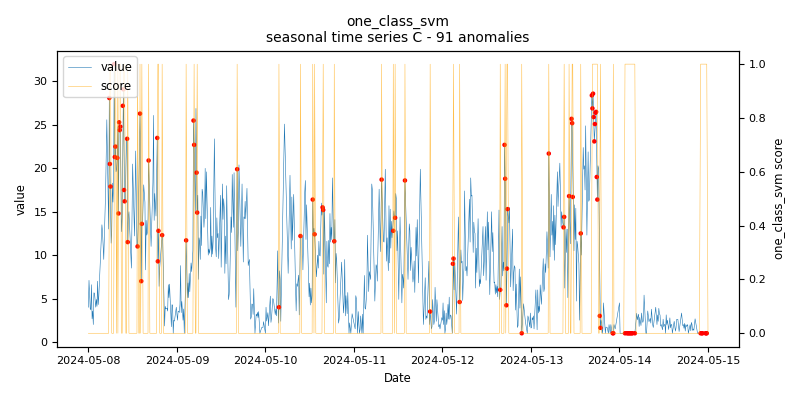
    
    *one_class_svm.seasonal.C - runtime: 0.074 seconds*

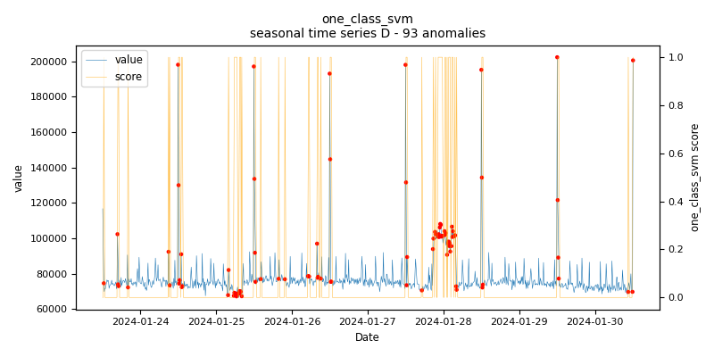
    
    *one_class_svm.seasonal.D - runtime: 0.03 seconds*

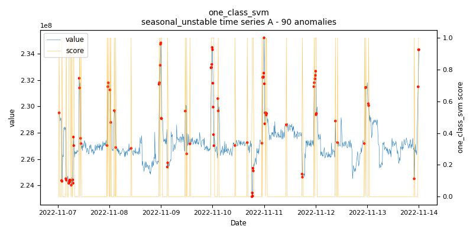
    
    *one_class_svm.seasonal_unstable.A - runtime: 0.082 seconds*

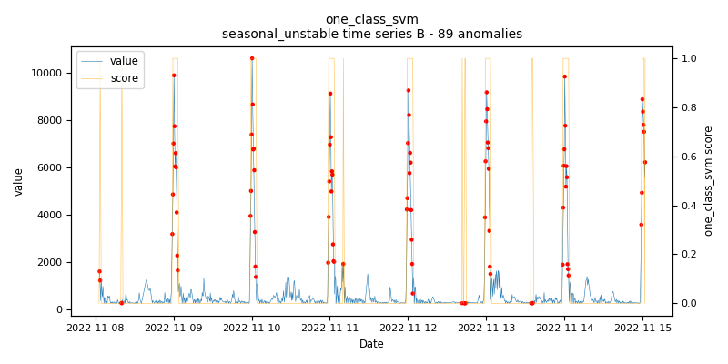
    
    *one_class_svm.seasonal_unstable.B - runtime: 0.077 seconds*

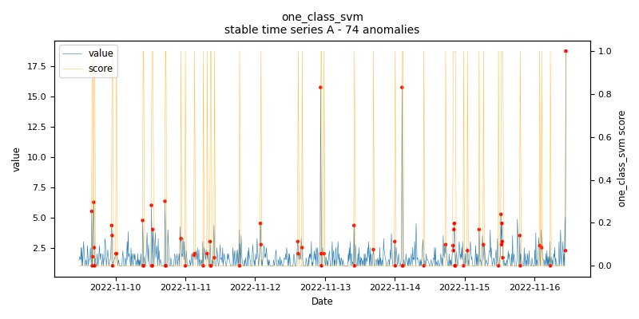
    
    *one_class_svm.stable.A - runtime: 0.097 seconds*

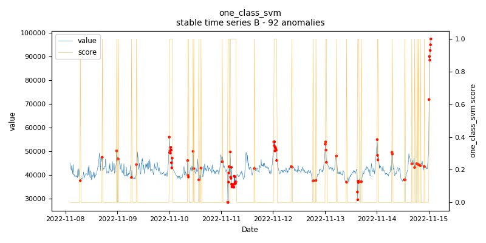
    
    *one_class_svm.stable.B - runtime: 0.034 seconds*

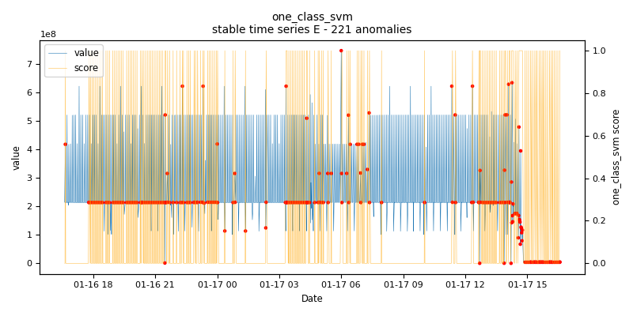
    
    *one_class_svm.stable.E - runtime: 0.072 seconds*

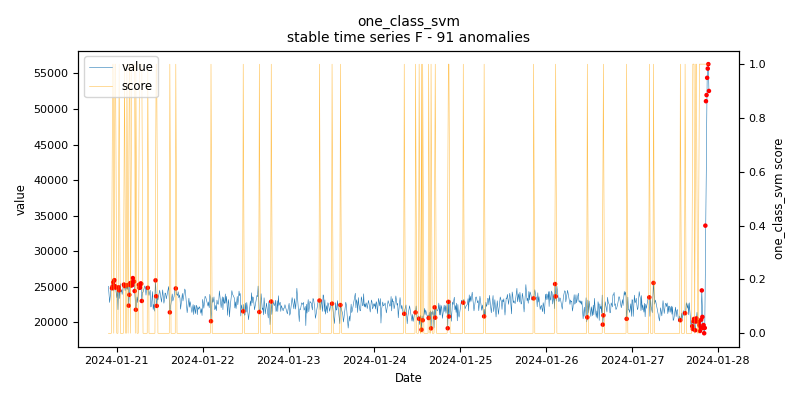
    
    *one_class_svm.stable.F - runtime: 0.027 seconds*

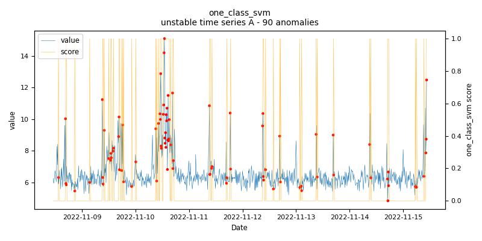
    
    *one_class_svm.unstable.A - runtime: 0.113 seconds*

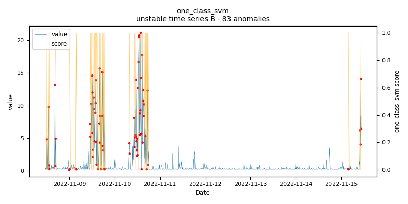
    
    *one_class_svm.unstable.B - runtime: 0.044 seconds*