.. role:: skyblue
.. role:: red

PCA
===

An implementation of PCA based on using the mean and variance features of the
time series based on `@andrewm4894 <https://andrewm4894.com/2021/10/11/time-series-anomaly-detection-using-pca/>`_
`interpretation <https://github.com/andrewm4894/colabs/blob/master/time_series_anomaly_detection_with_pca.ipynb>`_.

See the docstrings - https://earthgecko-skyline.readthedocs.io/en/latest/skyline.custom_algorithms.html#module-custom_algorithms.pca

See the custom_algorithm source - https://github.com/earthgecko/skyline/blob/master/skyline/custom_algorithms/pca.py

Example analysis output
------------------------

The below graphs show the results of pca run with the default
algorithm_parameters against seasonal, seasonal unstable, stable and unstable
time series.

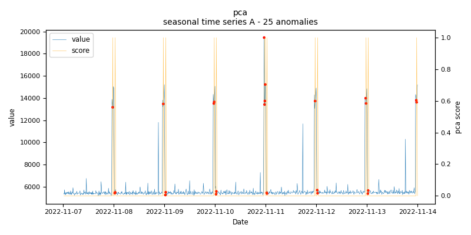
    
    *pca.seasonal.A - runtime: 0.119 seconds*

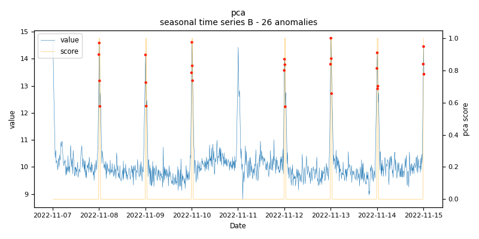
    
    *pca.seasonal.B - runtime: 0.295 seconds*

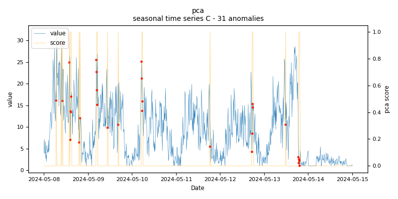
    
    *pca.seasonal.C - runtime: 0.112 seconds*

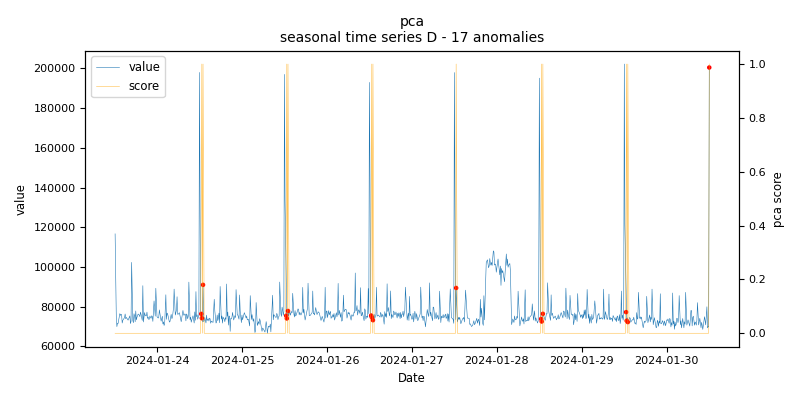
    
    *pca.seasonal.D - runtime: 0.064 seconds*

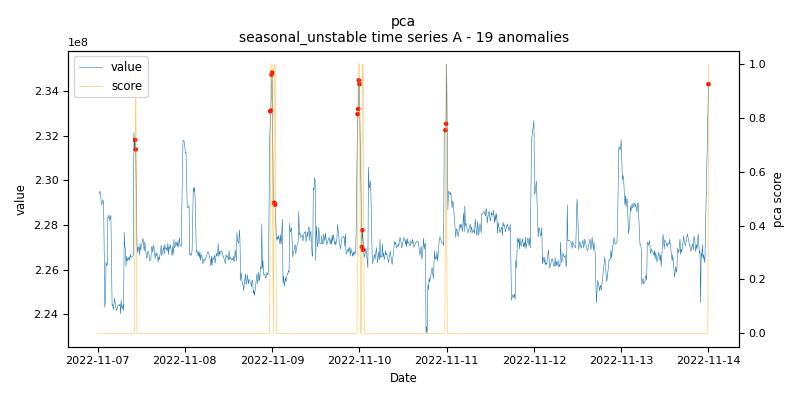
    
    *pca.seasonal_unstable.A - runtime: 0.267 seconds*

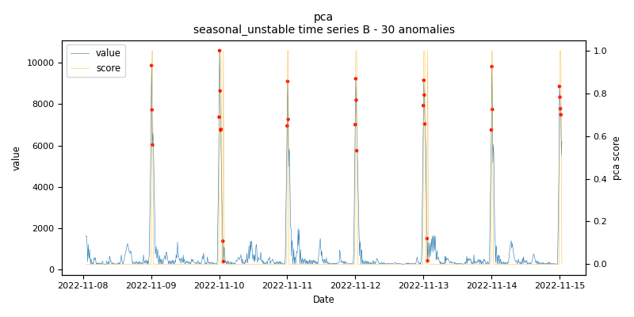
    
    *pca.seasonal_unstable.B - runtime: 0.298 seconds*

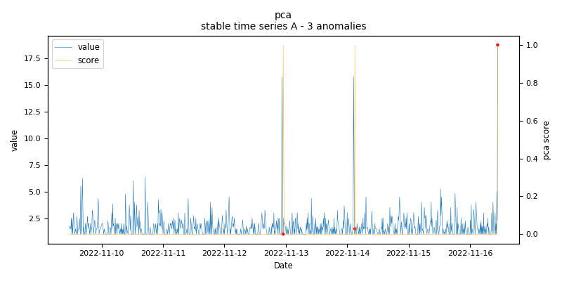
    
    *pca.stable.A - runtime: 0.112 seconds*

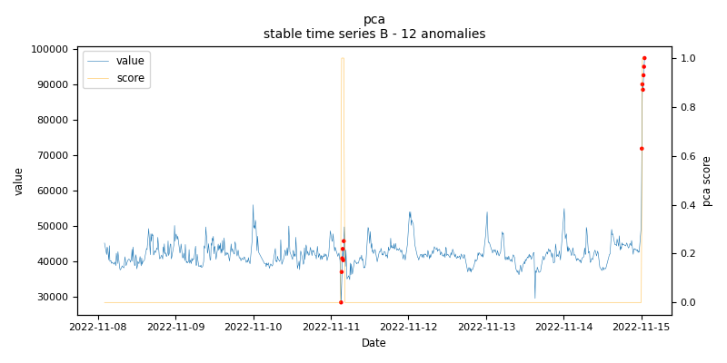
    
    *pca.stable.B - runtime: 0.384 seconds*

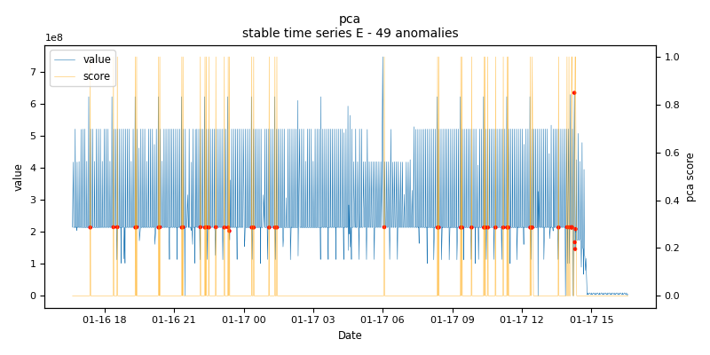
    
    *pca.stable.E - runtime: 0.117 seconds*

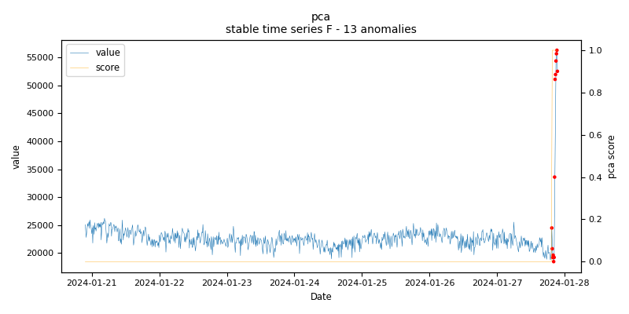
    
    *pca.stable.F - runtime: 0.068 seconds*

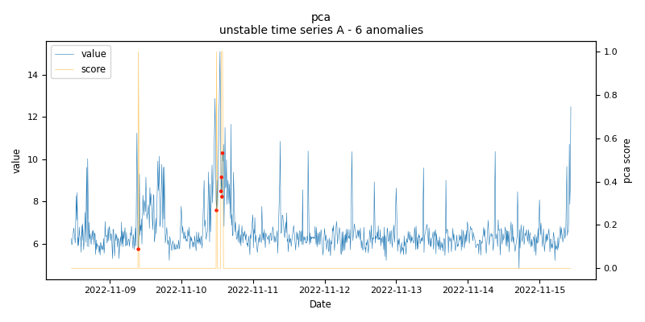
    
    *pca.unstable.A - runtime: 0.919 seconds*

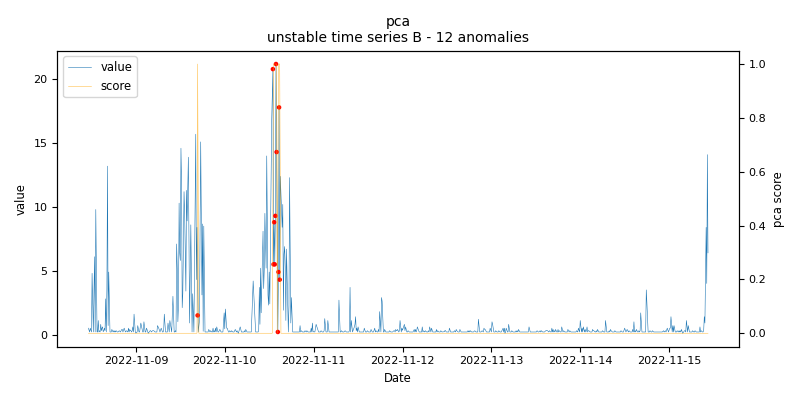
    
    *pca.unstable.B - runtime: 0.303 seconds*