.. role:: skyblue
.. role:: red

===========================================================
probabilistic_forecasts_generalized_pareto_distribution_ets
===========================================================

EXPERIMENTAL

A basic Python implementation of Probabilistic forecasts for anomaly detection
as proposed by Rob J Hyndman - 3 July 2024

https://robjhyndman.com/seminars/isf2024.html International Symposium on Forecasting, Dijon, France

https://raw.githubusercontent.com/robjhyndman/forecast-anomalies-talk/main/forecast_anomalies.pdf

..

    When a forecast is very inaccurate, it is sometimes because a poor
    forecasting model is used, but it can also occur when an unusual observation
    occurs. A good forecasting model can be used to identify anomalies. The
    approach taken is to use a probabilistic forecast, and to compute the
    "density scores" equal to the negative log likelihood of the observations
    based on the forecast distributions. The density scores provide a measure of
    how anomalous each observation is, given the forecast density. A large
    density score indicates that the observation is unlikely, and so is a
    potential anomaly. On the other hand, typical values will have low density
    scores. A Generalized Pareto Distribution is fitted to the largest density
    scores to estimate the probability of each observation being an anomaly.

    This implementation uses statespace ExponentialSmoothing.  Although
    holtwinters ExponentialSmoothing could also be used, a seasonal parameter
    needs to be defined therefore holtwinters ExponentialSmoothing is not suited
    to zero knowledge, unsupervised analysis.  It detects spike peaks and troughs
    really, similar to many other algorithms.

See the docstrings - https://earthgecko-skyline.readthedocs.io/en/latest/skyline.custom_algorithms.html#module-custom_algorithms.probabilistic_forecasts_generalized_pareto_distribution_ets

See the custom_algorithm source - https://github.com/earthgecko/skyline/blob/master/skyline/custom_algorithms/probabilistic_forecasts_generalized_pareto_distribution_ets.py

Example analysis output
------------------------

The below graphs show the results of probabilistic_forecasts_generalized_pareto_distribution_ets run with the default
algorithm_parameters against seasonal, seasonal unstable, stable and unstable
time series.

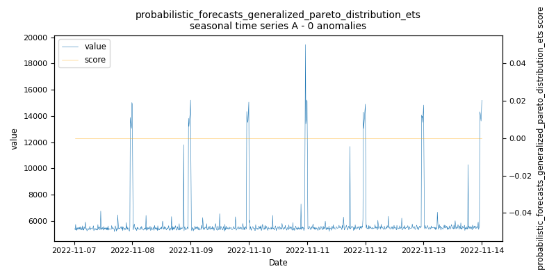
    
    *probabilistic_forecasts_generalized_pareto_distribution_ets.seasonal.A - runtime: 3.395 seconds*

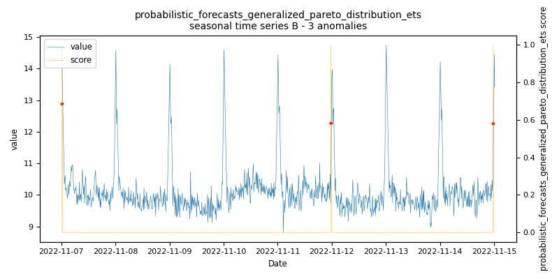
    
    *probabilistic_forecasts_generalized_pareto_distribution_ets.seasonal.B - runtime: 7.5 seconds*

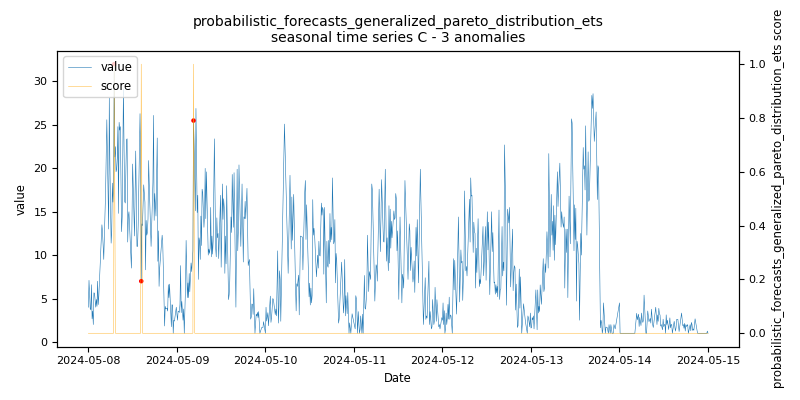
    
    *probabilistic_forecasts_generalized_pareto_distribution_ets.seasonal.C - runtime: 3.099 seconds*

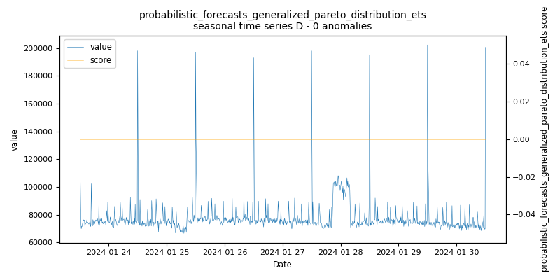
    
    *probabilistic_forecasts_generalized_pareto_distribution_ets.seasonal.D - runtime: 1.109 seconds*

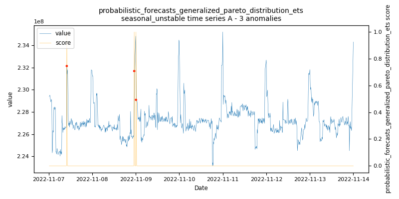
    
    *probabilistic_forecasts_generalized_pareto_distribution_ets.seasonal_unstable.A - runtime: 1.908 seconds*

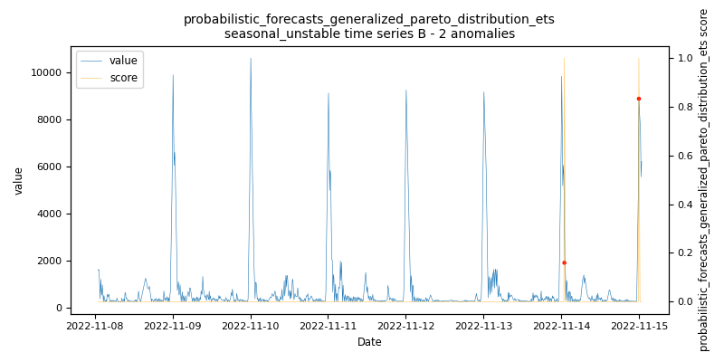
    
    *probabilistic_forecasts_generalized_pareto_distribution_ets.seasonal_unstable.B - runtime: 2.309 seconds*

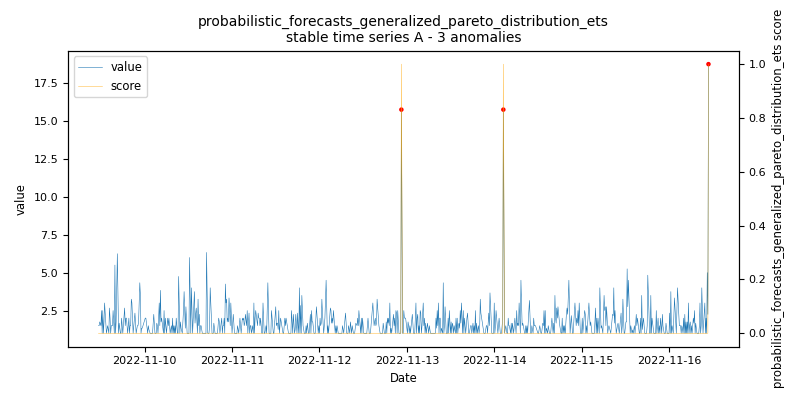
    
    *probabilistic_forecasts_generalized_pareto_distribution_ets.stable.A - runtime: 4.572 seconds*

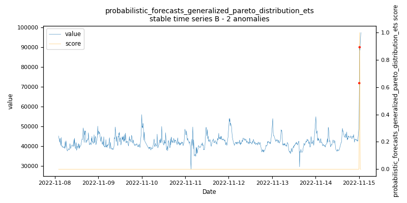
    
    *probabilistic_forecasts_generalized_pareto_distribution_ets.stable.B - runtime: 3.0 seconds*

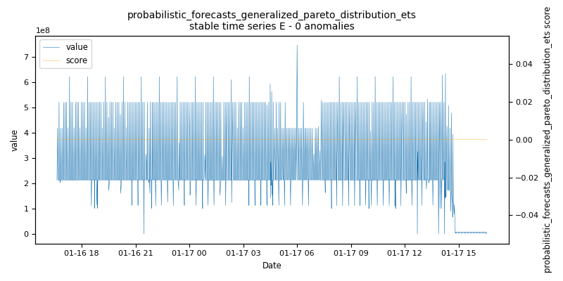
    
    *probabilistic_forecasts_generalized_pareto_distribution_ets.stable.E - runtime: 1.894 seconds*

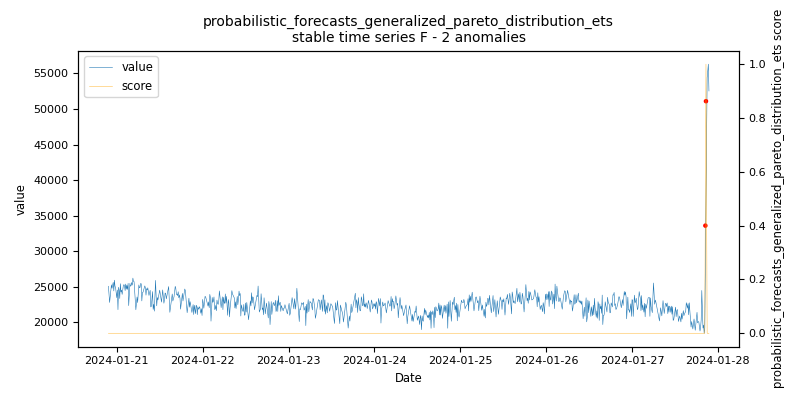
    
    *probabilistic_forecasts_generalized_pareto_distribution_ets.stable.F - runtime: 1.302 seconds*

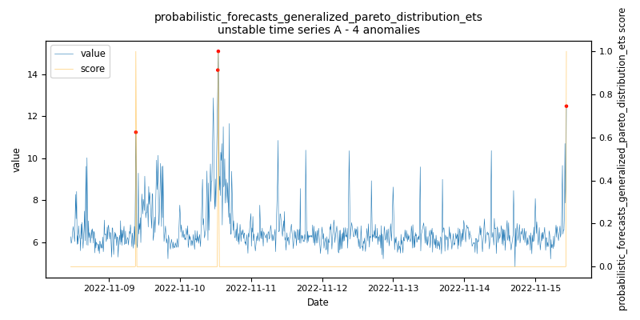
    
    *probabilistic_forecasts_generalized_pareto_distribution_ets.unstable.A - runtime: 8.298 seconds*

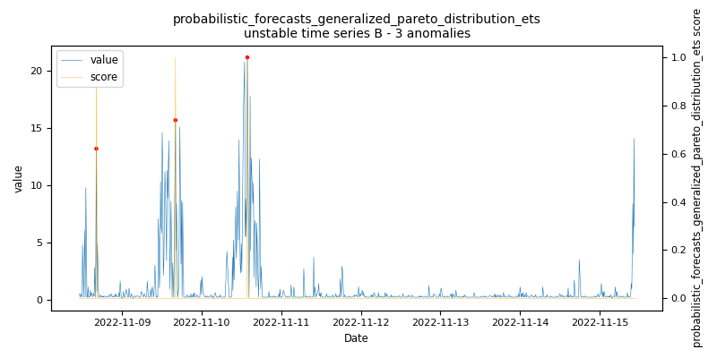
    
    *probabilistic_forecasts_generalized_pareto_distribution_ets.unstable.B - runtime: 2.504 seconds*