.. role:: skyblue
.. role:: red

prophet
=======

Facebook prophet.  Slow not suitable for Analyzer or Mirage takes around 30
seconds to analysis a data set of 1008 data points.

See the docstrings - https://earthgecko-skyline.readthedocs.io/en/latest/skyline.custom_algorithms.html#module-custom_algorithms.specskyline_prophet

See the custom_algorithm source - https://github.com/earthgecko/skyline/blob/master/skyline/custom_algorithms/skyline_prophet.py

Example analysis output
------------------------

The below graphs show the results of prophet run with the default
algorithm_parameters against seasonal, seasonal unstable, stable and unstable
time series.

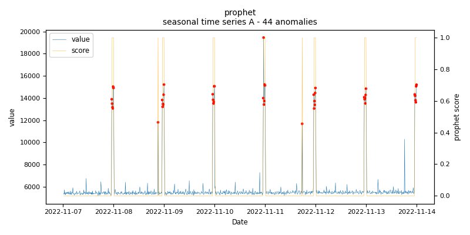
    
    *prophet.seasonal.A - runtime: 1.89 seconds*

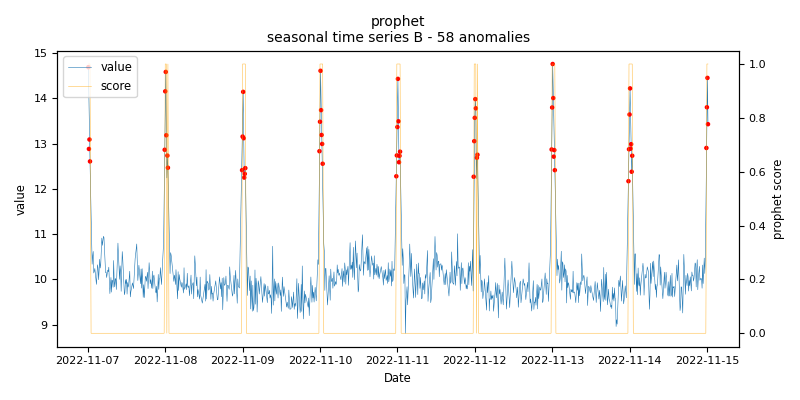
    
    *prophet.seasonal.B - runtime: 0.598 seconds*

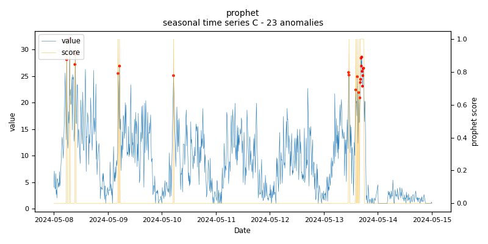
    
    *prophet.seasonal.C - runtime: 0.569 seconds*

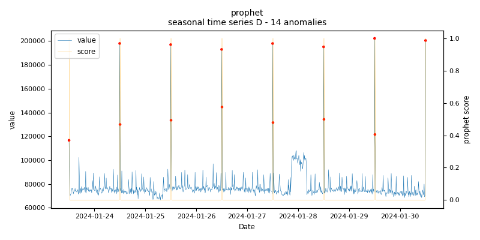
    
    *prophet.seasonal.D - runtime: 0.627 seconds*

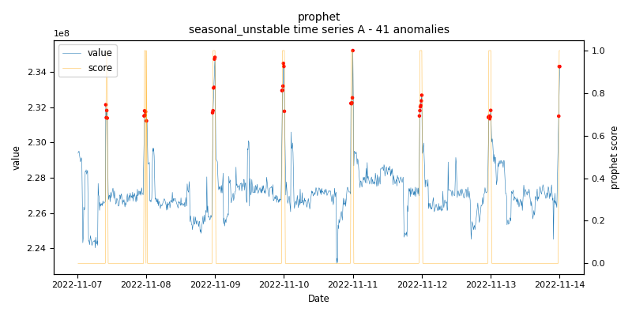
    
    *prophet.seasonal_unstable.A - runtime: 5.198 seconds*

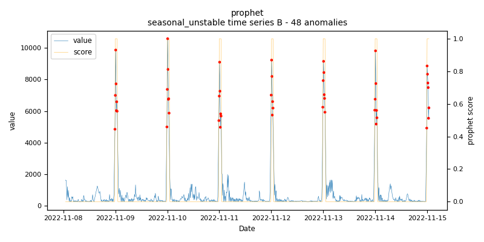
    
    *prophet.seasonal_unstable.B - runtime: 2.1 seconds*

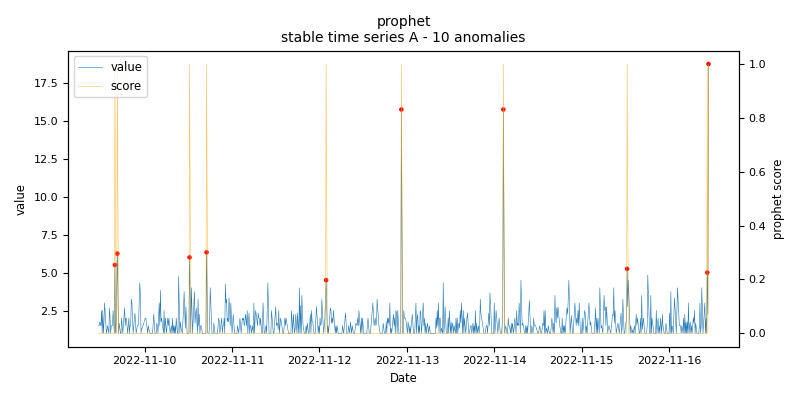
    
    *prophet.stable.A - runtime: 0.551 seconds*

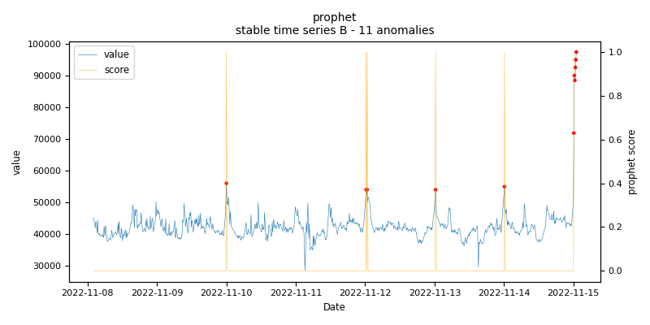
    
    *prophet.stable.B - runtime: 1.129 seconds*

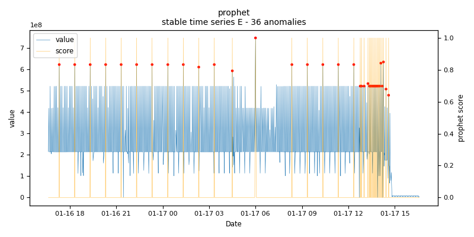
    
    *prophet.stable.E - runtime: 0.693 seconds*

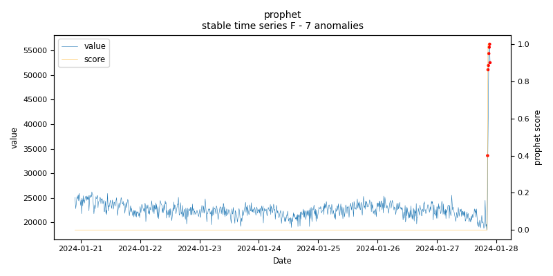
    
    *prophet.stable.F - runtime: 0.518 seconds*

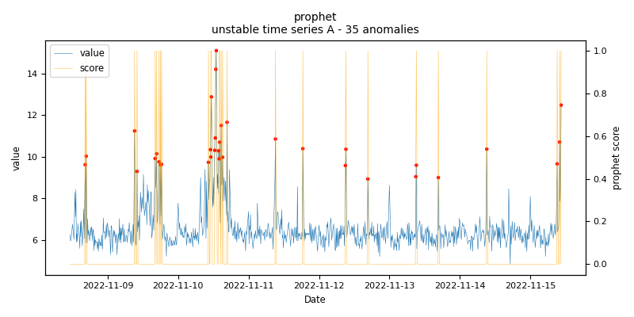
    
    *prophet.unstable.A - runtime: 5.917 seconds*

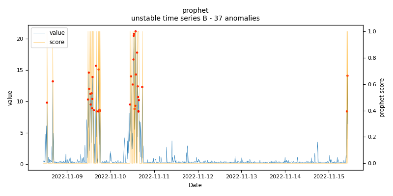
    
    *prophet.unstable.B - runtime: 2.709 seconds*