.. role:: skyblue
.. role:: red

=====
sigma
=====

This is an implementation of the original Skyline 3sigma algorithms as a single
custom algorithm.  It has been extended to allow for the sigma value to be
passed as a parameter.

The algorithm is a fast, unsupervised, ensemble based algorithm which mostly
uses "features" (statistical control processes) to determine if the latest data
point is 3 standard deviations from the control.  If :mod:`settings.CONSENSUS`
of these checks trigger the data point is considered to be anomalous.

Uses:
- histogram_bins
- first_hour_average
- stddev_from_average
- grubbs
- ks_test
- mean_subtraction_cumulation
- median_absolute_deviation
- stddev_from_moving_average
- least_squares

The algorithm is heavily optimised for performance with a number of methods
having the functions converted into numba jit implementations.

See the docstrings - https://earthgecko-skyline.readthedocs.io/en/latest/skyline.analyzer.html#module-analyzer.algorithms

See the custom_algorithm source:

- https://github.com/earthgecko/skyline/blob/master/skyline/custom_algorithms/sigma.py
- https://github.com/earthgecko/skyline/blob/master/skyline/custom_algorithm_sources/sigma/sigma.py

Example analysis output
------------------------

The below graphs show the results of sigma run with the default
algorithm_parameters against seasonal, seasonal unstable, stable and unstable
time series.

.. note:: when ``sigma`` is run adhoc it is not run in a oneshot manner, it is
    run in a hill climbing manner, each data point being added to a time series
    and then the algorithms run over each time series to determine whether the
    last data point in that time series is anomalous.

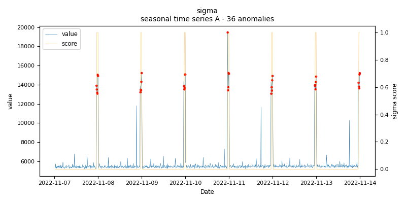
    
    *sigma.seasonal.A - runtime: 0.0035 seconds (total: 3.544 seconds)*

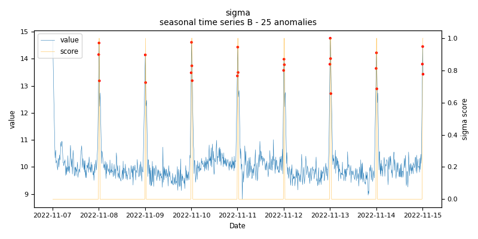
    
    *sigma.seasonal.B - runtime: 0.0178 seconds (total: 17.976 seconds)*

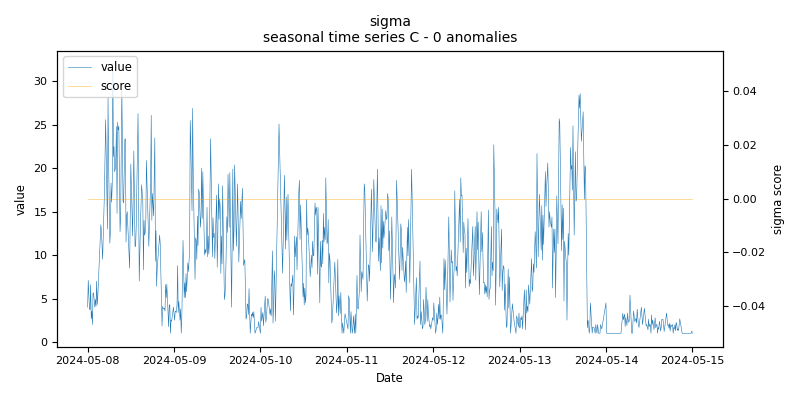
    
    *sigma.seasonal.C - runtime: 0.0135 seconds (total: 13.596 seconds)*

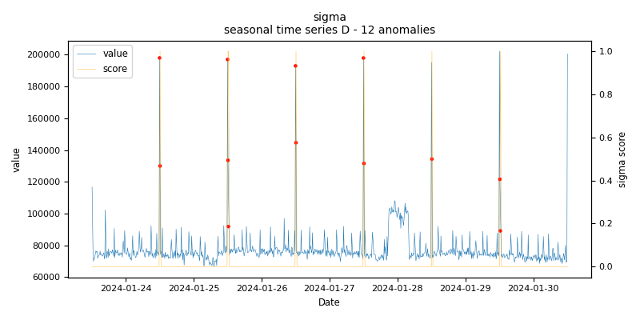
    
    *sigma.seasonal.D - runtime: 0.0092 seconds (total: 9.324 seconds)*

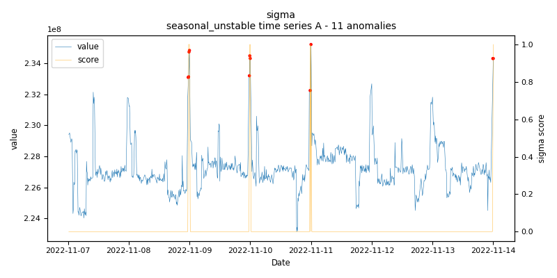
    
    *sigma.seasonal_unstable.A - runtime: 0.0042 seconds (total: 4.215 seconds)*

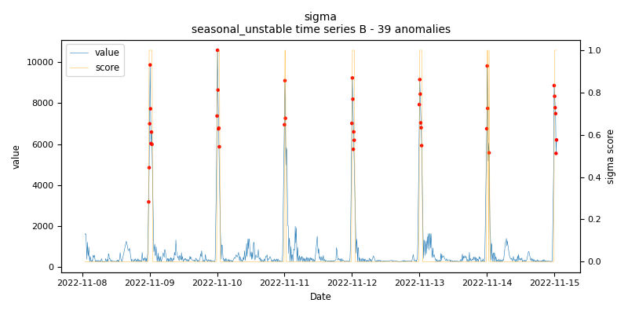
    
    *sigma.seasonal_unstable.B - runtime: 0.015 seconds (total: 15.121 seconds)*

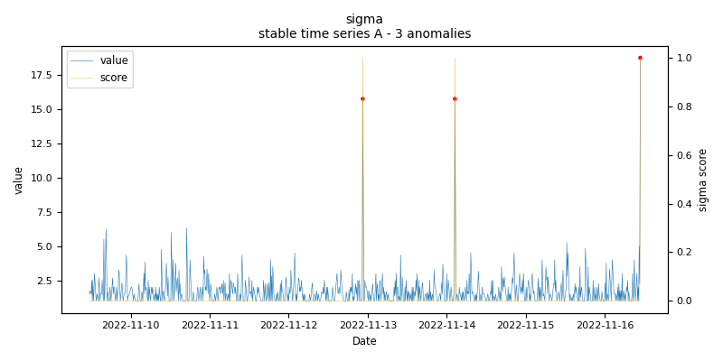
    
    *sigma.stable.A - runtime: 0.0043 seconds (total: 4.354 seconds)*

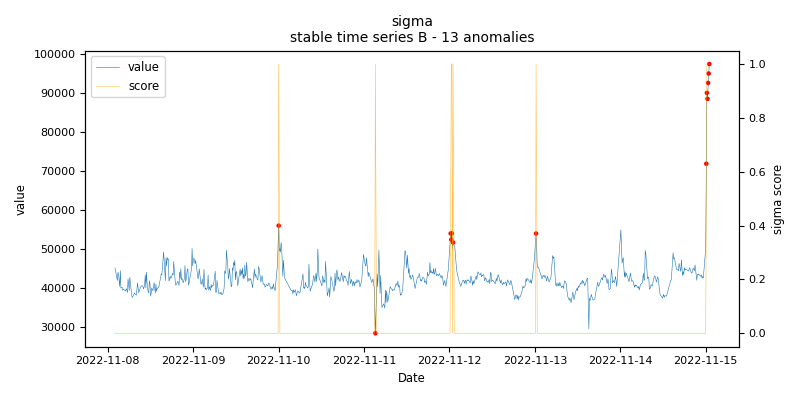
    
    *sigma.stable.B - runtime: 0.0104 seconds (total: 10.477 seconds)*

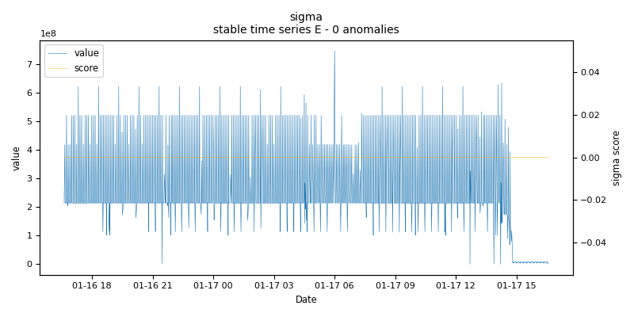
    
    *sigma.stable.E - runtime: 0.0174 seconds (total: 17.491 seconds)*

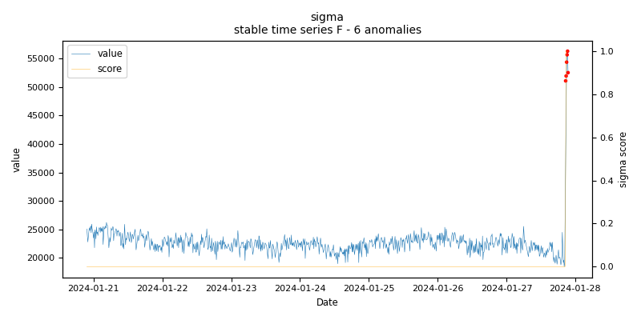
    
    *sigma.stable.F - runtime: 0.0147 seconds (total: 14.824 seconds)*

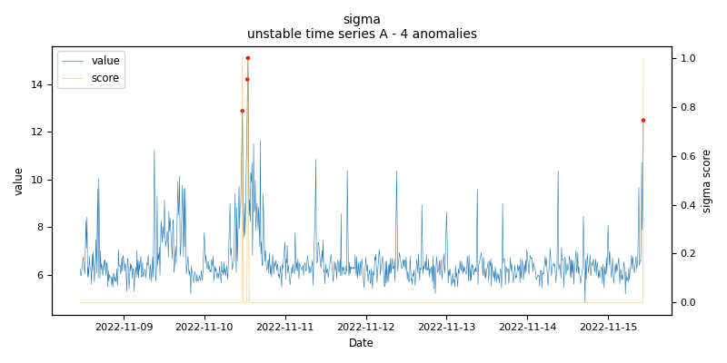
    
    *sigma.unstable.A - runtime: 0.0061 seconds (total: 6.148 seconds)*

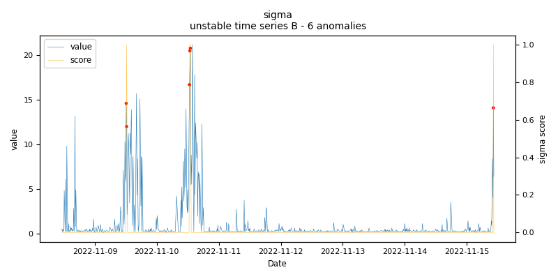
    
    *sigma.unstable.B - runtime: 0.0103 seconds (total: 10.402 seconds)*