.. role:: skyblue
.. role:: red

spectral_entropy
================

Outlier detection for time-series data using Spectral Entropy.

This implementation uses the antropy spectral_residual implementation based on
a variation of Ning Jia's (ningja1)
`interpretation <https://gist.githubusercontent.com/ningja1/4cce99b29657bb19079faf3b2a550639/raw/c8b0b77c154d48328c94fd449d015950c53aefa4/spectral_entropy.py>`_.

See the docstrings - https://earthgecko-skyline.readthedocs.io/en/latest/skyline.custom_algorithms.html#module-custom_algorithms.spectral_entropy

See the custom_algorithm source - https://github.com/earthgecko/skyline/blob/master/skyline/custom_algorithms/spectral_entropy.py

Example analysis output
------------------------

The below graphs show the results of spectral_entropy run with the default
algorithm_parameters against seasonal, seasonal unstable, stable and unstable
time series.

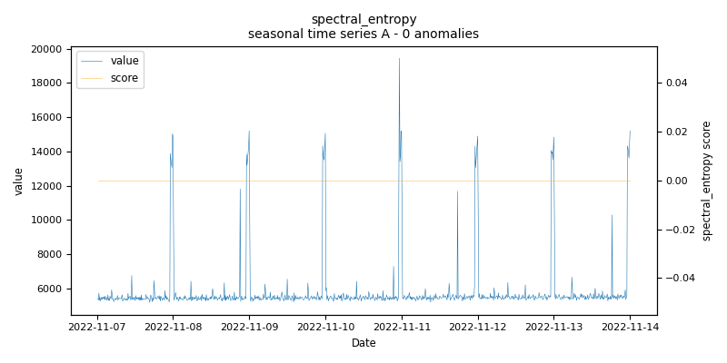
    
    *spectral_entropy.seasonal.A - runtime: 5.287 seconds*

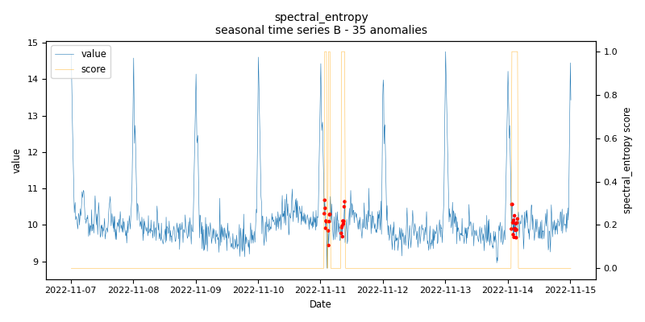
    
    *spectral_entropy.seasonal.B - runtime: 0.857 seconds*

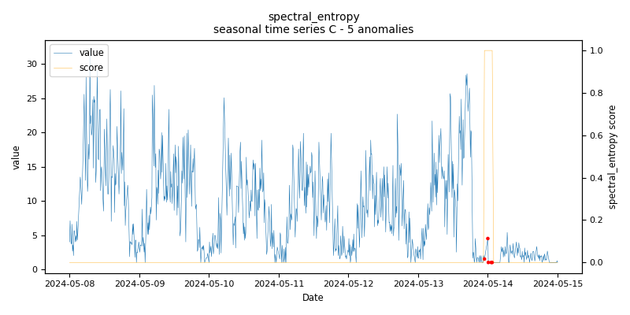
    
    *spectral_entropy.seasonal.C - runtime: 0.66 seconds*

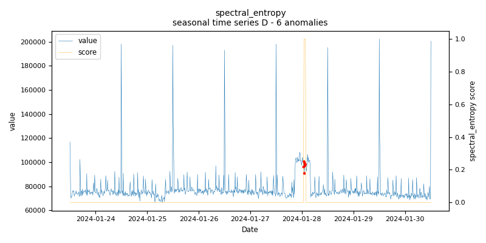
    
    *spectral_entropy.seasonal.D - runtime: 0.863 seconds*

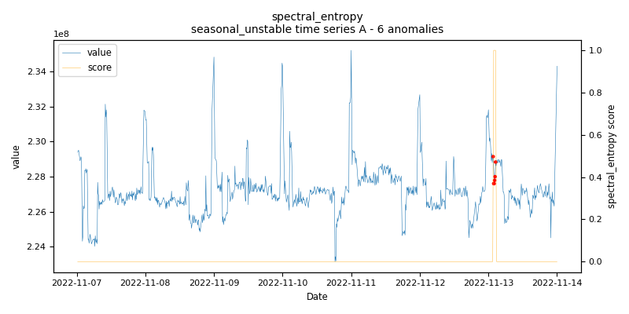
    
    *spectral_entropy.seasonal_unstable.A - runtime: 3.607 seconds*

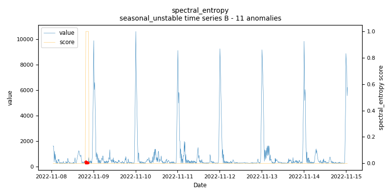
    
    *spectral_entropy.seasonal_unstable.B - runtime: 2.301 seconds*

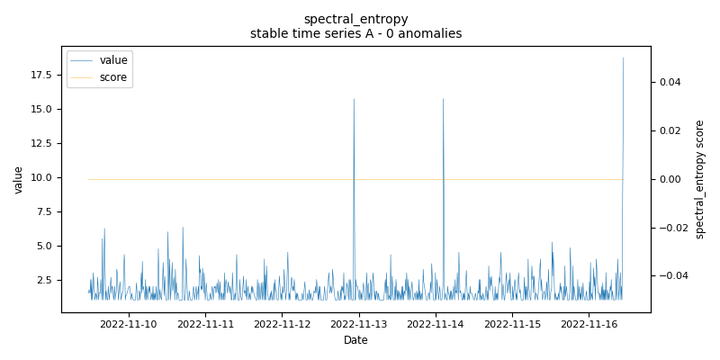
    
    *spectral_entropy.stable.A - runtime: 0.631 seconds*

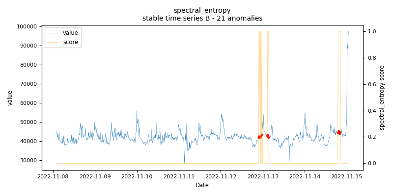
    
    *spectral_entropy.stable.B - runtime: 0.584 seconds*

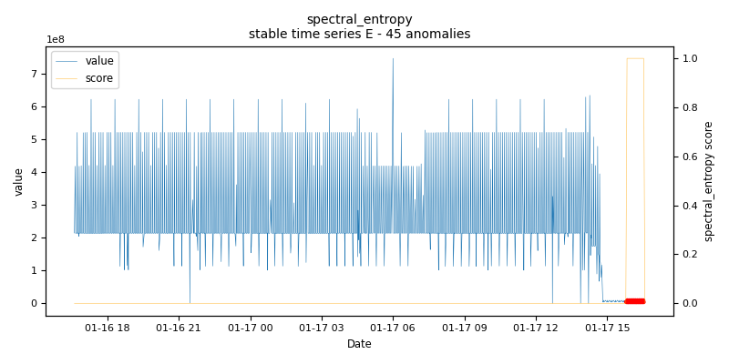
    
    *spectral_entropy.stable.E - runtime: 1.342 seconds*

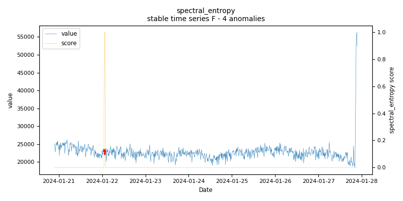
    
    *spectral_entropy.stable.F - runtime: 0.726 seconds*

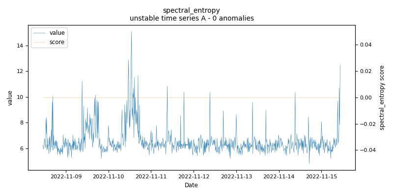
    
    *spectral_entropy.unstable.A - runtime: 3.98 seconds*

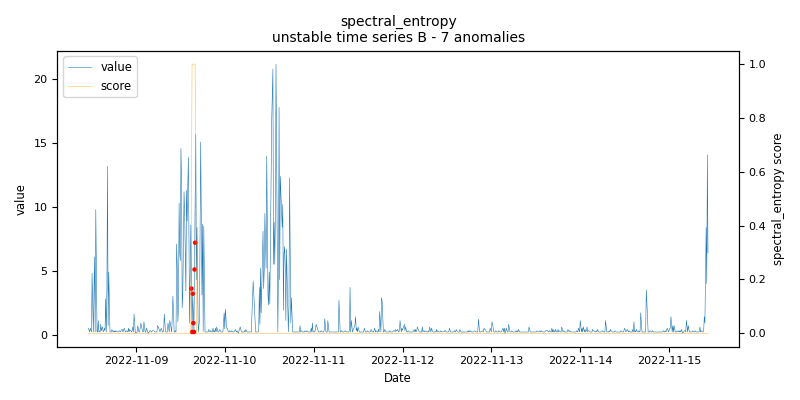
    
    *spectral_entropy.unstable.B - runtime: 0.948 seconds*