.. role:: skyblue
.. role:: red

spectral_residual
=================

Outlier detector for time-series data using the spectral residual algorithm.
Based on the
`alibi-detect implementation <https://github.com/SeldonIO/alibi-detect/blob/81486cd48b19e4adbb2c5b9d27e0fb601f4a5d41/alibi_detect/od/sr.py>`_ of

Time-Series Anomaly Detection Service at Microsoft (Ren et al., 2019) https://arxiv.org/abs/1906.03821

For Mirage this algorithm is FAST

For Analyzer this algorithm is SLOW

Although this algorithm is fast, it is not fast enough to be run in Analyzer,
even if only deployed against a subset of metrics.  In testing spectral_residual
took between 0.134828 and 0.698201 seconds to run per metrics, which is much too
long for Analyzer.

See the docstrings - https://earthgecko-skyline.readthedocs.io/en/latest/skyline.custom_algorithms.html#module-custom_algorithms.spectral_residual

See the custom_algorithms source - https://github.com/earthgecko/skyline/blob/master/skyline/custom_algorithms/spectral_residual.py

See the custom_algorithm_sources - https://github.com/earthgecko/skyline/blob/master/skyline/custom_algorithm_sources/spectral_residual/spectral_residual.py

Example analysis output
------------------------

The below graphs show the results of spectral_residual run with the default
algorithm_parameters against seasonal, seasonal unstable, stable and unstable
time series.

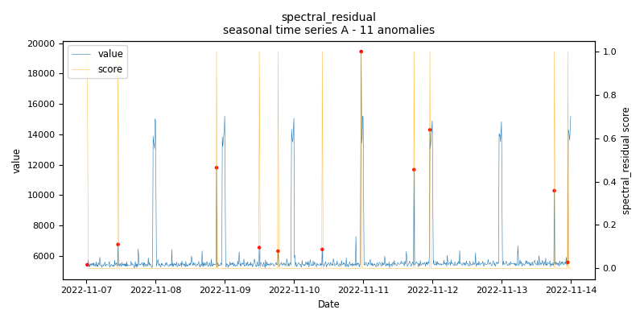
    
    *spectral_residual.seasonal.A - runtime: 0.084 seconds*

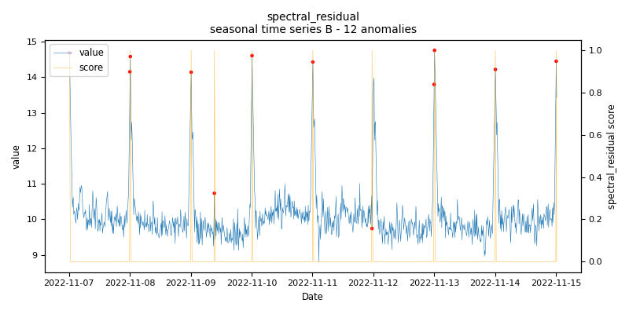
    
    *spectral_residual.seasonal.B - runtime: 0.01 seconds*

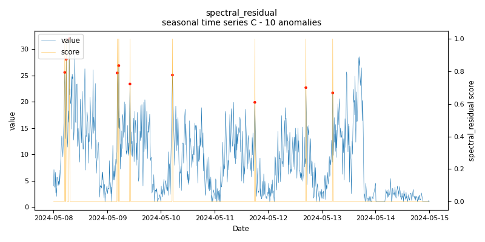
    
    *spectral_residual.seasonal.C - runtime: 0.011 seconds*

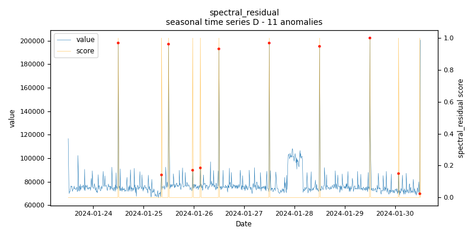
    
    *spectral_residual.seasonal.D - runtime: 0.082 seconds*

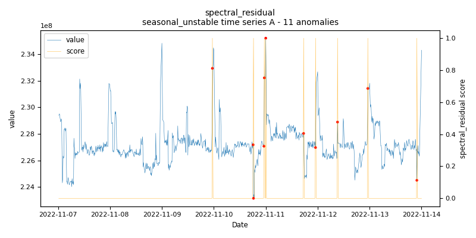
    
    *spectral_residual.seasonal_unstable.A - runtime: 0.193 seconds*

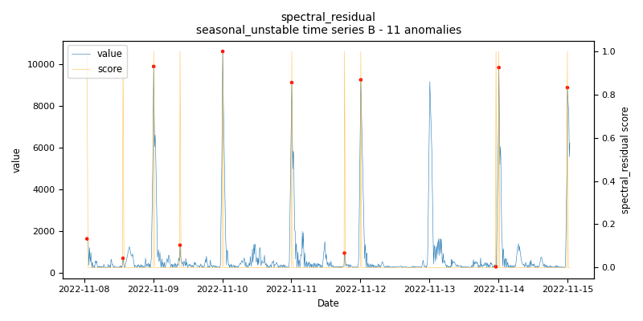
    
    *spectral_residual.seasonal_unstable.B - runtime: 0.01 seconds*

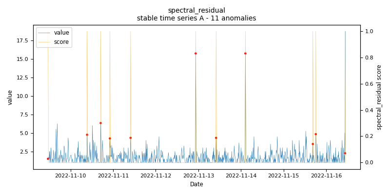
    
    *spectral_residual.stable.A - runtime: 0.027 seconds*

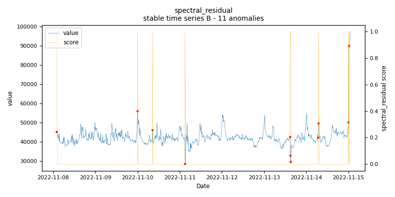
    
    *spectral_residual.stable.B - runtime: 0.021 seconds*

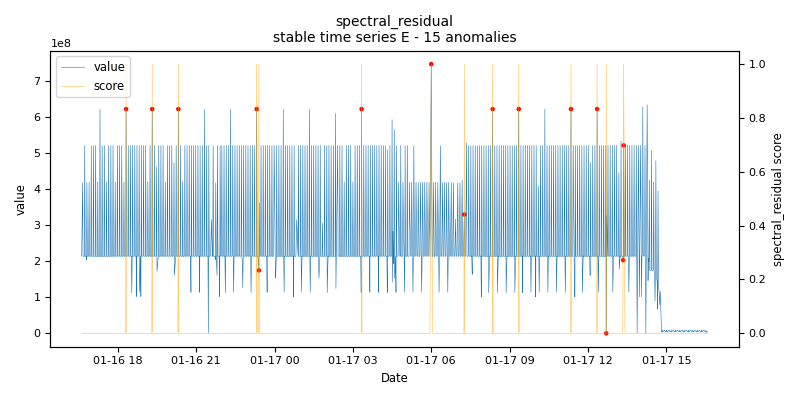
    
    *spectral_residual.stable.E - runtime: 0.015 seconds*

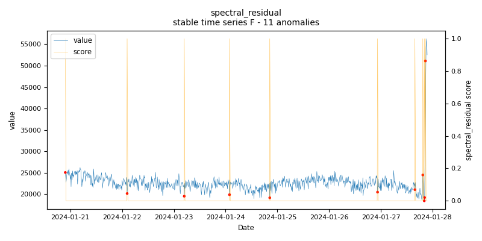
    
    *spectral_residual.stable.F - runtime: 0.488 seconds*

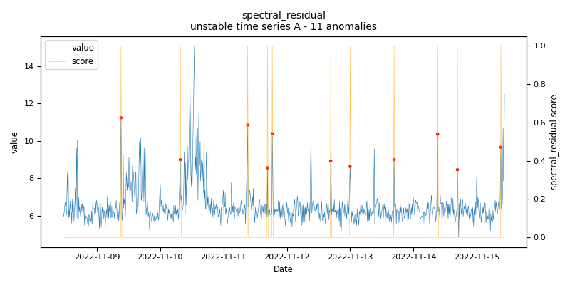
    
    *spectral_residual.unstable.A - runtime: 0.2 seconds*

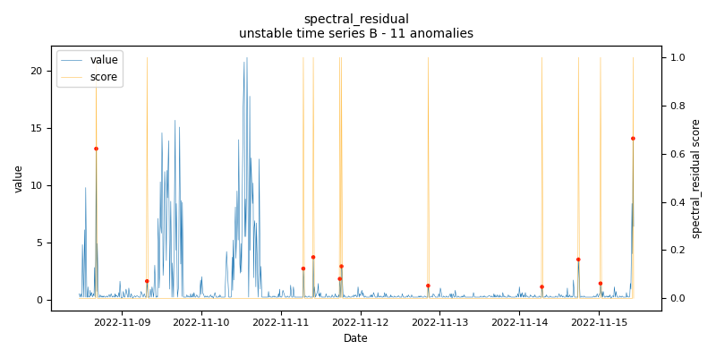
    
    *spectral_residual.unstable.B - runtime: 0.028 seconds*
