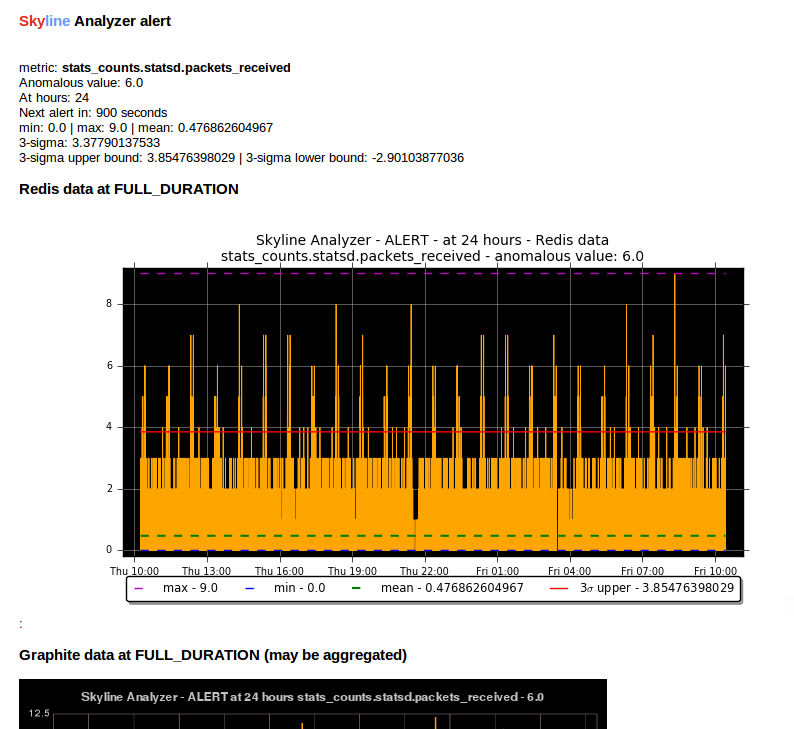

========
Analyzer
========

The Analyzer service is responsible for analyzing collected data. It has
a very simple divide-and-conquer strategy. It first checks Redis to get
the total number of metrics stored, and then it fires up a number of
processes equal to :mod:`settings.ANALYZER_PROCESSES`, assigning each
processes a number of metrics. Analyzing a metric is a very
CPU-intensive process, because each time series must be decoded from
Messagepack and then run through the algorithms.  Analyzer also routes
metric checks to other services (Mirage, Panorama and Ionosphere) for
further analysis or recording an anomaly event, as appropriately, more on that
later.

Due to Analyzer being one of the most CPU-intensive Skyline process, it is
advisable to set :mod:`settings.ANALYZER_PROCESSES` to about the number of cores
you have - leaving a few for the Skyline services and Redis.

The original documentation and settings for skyline were based on:

    a flow of about 5k metrics coming in every second on average (with
    250k distinct metrics). We use a 32 core Sandy Bridge box, with 64
    gb of memory. We experience bursts of up to 70k TPS on Redis

Skyline runs OK on much less. It can handle ~45000 metrics per minute on
a 4 vCore, 4GB RAM cloud SSD server, even before the introduction of the
:mod:`settings.RUN_OPTIMIZED_WORKFLOW` methodology.

Do read the notes in ``settings.py`` related to the
:mod:`settings.ANALYZER_PROCESSES` :mod:`settings.ANALYZER_OPTIMUM_RUN_DURATION`
if you are only processing a few 1000 metrics with a data point every minute
then the optimum settings will most likely be something similar to:

::

    ANALYZER_PROCESSES = 1
    ANALYZER_OPTIMUM_RUN_DURATION = 60

Python multiprocessing is not very efficient if it is not needed, in fact
the overall overhead of the spawned processes ends up greater than the
overhead of processing with a single process.

See `Optimizations results <analyzer-optimizations.html#optimizations-results>`__
and `Analyzer Optimizations <analyzer-optimizations.html>`__

Algorithms
==========

Skyline Analyzer was designed to handle a very large number of metrics,
for which picking models by hand would prove infeasible. As such,
Skyline Analyzer relies upon the consensus of an ensemble of a few
different algorithms. If the majority of algorithms agree that any given
metric is anomalous, the metric will be classified as anomalous. It may
then be surfaced to the Webapp or pushed to Mirage, if Mirage is enabled and
configured for the namespace of the anomalous metric.

Currently, Skyline does not come with very many algorithmic batteries
included. This is by design. Included are a few algorithms to get you
started, but you are not obligated to use them and are encouraged to
extend them to accommodate your particular data. Indeed, you are
ultimately responsible for using the proper statistical tools the
correct way with respect to your data.

Of course, we welcome all pull requests containing additional algorithms
to make this tool as robust as possible. To this end, the algorithms
were designed to be very easy to extend and modify. All algorithms are
located in ``algorithms.py``.  To add an algorithm to the ensemble, simply
define your algorithm and add the name of your :mod:`settings.ALGORITHMS`.
Make sure your algorithm returns either ``True``, ``False`` or ``None``, and be
sure to update the :mod:`settings.CONSENSUS` setting appropriately.

Algorithm philosophy
====================

The basic algorithms are based on 3-sigma, derived from Shewhart's
`statistical process
control <http://en.wikipedia.org/wiki/Statistical_process_control>`__.
However, you are not limited to 3-sigma based algorithms if you do not
want to use them - as long as you return a boolean, you can add any sort
of algorithm you like to run on time series and vote.

A break from traditions
=======================

As Skyline develops, the addition of non three-sigma algorithms and methodologies
is inevitable.  Further Skyline was designed to analyse all metrics via the
three-sigma algorithms, however there are instances where this is not
necessarily paramount and at times undesirable.  Therefore a number of
alternative methods and related configurations have been introduced to allow the
operator to analyse high and low priority metrics differently.

High and low priority metrics
-----------------------------

This supports the old monitoring mantra of "do not alert on everything, only
alert on the important things".

- High priority metrics: metrics that belong to a ``smtp`` alert setting are
  classified as high priority metrics (even if the ``smtp`` alerter is set to
  ``'no_email'``).
- Low priority metrics: metrics that do not belong to a ``smtp`` alert setting.

High priority metrics always get routed through all the analysis stages.
The amount of analysis done on low priority metrics is configurable.

With the default settings all low priority metrics are analysed through all the
analysis stages just like high priority metrics.  If you are not handling 1000s
and 1000s of metrics, this default should be fine.

In installations with large metric populations the full analysis of all low
priority metrics **all** the time is not necessarily desirable as it means that
Skyline needs a lot more CPU time to analyses all the metrics.

The point of analysing low priority metrics is too also record anomalies on
these metrics that are not alerted on, for the purpose of being able to related
anomalies on high priority metrics with anomalies on low priority metrics.
Although you do not want to be alerted on these, having them referenced in
high priority metric training pages and in the anomalous events timeline can be
useful for root cause analysis.  However if there amount of time being taken to
analyse *all* the metrics is resulting in lagging, Skyline can be configured to
reduce the amount of analysis on low priority metrics to gain time to focus on
getting through all the high priority metrics.

This can be achieved using MAD or disabling analysis of low priority metrics.

The analysis of low priority metrics can be turned off by setting
:mod:`settings.ANALYZER_ANALYZE_LOW_PRIORITY_METRICS` to ``False``.

Do note that low priority metrics will still always be cross-correlated against
in Luminosity even if the analysis of low priority is disabled, therefore this
useful root cause analysis information is not lost.  The total disabling of low
priority metrics just results in there never being any anomalies recorded on
low priority metrics.

There is an :mod:`settings.ANALYZER_DYNAMICALLY_ANALYZE_LOW_PRIORITY_METRICS`
mode which will attempt to dynamically analyse as many low priority metrics as
possible in the available time, looping through the metrics on a best effort
basis to analyse low priority metrics as frequently as possible without causing
lag on the analysis of high priority metrics.

ANALYZER_MAD_LOW_PRIORITY_METRICS
---------------------------------

In order to reduce the required amount of analysis done by Analyzer to identify
potential anomalous metrics, the use of the mean absolute deviation (MAD)
algorithm can be used to determine whether to analyse the metric with the
three-sigma algorithms or not.  This use of MAD is only implemented against low
priority metrics.  Low priority metrics being metrics that do not belong to a
:mod:`settings.ALERTS` ``smtp`` alert setting.  Metrics that belong to a ``smtp``
alert setting are classified as high priority metrics and are always analysed
with the three-sigma algorithms.

MAD is a bit faster than running all the three-sigma algorithms, therefore in
installations with large metric populations, running MAD on low priority metrics
results in a **marginal** performance gain in terms of overall compute time.  In
large low priority metric populations the implementation of MAD results in
approximately 30% of the low priority metrics not being checked with the
three-sigma algorithms because MAD does not trigger on them and therefore they
are not submitted to the func:`analyzer.run_selected_algorithms` function.

The use of MAD is not ideally suited to all variations in time series and could
potentially result in false negatives where you would want the metric to be
analysed with three-sigma.  However given that this is intended to be used in
large metric populations on low priority metrics only, occurrences of a few
false negatives is not significantly important.

The performance benefit is **only** achieved if the number of data points used
to compute MAD for is very low, less than 16, ideally 10.  Configuring
:mod:`settings.ANALYZER_MAD_LOW_PRIORITY_METRICS` to any value higher than this
results in a performance **loss** in terms of overall compute time.

Using custom algorithms
=======================

Originally the intent in Skyline was allow users to add any algorithms they
wanted directly into algorithms.py:

.. code-block:: python

  """
  This is no man's land. Do anything you want in here,
  as long as you return a boolean that determines whether the input
  timeseries is anomalous or not.

  To add an algorithm, define it here, and add its name to settings.ALGORITHMS.
  """

This is still of course possible, however it is not greatly useful if you do
not want your algorithm to be tied into the Skyline `CONSENSUS` methodology or
maintain the core algorithms files yourself.  Therefore the easier and preferred
method is to use the :mod:`settings.CUSTOM_ALGORITHMS` functionality, which
allows you to load any Python source algorithm file you want and define the
algorithm in terms of `CONSENSUS` and what namespaces to run it against.

See `Custom algorithms <algorithms/custom-algorithms.html>`__

Explanation of Exceptions
=========================

**TooShort**: The time series was too short, as defined in
:mod:`settings.MIN_TOLERABLE_LENGTH`

**Incomplete**: The time series was less than :mod:`settings.FULL_DURATION`
seconds long

**Stale**: The time series has not received a new metric in more than
:mod:`settings.STALE_PERIOD` seconds

**Boring**: The time series has been the same value for the past
:mod:`settings.MAX_TOLERABLE_BOREDOM` seconds

**EmptyTimeseries**: The time series has no data and is removed from the
:mod:`settings.FULL_NAMESPACE`unique_metrics Redis set and no longer submitted
for analysis.

**Other**: There's probably an error in the code, if you've been making
changes or we have.

Metrics monotonicity
====================

Analyzer is used to identify what metric time series are strictly increasing
monotonically, metrics that have an incrementing increasing count, so that these
time series can be handled via their derivative products where appropriate.  For
full details see `Monotonic metrics <monotonic-metrics.html>`__

Anomaly end_timestamp
=====================

The `end_timestamp` means that the anomaly has either:

1. Ended, when it is a peak or trough anomaly, and the time series data returns
   to a state that is represented in the norm in the previous 24 hour period
2. When the state change, in cases of frequency or level shifts, and occurs for
   sufficient time to begin to be represented in the norm in the previous 24 hour
   period (:mod:`settings.FULL_DURATION`).  In these cases you might consider the
   metric to still be in an anomalous state, but in terms of the
   :mod:`settings.FULL_DURATION` data, it is no longer anomalous.

Push to Mirage
==============

Analyzer can push anomalous metrics that have a seasonality /
periodicity that is greater than :mod:`settings.FULL_DURATION` to the Mirage
service, see `Mirage <mirage.html>`__.

Push to Ionosphere
==================

Analyzer pushes anomalous metrics that are ionosphere_enabled to Ionosphere
to check if the anomalous time series is known to be NOT ANOMALOUS due to it's
features profile matching a known NOT ANOMALOUS trained or learnt features
profile see `Ionosphere <ionosphere.html>`__.

analyzer_batch
==============

analyzer_batch is a submodule of Analyzer that runs as an independent service
with the sole purpose of handling and analysing metrics that are not streamed in
real time but are updated in batches, every x minutes or hour/s.
It is a "lite" and slightly modified version of analyzer that works in
conjunction with analyzer to handle batch metrics.
By default analyzer_batch and :mod:`settings.BATCH_PROCESSING` related settings
are disabled.

It should only be enabled if you have metrics that are received in infrequent
batches, metrics feed per minute do not require batch processing.  For example
if a metric/s are sent to Skyline every 15 minutes with a data point for each
minute in the period, Analyzer's default analysis would only analyse the latest
data point against the metric time series data and not all the 14 data points
since the last analysis, analyzer_batch does.

It is not default Analyzer behaviour as it adds unnecessary computational
overhead on analysing real time metrics, therefore it is only implemented if
required.

analyzer_batch and :mod:`settings.BATCH_PROCESSING` needs to be enabled if you
wish to use Flux to process uploaded data files, see
`Flux <flux.html>`__.

Analyzer :mod:`settings.ALERTS`
===============================

For all the specific alert configurations see the `Alerts <alerts.html>`__ page.

Order Matters
-------------

In terms of the :mod:`settings.ALERTS` order matters in Analyzer and in the
Mirage context as well.

.. warning:: It is important to note that Analyzer uses the first alert tuple
  that matches.  Unless you have :mod:`settings.EXTERNAL_ALERTS` enabled which
  is an ADVANCED FEATURE.

So for example, with some annotation.  Let us say we have a set of metrics
related to how many requests are made per customer.  We have two very important
customers which we have tight SLAs and we want to know very quickly if there is
ANY anomalies in the number of requests they are doing as it has immediate
effect on our revenue.  We have other customers too, we want to know there is
a problem but we do not want to be nagged, just reminded about them every hour
if there are anomalous changes.

.. code-block:: python

  ALERTS = (
             ('skyline', 'smtp', 3600),
             ('stats.requests.bigcheese_customer', 'smtp', 600),    # --> alert every 10 mins
             ('stats.requests.biggercheese_customer', 'smtp', 600), # --> alert every 10 mins
             ('stats.requests\..*', 'smtp', 3600),                  # --> alert every 60 mins
  )

The above would ensure if Analyzer found bigcheese_customer or
biggercheese_customer metrics anomalous, they would fire off an alert every 10
minutes, but for all other metrics in the namespace, Analyzer would only fire
off an alert every hour if they were found to be anomalous.

The below would NOT have the desired effect of analysing the metrics for
bigcheese_customer and biggercheese_customer

.. code-block:: python

  ALERTS = (
             ('skyline', 'smtp', 3600),
             ('stats.requests\..*', 'smtp', 3600),                  # --> alert every 60 mins
             ('stats.requests.bigcheese_customer', 'smtp', 600),    # --> NEVER REACHED
             ('stats.requests.biggercheese_customer', 'smtp', 600), # --> NEVER REACHED
  )

Hopefully it is clear that Analyzer would not reach the bigcheese_customer and
biggercheese_customer alert tuples as in the above example the
``stats.requests\..*`` tuple would match BEFORE the specific tuples were
evaluated and the bigcheese metrics would be alerted on every 60 mins instead of
the desired every 10 minutes.

Please refer to `Mirage - Order Matters <mirage.html#order-matters>`__ section
for a similar example of how order matters in the Mirage context and how to
define a metric namespace as a Mirage metric.

Analyzer SMTP alert graphs
==========================

Analyzer by default now sends 2 graphs in any SMTP alert.  The original Graphite
graph is sent and an additional graph image is sent that is plotted using the
actual Redis time series data for the metric.

The Redis data graph has been added to make it specifically clear as to the data
that Analyzer is alerting on.  Often your metrics are aggregated in Graphite and
a Graphite graph is not the exact representation of the time series data that
triggered the alert, so having both is clearer.

The Redis data graph also adds the mean and the 3-sigma boundaries to the plot,
which is useful for brain training.  This goes against the "less is more
(effective)" data visualization philosophy, however if the human neocortex is
presented with 3-sigma boundaries enough times, it will probably eventually be
able to calculate 3-sigma boundaries in any time series, reasonably well.

Bearing in mind that when we view anomalous time series in the UI we are
presented with a red line depicting the anomalous range, this graph just does
the similar in the alert context.

Should you wish to disable the Redis data graph and simply have the Graphite
graph, simply set :mod:`settings.PLOT_REDIS_DATA` to ``False``.

Example alert
-------------

   Example of the Redis data graph in the alert

.. note:: The Redis data graphs do make the alerter a little more CPU when
  matplotlib plots the alerts and the alert email larger in size.

Monitoring data sparsity
========================

If you have a reliable metrics pipeline this generally is not required, however
the Analyzer metrics_manager can be enabled to monitor how sparsely populated
the metric population is.  If the Analyzer metrics_manager is enabled via
:mod:`settings.CHECK_DATA_SPARSITY`, the metric population will be analysed
every ``RUN_EVERY`` (which for metrics_manager is 300 seconds) and the
resolution of each metric will be dynamically determined from the timeseries
data, the expected number of data points in :mod:`settings.FULL_DURATION` will
be determined and the data sparsity value will be calculated for each metric.
A data sparsity of 100% means that the metric is fully populated, as the value
decreases the metric data becomes increasingly sparsely populated (bad).

Enabling :mod:`settings.CHECK_DATA_SPARSITY` results in Skyline sending 4 new
metrics to Graphite:

- skyline.analyzer.<HOSTNAME>.metrics_sparsity.avg_sparsity - the average sparsity e.g. ``sum(all_sparsities) / len(all_sparsities)``
- skyline.analyzer.<HOSTNAME>.metrics_sparsity.metrics_fully_populated - the number of metrics fully (or over populated)
- skyline.analyzer.<HOSTNAME>.metrics_sparsity.metrics_sparsity_increasing - the number of metrics becoming more sparsely populated (bad)
- skyline.analyzer.<HOSTNAME>.metrics_sparsity.metrics_sparsity_increasing - the number of metrics becoming more densely populated (good)

Across the entire population, these are the key metrics regarding the reliability
of incoming metrics. An increasing `skyline.analyzer.<HOSTNAME>.metrics_sparsity.metrics_sparsity_increasing`
metric indicates that the metric data submission is degraded and could indicate
a problem.

Of course there may be some metrics that are not expected to send values
frequently but only occasionally, if you wish to exclude these types of metrics
they can be declared in :mod:`settings.SKIP_CHECK_DATA_SPARSITY_NAMESPACES`.

What **Analyzer** does
======================

- Analyzer determines all unique metrics in Redis and divides them
  between :mod:`settings.ANALYZER_PROCESSES` to be analysed between
  ``spin_process`` processes.
- The spawned ``spin_process`` processes pull the all time series for
  their ``assigned_metrics`` they have been assigned from Redis and
  iterate through each metric and analyse the time series against the
  :mod:`settings.ALGORITHMS` declared in the settings.py
- The ``spin_process`` will add any metric that it finds anomalous
  (triggers :mod:`settings.CONSENSUS` number of algorithms) to a list of
  anomalous\_metrics.
- The parent Analyzer process will then check every metric in the
  anomalous\_metrics list to see if:

  - If the metric matches an :mod:`settings.ALERTS` tuple in settings.py
  - If a Mirage SECOND_ORDER_RESOLUTION_HOURS parameter is set in the tuple,
    then Analyzer does not alert, but hands the metric off to Mirage by adding
    a Mirage check file.
  - If a metric is an Ionosphere enabled metric (and not a Mirage metric), then
    Analyzer does not alert, but sends the metric to Ionosphere by adding an
    Ionosphere check file.
  - If ``ENABLE_CRUCIBLE`` is True, Analyzer adds the time series as a json
    file and a Crucible check file.
  - If no Mirage parameter, but the metric matches an :mod:`settings.ALERTS`
    tuple namespace, Analyzer then checks if an Analyzer alert key exists for
    the metric by querying the metric's Analyzer alert key in Redis.
  - If no alert key, Analyzer sends alert/s to the configured alerters
    and sets the metric's Analyzer alert key for :mod:`settings.EXPIRATION_TIME`
    seconds.
  - Analyzer will alert for an Analyzer metric that has been returned from
    Ionosphere as anomalous having not matched any known features profile or
    layers.

- Analyzer also runs a metrics_manager process that runs every ``RUN_EVERY``
  seconds (currently 300 seconds).  This process is responsible for all metric
  classification in terms of determining what metrics are Mirage metrics,
  low priority metrics, what metrics are assigned to each alert group, etc.
  This is a separate process that run isolated from the analysis processes as
  these classifications some that they do not impact the analysis run time.
  metrics_manager creates Redis keys, sets and hash key for the various things
  which are consumed by the other apps.
