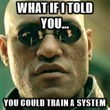

.. role:: skyblue
.. role:: red

Ionosphere
==========

Ionosphere is a story about timeseries.

Dedicated to my father, Derek, a man of numbers if there ever was one.

What Ionosphere is for - humble beginnings
------------------------------------------

**YOU** can teach a system.

**YOU** can help a system to LEARN.

You want to monitor metrics on small VPSs that do not do a great deal, meaning
there is no high, rate constant work or 3sigma consistency in the metrics.
There are 0 to 7 apache.sending a day, not 7000 a minute. Or there are some
peaks on the metric stats_counts.statsd.bad_lines_seen

.. image:: images/ionosphere/21060819.stats_counts.statsd.bad_lines_seen.png

This is :red:`NOT ANOMALOUS`

Even in massive, workload intensive, dynamic systems there are always some
metrics that are low rate and relatively low range.  And at 3sigma... that means
noisy.

Ionosphere's goal is to allow us to train Skyline on what is not anomalous and
thereby compliment statistical 3simga means with some new methodologies of
trying to "teach" the system.  Of course teaching statistics algorithms
something new is unfortunately not possible, but luckily teaching the system is
possible.  Giving the system better contextual data to work with is the key
factor.

Overview
--------

- Ionosphere gives the operator an input into Skyline to allow them to train it
  and compliment the existing statistical 3sigma anomaly detection methods.
- Ionosphere then starts to learn, **retrospectively**.
- Is Ionosphere the panacea for anomaly detection?  No.
- Is Ionosphere immediately useful for web scale anomaly detection?  No.  Unless
  you are already doing web scale anomaly detection with Skyline, then still no.
  However over time yes.  You cannot rush timeseries.
- Is Ionosphere a lot of work to train, yes.
- Ionosphere uses a timeseries similarality comparison method to compare two
  different timeseries for a metric.
- This method is based on summing the features that are calculated for the
  timeseries using |tsfresh| to "fingerprint" the data set.
- This allows the operator to fingerprint and profile what is not anomalous, but
  normal and to be expected, even if 3sigma will always detect it as anomalous.

Deploying and setting Ionosphere up
-----------------------------------

Ionosphere has a specific section of variables in ``settings.py`` that are
documented in the settings specific documentation see all the settings below:

- http://earthgecko-skyline.readthedocs.io/en/latest/skyline.html#settings.IONOSPHERE_CHECK_PATH
- http://earthgecko-skyline.readthedocs.io/en/ionosphere/skyline.html#settings.IONOSPHERE_CHECK_PATH

The Ionosphere settings follow normal Skyline settings conventions in terms of
being able to paint all metrics with certain defaults and allowing for specific
settings for specific or wildcard namespaces.  If you know Skyline then these
should all be fairly intuitive.

If you are new to Skyline, then by the time you have all the other Skyline apps
set up and running you should have a more intuitive feel for these to after
having spent some time looking over your running Skyline.  You cannot rush
timeseries :)

Ionosphere static demo pages
----------------------------

The demo pages show examples of how Ionosphere presents the operator with the
metric's details for the specific point anomaly and the all the Graphite
metric graphs at multiple resolutions so that the operator can evaluation the
anomaly in the full context of the metric's history.

Graphs demo page - multiple resolution Graphite graphs for context
^^^^^^^^^^^^^^^^^^^^^^^^^^^^^^^^^^^^^^^^^^^^^^^^^^^^^^^^^^^^^^^^^^

The demo page uses an edge case anomaly one which is not easy to decide whether
it is or is not an anomaly.

Would **YOU** consider it anomalous or not?  Would you want an alert?

Note that this is demo page is from an older version of Ionosphere before learn
was introduced.  So it does not give the operator the 2 options:

- Create features profile and DO NOT LEARN
- Create features profile and LEARN

It only gives the one option, however this demo page is about the **multiple
resolution Graphite graphs** giving the operator context, so do not worry about
the buttons, look at the graphs, see the :skyblue:`Graphite ::` :red:`graphs NOW`
section on the below demo page.

See |graphs_demo_page| for a clearer picture (opens in a new browser tab).  Is
it anomalous or not anomalous?

.. |graphs_demo_page| raw:: html

   <a href="_static/ionosphere_demo/training-data-stats.gauges.statsd.timestamp_lag-20170110161506UTC/Skyline.Ionosphere.training-data-stats.gauges.statsd.timestamp_lag-20170110161506UTC.html" target="_blank">Ionosphere static multiple resolution graphs demo page</a>

Features profile demo page with matched graphs
^^^^^^^^^^^^^^^^^^^^^^^^^^^^^^^^^^^^^^^^^^^^^^

This demo page shows an existing features profile with all the graph resources
that the profile was created, see the :skyblue:`Graphite ::` :red:`graphs WHEN created ::` **at 7h, 24h, 7d and 30d**
section in the below demo page.

A series of matched graphs, showing the instances where Ionosphere has
analyzed the Analyzer detected anomalouse timeseries and found it be not
anomalous because the calculated ``features_sum`` of the Analyzer anomalous
timeseries were within 1% difference of the ``features_sum :: 73931.7673978000``
that was calculated for features profile 269 see
:skyblue:`Graphite ::` :red:`graphs MATCHED` section in the below demo page.

See |fp_demo_page| for a clearer picture.

.. |fp_demo_page| raw:: html

   <a href="_static/ionosphere_demo/features-profile.stats.statsd.graphiteStats.calculationtime/Skyline.Ionosphere.features-profile.stats.statsd.graphiteStats.calculationtime.html" target="_blank">Ionosphere static features profile demo page with matched graphs</a>

Features profile search demo page with generational information
^^^^^^^^^^^^^^^^^^^^^^^^^^^^^^^^^^^^^^^^^^^^^^^^^^^^^^^^^^^^^^^

See |fp_gen_demo_page| for a clearer picture with generational, parent_id,
number of times checked, number of times matched information.

.. |fp_gen_demo_page| raw:: html

   <a href="_static/ionosphere_demo/features-profile-search.stats.statsd.graphiteStats.calculationtime/Skyline.Ionosphere.features-profile-search.stats.statsd.graphiteStats.calculationtime.html" target="_blank">Ionosphere static search features profiles demo page with generation info</a>

Still interested?
-----------------

.. image:: images/ionosphere/what_if_i_told_you_learn.jpeg

Things to consider
------------------

Contextual anomalies - Earthquakes and Earth tremors
^^^^^^^^^^^^^^^^^^^^^^^^^^^^^^^^^^^^^^^^^^^^^^^^^^^^

A point anomaly is only as contextual as the timeframe in which it is considered
to be anomalous in.

The following metaphor can be used to describe this concept.  As this concept is
important to understand in terms of Ionosphere and Mirage.

Let us take Bob as an example, Bob lived in the UK and decided to move to
San Francisco because he landed a good job at a cool San Jose data analytics
upstart.  In the first week he is there, the Bay Area has a few Earth tremors,
to Bob from the UK this is ANOMALOUS!!! Luckily Bob has a friendly co-worker
called Alice and she directs him to http://earthquaketrack.com/us-ca-san-jose/recent
and shows him it is not that anomalous, it is quite normal.  Alice shows Bob to
consider the context of these events in at a fuller duration.

- 5 earthquakes in the past 24 hours
- 5 earthquakes in the past 7 days
- 28 earthquakes in the past 30 days
- 381 earthquakes in the past 365 days

.. seealso:: Bob's Hampshire earthquake data, if there is any...

And the penny drops for Bob that HERE in the Bay Area this is obviously this
quite normal.

Bob then wonders to himself why he did not think about this before leaving
his stable shire in the UK.  He consoles himself by thinking "Well all the VCs
and players are here...  so it obviously cannot be a big single point of
failure.

.. code-block:: python

  bob = 'Skyline'
  alice = 'You'

Skyline does not know all the contexts to the data, you do.  Ionosphere lets
us teach Bob **that is not an earthquake!!!** and enables Bob to look and ask,
"Did Alice say this was not an earthquake, let me look".

"Create" or "Create and LEARN"
^^^^^^^^^^^^^^^^^^^^^^^^^^^^^^

With Ionosphere, you have the option to allow it to learn these things for
itself, as long as you tell it what it is ALLOWED to learn at the fuller
duration.

So Ionosphere gives you 2 options:

.. figure:: images/ionosphere/create.and.do.not.learn.png

  Only make a features profile based on the ``FULL_DURATION`` data.

.. figure:: images/ionosphere/create.and.learn.png

  This is not an anomaly now or then or in the forseeable future if it
  looks anything like the FULL_DURATION or any of the multiple resoluiton
  Graphite graphs, LEARN it at the ``learn_full_duration``.

This means you do not have to ship that earthquake that happened 17 days ago into
Ionosphere's features profiles and teach it BAD, badly.  You can just tell it
to see the relevant Analyzer ``FULL_DURATION`` or Mirage the
``SECOND_ORDER_RESOLUTION_HOURS`` data as not anomalous and **not** learn at
the fuller duration of the metric's ``learn_full_duration``.

You can teach Ionosphere badly, but to unteach it is just a SQL update.

How Ionosphere works - as simple overview as possible
-----------------------------------------------------

Firstly one needs to understand there is a chicken and egg aspect to Ionosphere.
Which if you have read up to this point, hopefully you have already got that
point.

Ionosphere has a number of roles that are centered on feature extractions,
feature calculations and comparisons and a role centered on learning.

The features role
^^^^^^^^^^^^^^^^^

- Ionosphere **only** analyses SMTP alerter enabled metrics.
- Once Ionosphere is enabled, if Analyzer or Mirage detect an anomaly on a
  metric they:

  - Save the training data set and the anomaly details
  - If the metric is not an ``ionosphere_enabled`` metric and SMTP alert enabled
    metric, an alert is triggered and all the created alert images are saved in
    the training data directory as well.
  - If the metric is an ``ionosphere_enabled`` metric, Analyzer and Mirage defer
    the timeseries to Ionosphere, via a check file, for Ionosphere to make a
    decision on.  More on that below.

- Ionosphere serves the training data set for each triggered anomaly, ready for
  a human to come along in the webapp Ionosphere UI and say, "that is not
  anomalous" (if it is not).
- At the point the operator makes a features profile, all the features values
  that are created for the not anomalous timeseries are entered into the
  database and the metric becomes an ``ionosphere_enabled`` metric, if it was
  not one already.
- All the anomaly resources are then copied to the specific features profile
  directory that is created for the features profile.Over time,
- Once a metric is ``ionosphere_enabled``, both Analyzer and Mirage will refer
  any anomalies found for the metric to Ionosphere instead of just alerting.
- When a 3sigma anomalous timeseries is sent to Ionosphere, it calculates the
  features with |tsfresh| for the 3sigma anomalous timeseries and then compares
  the common features sums with those of previously recorded features profiles.
  If the two values are less than
  :mod:`settings.IONOSPHERE_LEARN_DEFAULT_MAX_PERCENT_DIFF_FROM_ORIGIN`

    - Ionosphere will deem the timeseries as not anomalous and remove the
      related training data.
    - If Ionosphere does **not** find a match, it tells the originating app (
      Analyzer or Mirage) to send out the anomaly alert with a
      ``[Skyline alert] - Ionosphere ALERT`` subject field.

The learning role
^^^^^^^^^^^^^^^^^

- Once a features profile has been made for a metric with the LEARN option, for
  every unmatched anomaly that training_data is created for, after the
  ``learn_valid_ts_older_than`` seconds have been reached, Ionosphere will
  attempt to "learn" whether the anomalous event after ``learn_valid_ts_older_than``
  seconds and any subsequent aggregration has had time to occur, if the timeseries
  features at ``learn_full_duration`` seconds match any feature profiles that
  were created for the metric at the ``learn_full_duration``.
- If Ionosphere finds a match to the features calculated from the metric
  timeseries that it surfaces the from Graphite at ``learn_full_duration``, it
  will use the anomaly training data to create a features profile for the metric
  at the metric's ``FULL_DURATION`` or ``SECOND_ORDER_RESOLUTION_HOURS``
  (whichever is applicable) **and** it will also create a features profile with
  the ``learn_full_duration`` data that matched, as long as the ``FULL_DURATION``
  or ``SECOND_ORDER_RESOLUTION_HOURS`` features sum as long as the difference is
  within the :mod:`settings.IONOSPHERE_LEARN_DEFAULT_MAX_PERCENT_DIFF_FROM_ORIGIN`
  or the metric specific ``max_percent_diff_from_origin``

Input
-----

When an anomaly alert is sent out via email, a link to the Ionosphere training
data is included in the alert.  This link opens the Ionosphere UI with the all
training data for the specific anomaly where the user can submit the metric
timeseries as not anomalous and generate have Skyline generate a features
profile with |tsfresh|.

features profiles
-----------------

When a training data set is submitted as not anomalous for a metric a features
profile is extracted from the timeseries using |tsfresh|.  This features profile
contains the about values of 216 features (currently as of tsfresh-0.4.0), such
as median, mean, variance, etc, for a full list of known features that are
calculated see :mod:`tsfresh_feature_names.TSFRESH_FEATURES`.

This features profile is then stored in the Skyline MySQL database in the
following manner.  For every metric that has a features profile that is created,
2 MySQL InnoDB tables are created for the metric.

- The features profile details are inserted into the ionosphere table and the
  features profile gets a unique id.
- z_fp_<metric_id> - features profile metric table which contains the features
  profile id, feature name id and the calculated value of the feature.
- z_ts_<metric_id> - the timeseries data for the metric on which a features
  profile was calculated.

These tables are prefixed with ``z_`` so that they are all listed after all core
Skyline database tables.  Once a metric has a z_fp_<metric_id> and a
z_ts_<metric_id>, these tables are updated any future features profiles and
timeseries data.  So there is are 2 tables per metric, not tables per features
profile.

How Ionosphere is "learning"?
-----------------------------

Ionosphere may have had humble beginnings, but adding this seemingly trivial
function was anything but humble, simple or easy.  So to solve the seemingly
simple problem, something completely new had to be pieced together.

Ionosphere "learns" timeseries and makes decisions based on a timeseries
similarities comparison method, based on a method using the |tsfresh| package.

This "learning" is base upon determining the similarities in timeseries that
could be best described as attempting to determine how similar 2 timeseries are
in terms of the amount of "power/energy", range and "movement" there is within
the timeseries data set.  A fingerprint or signature if you like, but understand
that neither are perfect.  This timeseries similarities comparison method is not
perfect in the dynamic, operational arena, but it achieves the goal of being useful.
However, it must be stated that it **can** be perfect, a |tsfresh| features
profile sum is (about as) **perfect** as you can get at 0% difference.  However
using it with 100% perfection is not useful to learning and trying to profile the
Active Brownian Motion (for want of a better way of explaining it).  Lots of
dynamic metrics/systems will exhibit a tendency to try an achieve Active
Brownian Motion, not all but many and definitely at differing and some times
multiple seasonalities.

For a very good overview of Active Brownian Motion please see the @kempa-liehr
description at

.. seealso:: https://github.com/blue-yonder/tsfresh/pull/143#issuecomment-272314801 -
  "Dynamic systems have stable and unstable fixed points. Without noise these
  systems would be driven to one of their stable fixed points and stay there for
  ever. So, fixed points resemble an equilibrium state"

Ionosphere enables us to try and profile this Active Brownian Motion as the norm,
again for want of a better way of trying to explain it.

However, contextually, Ionosphere nor the |tsfresh| implemented method, will ever
be perfect, unless 2 timeseries have identical data, consistently, without
change.  But how challenging would that be? :)

Also it may be possible that an identical timeseries reversed may give the same
or negative of a features sum.

**TODO**: test that theory, reversed timeseries the same or the inverse?

Anyway, it is not perfect, by design.  Evolution tends to not achieve perfection,
attaining a working, functional state is usually the norm in evolution it seems.

Evolutionary learning - generations
^^^^^^^^^^^^^^^^^^^^^^^^^^^^^^^^^^^

Ionosphere uses an evolutionary learning model that records (and limits) the
generations of trained and learnt features profiles per metric.  Limits can be
set in settings.py and played around with.  For veterans of Skyline, these tend
to be much like ``CONSENSUS``, what is the correct ``CONSENSUS``?

They are tweak and tunable.  Keep them low, you give Ionosphere less
leverage to learn.  But you will bump them up so that it can learn more and
better.

Caveat.  Right now, as of writing, Ionosphere can learn bad incrementally quite
quickly.  Only when you have a big, bad anomalous event like a spawn.c fork on a
number of servers or such.  Learning rate limiting is to be introduced, next,
which shall immediately solve this issue.  But sometimes documentation needs to
be written so you can release and move on :)

Although this documentation may seem overly chatty and verbose, all things have
stories.  And why should documentation be overly dull, try explaining Skyline
to someone, good luck.  You should see me at parties.  Anyway not many people
read this, so it does not really matter :)

If you want to understand Skyline more, look at the code.  But be gentle :)

Or better yet, set it up.  Being able to teach a system and see it learn it
pretty cool, just look at https://github.com/xviniette/FlappyLearning
and NeuroEvolution.js (thanks for the inspiration from @nylar and @xviniette)

Lots of Skyline concepts are easy enough to get, some are not so easy and when
they are all tied together with a splash of seasonality and a dash of
similarities, it gets quite complicated.

However, all Skyline pieces, individually, are relatively simple.  Seeing them
work helps or hinders depending on your outlook...
"Shit lots of stuff is anomalous" can often lead to lots of work, debugging,
fine tuning and making better or polishing a turd or diamante.

No machine learning
^^^^^^^^^^^^^^^^^^^

Ionosphere brings **no** machine learning to Skyline per se.  It is merely making
programmatic decisions based on the data it is provided with, things a human
operator tells it are not anomalous.  Ionosphere is an attempt to give Skyline
an Apollo Program refit.  Enabling the pilots to take control, have inputs.

For Humans
----------

If Ionosphere achieves the sentiments expressed in Brian L. Troutwine @bltroutwine
seminal Belgium 2014 devopsdays presentation, then it has achieved a goal.

- Automation with Humans in Mind: Making Complex Systems Predictable, Reliable and
  Humane - https://legacy.devopsdays.org/events/2014-belgium/proposals/automation-with-humans-in-mind/
- video - http://www.ustream.tv/recorded/54703629

Ionosphere first and foremost was created to give this dimension of human
piloting where necessary.  Giving Skyline that ability to allow human input in
some form to "teach" Skyline what is not anomalous comes with a number
additional benefits, like giving the Skyline the information needed to learn
how to make decisions based on the input data it is provided within.

The initial goal has been achieved, but it comes at a price.  Everything has a
cost and here the cost is the operator needs to
``train_ionosphere_learn == time_in_seconds  # about 12 seconds``.

Ionosphere can only be activated by the input from a human neocortex to tell it
what is not anomalous.  Some brain CPU cycles, opening emails and clicks,
assess 1 or 2 more clicks.  It is not easy, however that said it is effective at
what it set out to achieve.

Current state
-------------

It appears that Ionosphere is better at doing what it was intended for than
doing what it was not intended for.  All timeseries not being created equal.

Ionosphere does low range, low rate metrics very well.

Ionosphere does them better than high rate, highly variable metrics, when it saw
first light at least.  This is not to say that it does not do high rate, highly
variable metrics, it just needs a lot more features profiles for the metric
describing what is not anomalous. However it is possible that a larger
:mod:`settings.IONOSPHERE_LEARN_DEFAULT_MAX_PERCENT_DIFF_FROM_ORIGIN` or metric
specific ``max_percent_diff_from_origin`` may work quite well on large volume
and high variability metrics, time will tell.

Over the fullness of time and data, these learning efficiency metrics will be
available via the database data for analysis.

tsfresh
-------

The |tsfresh| package and features extraction functions, enabled this ability of
features calculation on a wholesale scale, without having to design lots of
algorithms to calculate the timeseries features for.  The |tsfresh| package
enabled Ionosphere to happen much FASTER, it calculates all the features that
are required to make this method viable and work.  They said:

``"Spend less time on feature engineering"``

They were not wrong.  Skyline has added a lot of "checks" to ensure consistency
in the |tsfresh| calculated features so that a features profile is not affected
by any changes that may be implemented in the |tsfresh| package.  All of this
has been pushed back into |tsfresh| and may be one of the reasons why the actual
development of Ionosphere took so long, but you cannot rush timeseries.

This overview of Ionosphere could not be complete without a special thanks to
the |tsfresh| people @MaxBenChrist, @nils-braun and @jneuff who are some of nicest
people in open source, on par with @astanway :)

Thanks to |blue-yonder| for supporting the open sourcing of |tsfresh|.

Operational considerations
--------------------------

No UI data update method
^^^^^^^^^^^^^^^^^^^^^^^^

There is no method to modify the DB data via the UI.  If you want to make any
changes, they must be made directly against the DB.  Disabling a features
profile, deleting features profiles, changing any of the metrics values once set
for metrics e.g. ``learn_full_duration``, ``learn_valid_ts_older_than``,
``max_generations`` or ``max_percent_diff_from_origin``

Backup
^^^^^^

- Backup the MySQL DB to another machine or better slave it and backup the slave.
- rsync backup /opt/skyline/ionosphere/features_profiles to another machine,
  frequently (for the time being, until autobuild is available, however
  autobuild will not a able to recreate all the resources, but most).

MySQL configuration
^^^^^^^^^^^^^^^^^^^

There could be a lot of tables. **DEFINITELY** implement ``innodb_file_per_table``
in MySQL.

Ionosphere - autobuild features_profiles dir
--------------------------------------------

.. warning:: autobuild - TBD at some point in the future, for now see the Backup
  section above.

The number of features_profiles dirs that Ionosphere learn could spawn and the
amount of data storage that would result is unknown. It is possible the operator
is going to need to prune this data a lot of which will probably never be looked
at. Or a Skyline node is going to fail, not have the features_profiles dirs
backed up and all the data is going to be lost or deleted. So it is possible for
Ionosphere to created all the human interrupted resources for the features
profile back under a best effort methodology. Although the original Redis graph
image would not be available, nor the Graphite graphs in the resolution at which
the features profile was created, however the fp_ts is available so the Redis
plot could be remade and all the Graphite graphs could be made as best effort
with whatever resolution is available for that time period.

This allows the operator to delete/prune feature profile dirs by possibly least
matched by age, etc or all and still be able to surface the available features
profile page data on-demand.

.. note:: expire features profiles older than?  Ionosphere forget.

See `Development - Ionosphere <development/ionosphere.html>`__

.. |blue-yonder| raw:: html

   <a href="https://www.blue-yonder.com" target="_blank">blue-yonder</a>

.. |tsfresh| raw:: html

   <a href="https://github.com/blue-yonder/tsfresh" target="_blank">tsfresh</a>
