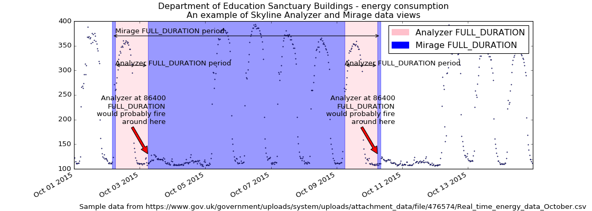

######
Mirage
######

The Mirage service is responsible for analyzing selected time series at custom
time ranges when a time series seasonality does not fit within
:mod:`settings.FULL_DURATION`.  Mirage allows for testing of real time data
and algorithms in parallel to Analyzer.  Mirage was inspired by Abe Stanway's
Crucible and the desire to extend the temporal data pools available to Skyline
in an attempt to handle seasonality better, reduce noise and increase signal,
specifically on seasonal metrics.

An overview of Mirage
=====================

- Mirage is fed specific user defined metrics by Analyzer when Analyzer triggers
  them as anomalous over a 24 hour period.
- Mirage gets 7 days of time series data for the metric from Graphite and
  analyses the time series with the same 9 three-sigma algortihms as Analyzer
  does (and any additional custom algorithms).
- If the instance is still found to be anomalous, Mirage forwards on any trained
  metrics to Ionosphere for further analysis or alerts if the metric is not
  trained.
- Mirage does not have its own ``ALERTS`` settings it uses the same
  :mod:`settings.ALERTS` as Analyzer.
- Mirage also sends anomaly details to Panorama, like Analyzer does.

.. figure:: images/crucible/mirage/skyline.mirage.overview.png
   :alt: An overview of Mirage

`Fullsize overview image <_images/skyline.mirage.overview.png>`_ for a clearer picture.

Why Mirage?
-----------

Analyzer's :mod:`settings.FULL_DURATION` somewhat limits Analyzer's usefulness
for metrics that have a seasonality / periodicity that is greater than
:mod:`settings.FULL_DURATION`.  This means Analyzer is not great in terms of
"seeing the bigger picture" when it comes to metrics that have a weekly pattern
as well as a daily patterns for example.

Increasing :mod:`settings.FULL_DURATION` to anything above 24 hours (86400) is
not necessarily realistic or useful, because the greater the
:mod:`settings.FULL_DURATION`, the greater memory required for Redis and the
longer Analyzer will take to run.

What Mirage can and cannot do
=============================

It is important to know that Mirage is not necessarily suited to making highly
variable metrics less noisy e.g. spikey metrics.

Mirage is more useful on fairly constant rate metrics which contain known
or expected seasonalities.  For example take a metric such as
office.energy.consumation.per.hour,  this type of metric would most likely have
2 common seasonalities.

As an example we can use the `Department of Education
<https://www.gov.uk/government/publications/greening-government-and-transparency-commitments-real-time-energy-data>`_
Sanctuary Buildings energy consumption public `data set
<https://www.gov.uk/government/uploads/system/uploads/attachment_data/file/476574/Real_time_energy_data_October.csv>`_
to demonstrate how Mirage and Analyzer views are different.  The energy
consumption in an office building is a good example of a multi-seasonal data set.

* Office hour peaks
* Out of hour troughs
* Weekend troughs
* Holidays
* There could be summer and winter seasonality too

For now let us just consider the daily and weekly seasonality.

The difference between the Analyzer and Mirage views of a time series
---------------------------------------------------------------------

`Fullsize image <images/mirage/mirage-1.png>`_ for a clearer picture.

As we can see above, on a Saturday morning the energy consumption does not
increase as it normally does during the week days. Analyzer would probably find
the metric to be anomalous if :mod:`settings.FULL_DURATION` was set to 86400 (24
hours), Saturday morning would seem anomalous.

However, if the metric's alert tuple was set up with a
``SECOND_ORDER_RESOLUTION_HOURS`` of 168, Mirage would analyze the data point
against a week's worth of data points and the Saturday and Sunday daytime data
points would have less probability of triggering as anomalous.  *The above
image is plotted as if the Mirage* ``SECOND_ORDER_RESOLUTION_HOURS`` *was set to
172 hours just so that the trailing edges can be seen.*

A real world example with tenfold.com
-------------------------------------

:blak3r2: Our app logs phone calls for businesses and I want to be able to
  detect when VIP phone systems go down or act funny and begin flooding us with
  events.  Our work load is very noisy from 9-5pm... where 9-5 is different for
  each customer depending on their workload so thresholding and modeling isn't
  good.

:earthgecko:  Yes, Mirage is great at user defined seasonality, in your case
  weekday 9-5 peaks, evening drop offs, early morning and weekend lows - multi
  seasonal, Mirage is the ticket.
  Your best bet would be to try 7days (168) as your SECOND_ORDER_RESOLUTION_HOURS
  value for those app log metrics, however, you may get away with a 3 day
  window, it depends on the metrics really, but it may not be noisy at 3 days
  resolution, even at the weekends.

Mirage "smooths"
-------------------

Mirage is a "tuning" tool for seasonal metrics and it is important to understand
that Mirage is probably using aggregated/downsampled data (unless your Graphite
is not using multiple retentions and aggregating) and due to this Mirage can
lose some resolution if your metrics are set to `aggregationMethod = average` in
Graphite, resulting in it being less sensitive to anomalies than Analyzer is.

So Mirage does some "smoothing" if the data is crossing a retention boundary and
you have aggregations in Graphite.  However it is analyzing the time series at
the aggregated resolution so it is "smoothed" as the data point that Analyzer
triggered on is ALSO aggregated in the time series resolution that Mirage is
analyzing.

Intuitively one may think it may miss it in the aggregation then.  This is true
to an extent, but Analyzer will likely trigger multiple times if the metric
**IS** anomalous, so when Analyzer pushes to Mirage again, each aggregation is
more likely to trigger as anomalous, **IF** the metric anomalous at the user
defined full duration.  A little flattened maybe, a little lag maybe, but less
noise, more signal.

Setting up and enabling Mirage
==============================

By default Mirage is disabled, various Mirage options can be configured in the
``settings.py`` file and Analyzer and Mirage can be configured as appropriate
for your environment.

For all the specific alert configurations see the `Alerts <alerts.html>`__ page.

Mirage requires some directories as per ``settings.py`` defines (these require
absolute path):

.. code-block:: bash

  mkdir -p $MIRAGE_CHECK_PATH
  mkdir -p $MIRAGE_DATA_FOLDER

Configure ``settings.py`` with some :mod:`settings.ALERTS` alert tuples that
have the ``SECOND_ORDER_RESOLUTION_HOURS`` defined. For example below is an
Analyzer only :mod:`settings.ALERTS` tuple that does not have Mirage enabled as
it has no ``SECOND_ORDER_RESOLUTION_HOURS`` defined:

.. code-block:: python

  ALERTS = (
             ('stats_counts.http.rpm.publishers.*', 'smtp', 300),  # --> Analyzer sends to alerter
  )

To enable Analyzer to send the metric to Mirage we append the metric alert tuple
in :mod:`settings.ALERTS` with the ``SECOND_ORDER_RESOLUTION_HOURS`` value.
Below we have used 168 hours to get Mirage to analyze **any** anomalous metric
in the 'stats_counts.http.rpm.publishers.*' namespace using using 7 days worth
of time series data from Graphite:

.. code-block:: python

  ALERTS = (
  #          ('stats_counts.http.rpm.publishers.*', 'smtp', 300),  # --> Analyzer sends to alerter
             ('stats_counts.http.rpm.publishers.*', 'smtp', 300, 168),  # --> Analyzer sends to Mirage
  )

Order Matters
-------------

.. warning:: It is important to note that Mirage enabled metric namespaces must
  be defined before non Mirage enabled metric namespace tuples as Analyzer uses
  the first alert tuple that matches.

So for example, with some annotation

.. code-block:: python

  ALERTS = (
             ('skyline', 'smtp', 1800),
             ('stats_counts.http.rpm.publishers.seasonal_pub1', 'smtp', 300, 168),    # --> To Mirage
             ('stats_counts.http.rpm.publishers.seasonal_pub_freddy', 'smtp', 300, 168),    # --> To Mirage
             ('stats_counts.http.rpm.publishers.*', 'smtp', 300),    # --> To alerter
  )

The above would ensure if Analyzer found seasonal_pub1 or seasonal_pub_freddy
anomalous, instead of firing an alert as it does for all other
``stats_counts.http.rpm.publishers.*``, because they have 168 defined, Analyzer
sends the metric to Mirage.

The below would NOT have the desired effect of analysing the metrics
seasonal_pub1 and seasonal_pub_freddy with Mirage

.. code-block:: python

  ALERTS = (
             ('skyline', 'smtp', 1800),
             ('stats_counts.http.rpm.publishers.*', 'smtp', 300),    # --> To alerter
             ('stats_counts.http.rpm.publishers.seasonal_pub1', 'smtp', 300, 168),    # --> NEVER gets reached
             ('stats_counts.http.rpm.publishers.seasonal_pub_freddy', 'smtp', 300, 168),    # --> NEVER gets reached
  )

Hopefully it is clear that the first ``stats_counts.http.rpm.publishers.*``
alert tuple would route ALL to alerter and seasonal_pub1 and seasonal_pub_freddy
would never get sent to Mirage to be analyzed.

Enabling
--------

And ensure that ``settings.py`` has Mirage options enabled, specifically the
basic ones:

.. code-block:: python

  ENABLE_MIRAGE = True
  ENABLE_FULL_DURATION_ALERTS = False
  MIRAGE_ENABLE_ALERTS = True

Start Mirage and restart Analyzer:

.. code-block:: bash

  cd skyline/bin
  ./mirage.d start
  ./analyzer.d restart

Rate limited
------------

Mirage is rate limited to analyze 30 metrics per minute, this is by design and
desired. Surfacing data from Graphite and analyzing ~1000 data points in a
time series takes less than 1 second and is much less CPU intensive than
Analyzer in general, but it is probably sufficient to have 30 calls to Graphite
per minute.  If a large number of metrics went anomalous, even with Mirage
discarding :mod:`settings.MIRAGE_STALE_SECONDS` checks due to processing limit,
signals would still be sent.

Periodic Checks
===============

Due to the fact that Analyzer feeds Mirage metrics to check when Analyzer finds
a Mirage metric anomalous, there are situations where a metric may change fairly
substantially over a period greater than :mod:`settings.FULL_DURATION`, for
example over 36 hours.  In these cases Analyser will not detect these changes as
anomalous and therefore Mirage will not have a chance to check them.

Periodic checks can be enabled on Mirage metric namespaces that are declared in
:mod:`settings.MIRAGE_PERIODIC_CHECK_NAMESPACES`.  It is not advisable to
analyse all Mirage metrics periodically as this would probably have a
significant impact on both Skyline and Graphite.

Periodic checks should only be run on Mirage key metrics.  Periodic checks suit
KPI metrics that are have fairly constant rate.  Periodic checks should not be
implemented on general server and app metrics.

It is important to note that the :mod:`settings.MIRAGE_PERIODIC_CHECK_NAMESPACES`
will match the exact string and dotted namespace elements as per
documented in :mod:`settings.SKIP_LIST`.

The types of metrics that suit periodic checks are total/global metrics,
summed metrics rather than individual metrics.  The type of individual metrics
that suit Mirage periodic checks are metrics like % disk space used on fairly
consistent servers that are not expected to fluctuate too drastically over a
period of days, like a DB server volume.

You definitely do not what to run all your server or app metrics through Mirage
periodic checks, unless you used some sane configuration in terms of setting a
reasonable :mod:`settings.MIRAGE_PERIODIC_CHECK_INTERVAL`, you could send all
your metrics through Mirage over say a 4 hour period.

Say you have 10000 metrics and you want to periodically analyse them all with
Mirage you could set them all to be analysed over a 6 hour period.

.. code-block:: python

  MIRAGE_PERIODIC_CHECK = True
  MIRAGE_PERIODIC_CHECK_NAMESPACES = ['*']
  MIRAGE_PERIODIC_CHECK_INTERVAL = 21600

This would result in Mirage surfacing and analysing 27 metrics per minute, so
you need to consider the impact on your Graphite, bandwidth and CPU usage.
However Mirage will prioritise real time checks received from Analyzer over
periodic checks and periodic checks will be queued to ensure real time analysis
is not affected by periodic checks.

What Mirage does
================

- If Analyzer finds a metric to be anomalous at :mod:`settings.FULL_DURATION`
  and the metric alert tuple has ``SECOND_ORDER_RESOLUTION_HOURS`` and
  :mod:`settings.ENABLE_MIRAGE` is ``True``, Analyzer will push the metric
  variables to the Mirage check file.
- Mirage watches for added check files.
- When a check is found, Mirage determines what the configured
  ``SECOND_ORDER_RESOLUTION_HOURS`` is for the metric from the tuple in
  :mod:`settings.ALERTS`
- Mirage queries graphite to surface the json data for the metric time series at
  ``SECOND_ORDER_RESOLUTION_HOURS``.
- Mirage then analyses the retrieved metric time series against the configured
  :mod:`settings.MIRAGE_ALGORITHMS`.
- If a metric is an Ionosphere enabled metric, then Mirage does not alert,
  but hands the metric off to Ionosphere by adding an Ionosphere check
  file.
- If the metric is anomalous over ``SECOND_ORDER_RESOLUTION_HOURS`` then alerts
  via the configured alerters for the matching metric :mod:`settings.ALERT`
  tuple and sets the metric alert key for ``EXPIRATION_TIME`` seconds.
- Mirage will alert for a Mirage metric that has been returned from Ionosphere
  as anomalous having not matched any known features profile or layers.
