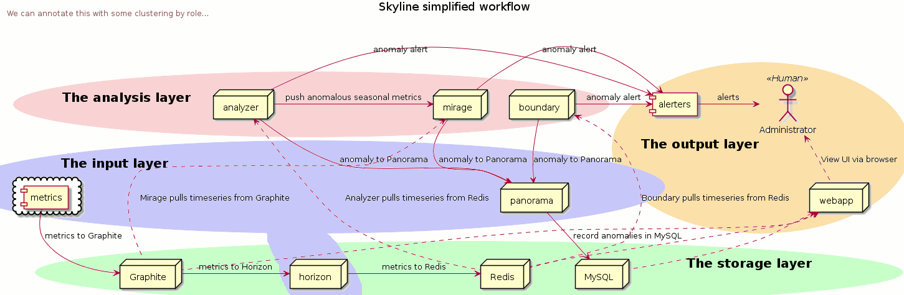

.. role:: skyblue
.. role:: red
.. role:: brow

Overview
========

Welcome to Skyline.

You must be interested in doing real time anomaly detection on vast amounts of
time series data streams on a reasonable Linux VM (or in a container/s if you
were really committed).

You are still here.

You use Graphite as your time series data source?  No?

Currently Skyline needs Graphite, if you do not already have Graphite please
consider setting Graphite up and if you like that, come back.

If you are still here and reading this, then maybe you are serious about
installing and trying Skyline.  In which case a word of warning, continuing from
this point forward, will require a LOT of hours of your time.

Skyline is not some Python data science anomaly detection library, it is a full
blown production grade anomaly detection stack.  Although certain aspects of
Skyline may have interest to the data science community.

A brief history
---------------

Skyline was originally open sourced by `Etsy`_ as a real-time anomaly detection
system. It was originally built to enable passive monitoring of hundreds of
thousands of metrics, without the need to configure a model/thresholds for each
one, as you might do with Nagios.  It was designed to be used wherever there are
a large quantity of high-resolution time series which need constant monitoring.
Once a metric stream was set up (from statsd, Graphite or other), additional
metrics are automatically added to Skyline for analysis, anomaly detection,
alerting and briefly published in the Webapp frontend.  `github/etsy`_ stopped
actively maintaining Skyline in 2014.

Skyline - as a work in progress
-------------------------------

`Etsy`_ found the "one size fits all approach" to anomaly detection wasn't
actually proving all that useful to them.

There is **some truth** in that in terms of the one size fits all methodology that
Skyline was framed around.  With hundreds of thousands of metrics this does make
Skyline fairly hard to tame, in terms of how useful it is and tuning the noise
is difficult.  Tuning the noise to make it constantly useful and not just noisy,
removes the "without the need to configure a model/thresholds" element somewhat.

So why continue developing Skyline?

The first way to make Skyline MUCH better than the manner it was implemented and
framed by Etsy, is to **NOT** try and use it to anomaly detect on 1000s of
metrics in the first place.  Using Skyline as a scapel rather than a sword.

Within in this paradigm, Skyline has been much improved in many ways and is
very useful at doing anomaly detection on your KEY metrics.  The ongoing
development of Skyline has been focused on improving Skyline in the following
ways:

- Improving the anomaly detection methodologies used in the 3-sigma context.
- Extending Skyline's 3-sigma methodology to enable the operator and Skyline to
  handle seasonality in metrics.
- The addition of an anomalies database for learning and root cause analysis.
- Adding the ability for the operator to teach Skyline and have Skyline learn
  things that are NOT anomalous using a time series similarities comparison
  method based on features extraction and comparison using the `tsfresh`_
  package.  With Ionosphere we are training Skyline on what is NOT anomalous,
  rather than focusing on what is anomalous.  Ionosphere allows us to train
  Skyline as to what is normal, even if normal includes spikes and dips and
  seasonality.  After all we have some expectation that most of our metrics
  would be NOT anomalous most of the time, rather than anomalous most of the
  time.  So training Skyline what is NOT ANOMALOUS is more efficient than trying
  to label anomalies.
- Adding the ability to Skyline to determine what other metrics are related to
  an anomaly event using cross correlation analysis of all the metrics using
  Linkedin's `luminol`_ library when an anomaly event is triggered and
  recording these in the database to assist in root cause analysis.

And...

The architecture/pipeline works very well at doing what it does.  It is solid
and battle tested..

Skyline is **FAST**!!!  Faster enough to handle 10s of 1000s of time series in
near real time.  In the world of Python, data analysis, R and most machine
learning, Skyline is FAST.  Processing and analyzing 1000s and 1000s of
constantly changing time series, every minute of every day and it can do it in
multiple resolutions, on a fairly low end commodity server.

The new look of Skyline apps
----------------------------

* Horizon - feed metrics to Redis via a pickle input from Graphite/s
* Analyzer - analyses metrics with 3-sigma algorithms
* Mirage - analyses specific metrics at a custom time range with 3-sigma algorithms
* Boundary - analyses specific time series for specific conditions
* Crucible - store anomalous time series resources and adhoc analysis of any
  time series
* Panorama - anomalies database, historical views and root cause analysis
* Webapp - frontend to view current and historical anomalies and browse Redis
  with :red:`re`:brow:`brow` and manage Skyline's learning
* Ionosphere - time series fingerprinting and learning
* Luminosity - Cross correlation of metrics for root cause analysis

Skyline is still a near real time anomaly detection system, however it has
various modes of operation that are modular and self contained, so that only the
desired apps need to be enabled, although the stack is now much more useful with
them all running.  This modular nature also isolated the apps from one another
in terms of operation, meaning an error or failure in one does not necessarily
the others.

Skyline can now be feed/query and analyse time series on an adhoc basis, on the
fly.  This means Skyline can now be used to analyse and process static data too,
it is no longer just a machine/app metric fed system, if anyone wanted to use
it to analyse historic data.

A simplified workflow of Skyline
--------------------------------

This is a bit out of date.

`Fullsize image <_images/skyline.simplified.workflow.annotated.gif>`_ for a clearer picture.

What's new
----------

See `whats-new <whats-new.html>`__ for a comprehensive overview and description
of the latest version/s of Skyline.

What's old
----------

It must be stated the original core of Skyline has not been altered in any way,
other than some fairly minimal Pythonic performance improvements, a bit of
optimization in terms of the logic used to reach :mod:`settings.CONSENSUS` and a
package restructure.  In terms of the original Skyline Analyzer, it does the
same things just a little differently, hopefully better and a bit more.

There is little point in trying to improve something as simple and elegant in
methodology and design as Skyline, which has worked so outstandingly well to
date.  This is a testament to a number of things, in fact the sum of all it's
parts, `Etsy`_, Abe and co. did a great job in the conceptual design,
methodology and actual implementation of Skyline and they did it with very good
building blocks from the scientific community.

The architecture in a nutshell
------------------------------
Skyline uses to following technologies and libraries at its core:

1. **Python** - the main skyline application language - `Python`_
2. **Redis** - `Redis`_ an in-memory data structure store
3. **numpy** - `NumPy`_ is the fundamental package for scientific computing with Python
4. **scipy** - `SciPy`_ Library - Fundamental library for scientific computing
5. **pandas** - `pandas`_ - Python Data Analysis Library
6. **mysql/mariadb** - a database - `MySQL`_ or `MariaDB`_
7. :red:`re`:brow:`brow` - Skyline uses a modified port of Marian
   Steinbach's excellent `rebrow`_
8. **tsfresh** - `tsfresh`_ - Automatic extraction of relevant features from time series
9. **memcached** - `memcached`_ - memory object caching system
10. **pymemcache** - `pymemcache`_ - A comprehensive, fast, pure-Python memcached client
11. **luminol** - `luminol`_ - Anomaly Detection and Correlation library

.. _Etsy: https://www.etsy.com/
.. _github/etsy: https://github.com/etsy/skyline
.. _whats-new: ../html/whats-new.html
.. _Python: https://www.python.org/
.. _Redis: http://Redis.io/
.. _NumPy: http://www.numpy.org/
.. _SciPy: http://scipy.org/
.. _pandas: http://pandas.pydata.org/
.. _MySQL: https://www.mysql.com/
.. _rebrow: https://github.com/marians/rebrow
.. _MariaDB: https://mariadb.org/
.. _tsfresh: https://github.com/blue-yonder/tsfresh
.. _memcached: https://memcached.org/
.. _pymemcache: https://github.com/pinterest/pymemcache
.. _luminol: https://github.com/linkedin/luminol
