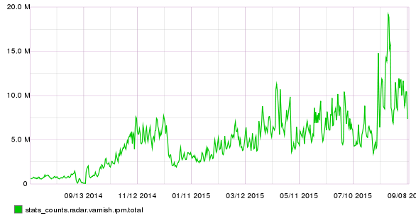
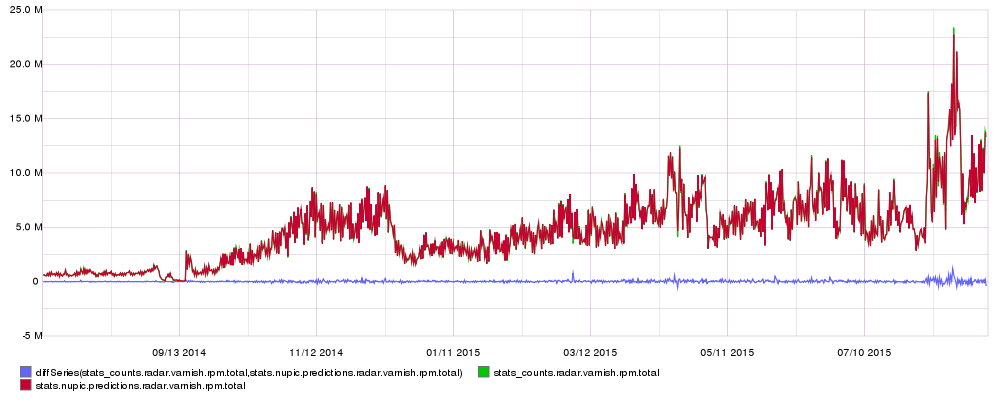

=======
Roadmap
=======

Things on the horizon :)

This is not really a roadmap per se it is more just a collection of
ideas at the moment, in no particular order.

UPDATE 20180526 - Skyline itself now seems to write its own roadmap and also
seems to be plotting it's own course.  Regardless of any whaffle you may read
here.

Further performance improvements and Python-3.5
===============================================

Further performance improvements where possible with the use of cython.
pypy is unfortunately not an overall viable route due to no real support
for scipy and limited numpy support. pypy would be a quick win if it
were possible, so cython where applicable is the obvious choice.

Continue updating the code base to ensure that everything can be run on
>= Python-3.5.x

UPDATE 20180526 - Skyline has not been cooperative here in terms of it's own
roadmap and plotted course.

Ionosphere
==========

Functionality to allow the operator to flag false positives, with a view
to using machine learning to train Skyline on anomalies.  Using the entire data
set for training it, perhaps even using an entire namespace to increase the
accuracy of the anomaly detection via multiple avenues of analysis.

In progress
-----------

See `Ionosphere <ionosphere.html>`__ and `Development - Ionosphere
<development/ionosphere.html>`__

UPDATE 20180526 - Ionosphere development, still in progress in small increments

UPDATE 20180715 - Ionosphere stable

Meteor
======

Add the ability to inject data into a data set and test a metric, the workflow,
algorithms, alerters and the apps themselves,etc.

UPDATE 20180526 - Skyline has not been cooperative here.

Constellations (Updated 20150526 now to be known as Luminosity)
===============================================================

A pure Python implementation of the Oculus functionality, but not
necessarily exactly the same, but similar. Calculating in realtime using
the redis data and fingerprinting the slope/gradient/alphabet of the
last x datapoints of each timeseries on the fly and correlating /
finding similarities in the timeseries in terms of patterns. Perhaps
some inplementation of Cosine Similarity could be used. A pure Python
implementation of Oculus functionality within Skyline would remove the
requirement for the additional overheads of ruby and Elasticsearch.

This would allow for the correlations to be determined for any metrics
at any point within the ``FULL_DURATION`` period.

Help wanted.

UPDATE 20180526 - Skyline HAS been cooperative here and hooked up with
Linkedin/luminol to provide Skyline Luminosity and adding back the additional
dimension of correlations, it has managed to provide a fairly good root cause
analysis dimension to Skyline too.  Ticked. Although I still like the app
Skyline meme of Constellations, just have to think up or find another cool thing
(similarly related) to name Constellations.  No doubt in the next roadmap
edition, this may be updated with something like, "Skyline and other parties
have not been cooperative here."  Take that as ode to yourselves Linkedin, the
name was even changed to fit in with paying homeage to your library, however if
the aim here is to be accurate the app should be called skyline/paulbourke...
Which gives me an idea :)

Skyline and NASA/FITS data
==========================

There is a Skyline module in development that is specifically designed
for analysing Kepler FITS timeseries data. Although it specifically
focus at extracting lightcurve data from the Kepler llc.fits data files,
that in itself has added the functionality to convert any relevant FITS
based data file that has a timeseries element in it. This should extend
to other data types that the FITS data format (Flexible Image Transport
System) handles:

-  Much more than just another image format (such as JPEG or GIF)
-  Used for the transport, analysis, and archival storage of scientific
   data sets

-  Multi-dimensional arrays: 1D spectra, 2D images, 3D+ data cubes
-  Tables containing rows and columns of information
-  Header keywords provide descriptive information about the data

It should be possible for Skyline to be able to ingest any FITS data
file or ingest an image file from a FITS file and feed it to scikit-image,
etc.

UPDATE 20180526 - Skyline and other parties have not been cooperative here.

NuPIC
=====

Last year `NuPIC <https://github.com/numenta/nupic/>`__ was assessed in terms of
use in Internet advertising for an additional monitoring dimension.  Although
the assessment was fairly brief, it's predictive capabilities were quite
impressive.  Working with a 14 month data set for one advertising service it was
able to predict the service's ad\_requests per 10 minutes for the 14 month
period remarkably well given the nature of the specific domain.  The result was
a little peaky, with a few large peaks. Evaluation of the event streams from the
timeframes around the large peaks in question, identified known causes for
those peaks, with a "noise filter" applied to ``exclude > x`` to reduce
those now known few noisy events and the result were indeed remarkable. In fact
NuPIC predicted our requests for 14 months within the bounds of ~5% error margin
and when it made and error, it learned.

Truly remarkable given this is adtech data, 6.5 million request per
minute peaks, low troughs with sparse seasonalities (if there is such
a thing) at times. NuPIC and the Cortical Learning Algorithm are really
amazing, if not a little difficult upfront.

NuPIC predictions and Graphite timeseries
-----------------------------------------

Feeding NuPIC prediction data back into Graphite helps our own Neocortex
to visually analyse the results too (data courtesy of
`Coull <http://coull.com/>`__).

Original requests timeseries
^^^^^^^^^^^^^^^^^^^^^^^^^^^^

   Original requests timeseries data

NuPIC predicted timeseries
^^^^^^^^^^^^^^^^^^^^^^^^^^

.. figure:: images/nupic.radar.predicted.14.month.requests.png
   :alt: NuPIC predicted data

   NuPIC predicted data

percentage error - positive and negative
^^^^^^^^^^^^^^^^^^^^^^^^^^^^^^^^^^^^^^^^

-  positive - under predicted (we did more than predicted)
-  negative - over predicted (we did less than predicted)

asPercent(diffSeries(stats\_counts.radar.varnish.rpm.total,stats.nupic.predictions.radar.varnish.rpm.total),stats\_counts.radar.varnish.rpm.total)

Drop the noisy for an average representation

.. figure:: images/nupic.radar.real.predicted.difference.14.month.requests.png
   :alt: NuPIC percentage error

   NuPIC percentage error

Overlaid
^^^^^^^^

Real data, NuPIC predictions and percentage error (on the 2nd unticked y
axis as above)

   Real data, NuPIC predictions and percentage error

Quite amazing.  It a not beyond the realms of possibility to have a Horizon
feeding specific metrics to various NuPIC HTM Cortical Learning
Algorithms models...

UPDATE 20180526 - Skyline and other parties have not been cooperative here.

Update the NAB Scoreboard
~~~~~~~~~~~~~~~~~~~~~~~~~

Look at the automated running of the Numenta Anomaly Benchmark (NAB)
data and frequently determine the Standard Profile, Reward Low FP and
Reward Low FN scores (metrics). This will only aid and improve the
evaluation of any additional algorithms, methods or techniques that are
added or applied to Skyline in the future, e.g:

-  Does Mirage change the score?
-  Does Boundary?
-  Would the addition of pyculiarity as an "algorithm"?
   (https://github.com/nicolasmiller/pyculiarity)

Automated NAB benchmark metrics would be a nice thing to have :)

**Update 20170225**: Skyline can no longer necessarily be NAB-ed due to it now
functioning in multiple temporal resolutions as a whole.

UPDATE 20180526 - Skyline and other parties have not been cooperative here.

Machine learning
================

Bring additional dimensions of machine learning capabilities into Skyline, too
many avenues to mention...

UPDATE 20180526 - Skyline and other parties have not been cooperative here.

Grumpy
======

Investigate if any elements could benefit performance wise from being
implemented in Grumpy - go running Python -
https://opensource.googleblog.com/2017/01/grumpy-go-running-python.html there
may be some mileage in using go instead of multiprocessing in some cases,
algorithms, ionosphere, tsfresh chunks to go in extract_features rather than
multiprocessing, scope for investigation.

UPDATE 20180526 - Skyline and other parties have not been cooperative here.  So
at least one thing on the roadmap was done.  I guess that is progress :)
